## 姓名：席崇援

## 学习任务：

- java初体验（java语言概述）
  - 了解java
  - 开发环境的搭建
  - java关键字
  - 标识符
  - 注释
- 变量与数据类型
  - 变量与常量
  - java中的数据类型
  - java各数据类型之间的转换
  - String类型数据
- 运算符
  - 算数运算符
  - 关系运算符
  - 逻辑运算符
  - 三元运算符
- 分支结构
  - if-else
  - switch-case
- 循环结构
  - for 
  - while
  - do - while
- 开发工具idea
  - 目录结构

## 完成情况:

已完成概上

## 笔记：

# java初体验

## java关键字

### 关键字分类

#### 48个关键字

**abstract、assert、boolean、break、byte、case、catch、char、class、continue、default、do、double、else、enum、extends、final、finally、float、for、if、implements、import、int、interface、instanceof、long、native、new、package、private、protected、public、return、short、static、strictfp、super、switch、synchronized、this、throw、throws、transient、try、void、volatile、while。**

#### 2个保留字

**goto const**

#### 3个特殊直接量：

**true、false、null**

### 关键字大致意思

abstract	表明类或者成员方法具有抽象属性
assert	断言，用来进行程序调试
boolean	基本数据类型之一，声明布尔类型的关键字
break	提前跳出一个块
byte	基本数据类型之一，字节类型
case	用在 switch 语句之中，表示其中的一个分支
catch	用在异常处理中，用来捕捉异常
char	基本数据类型之一，字符类型
class	声明一个类
const	保留关键字，没有具体含义
continue	回到一个块的开始处
default	默认，例如，用在 switch 语句中，表明一个默认的分支
do	用在 do-while 循环结构中
double	基本数据类型之一，双精度浮点数类型
else	用在条件语句中，表明当条件不成立时的分支
enum	枚举
extends	表明一个类型是另一个类型的子类型，表示继承关系，这里常见的类型有类和接口
final	表示不可变，最终的，在Java中表示常量
finally	用于处理异常情况，用来声明一个基本肯定会被执行到的语句块
float	基本数据类型之一，单精度浮点数类型
for	一种循环结构的引导词
goto	保留关键字，没有具体含义
if	条件语句的引导词
implements	表明一个类实现了给定的接口
import	表明要访问指定的类或包
instanceof	用来测试一个对象是否是指定类型的实例对象
int	基本数据类型之一，整数类型
interface	接口
long	基本数据类型之一，长整数类型
native	用来声明一个方法是由与计算机相关的语言（如 C/C++语言）实现的
new	用来创建新实例对象
package	包
private	一种访问控制方式：私用模式
protected	一种访问控制方式：保护模式
public	一种访问控制方式：共用模式
return	从成员方法中返回数据
short	基本数据类型之一,短整数类型
static	表明具有静态属性
strictfp	用来声明 FP_strict（单精度或双精度浮点数）表达式遵循IEEE 754 算术规范
super	表明当前对象的父类型的引用或者父类型的构造方法
switch	分支语句结构的引导词
synchronized	表明一段代码需要同步执行
this	指向当前实例对象的引用
throw	抛出一个异常
throws	声明在当前定义的成员方法中所有需要抛出的异常
transient	声明不用序列化的成员域
try	尝试一个可能抛出异常的程序块
void	声明当前成员方法没有返回值
volatile	表明两个或者多个变量必须同步地发生变化
while	用在循环结构中
null	引用数据类型默认初始值
注意：Java中总共有53个关键字，并且Java的关键字都是小写的
2个保留字

 Java语言的的保留字是指预留的关键字
1).const 有道释义：n. 常量，常数

        用于修改字段或局部变量的声明。它指定字段或局部变量的值是常数，不能被修改
2).goto 有道释义：vi. 转到

     指定跳转到标签，找到标签后，程序将处理从下一行开始的命令。
#### 关键字分类记忆

##### 1).访问修饰符的关键字（共3个）

关键字	意思	备注，常用
public	公有的	可跨包，（默认选择）
protected	受保护的	当前包内可用
private	私有的	当前类可用

##### 2).定义类、接口、抽象类和实现接口、继承类的关键字、实例化对象（共6个）

关键字	意思	备注，常用
class	类	public class A(){} 花括号里有已实现方法体，类名需要与文件名相同
interface	接口	public interface B(){} 花括号里有方法体，但没有实现，方法体句子后面是英文分号“:”结尾
abstract	声明抽象	public abstract class C(){} 介于类与接口中间，可以有也可以没有已经实现的方法体
implements	实现	用于类或接口实现接口public class A interface B(){}
extends	继承	用于类继承类 public class A extends D(){}
new	创建新对象	A a=new A(); A表示一个类

##### 3).包的关键字（共2个）

关键字	意思	备注，常用
import	引入包的关键字	当使用某个包的一些类时，仅需类名 然后使用ctrl+shift+o或者选定类名（类或属性或	方法）按住ctrl+单击 即可自动插入类所在的包。如：JFrame 快捷键之后自动加入import javax.swing.JFrame;
package	定义包的关键字	将所有有关的类放在一个包类以便查找修改等。如：package javake.flycat.draw002;

##### 4).数据类型的关键字（共12个）

关键字	意思	备注，常用
byte	字节型	8bit
char	字符型	16bit
boolean	布尔型	–
short	短整型	16bit
int	整型	32bit
float	浮点型	32bit
long	长整型	64bit
double	双精度	64bit
void	无返回	public void A(){} 其他需要返回的经常与return连用
null	空值	
true	真	
false	假	

##### 5).条件循环（流程控制）（共12个）

关键字	意思	备注，常用
if	如果	if(){} 如果小括号里面怎么怎么样 花括号就怎么怎么样
else	否则，或者	常与if连用，用法相同
while	当什么的时候	while 怎么样就do什么 while(){}
for	满足三个条件时	for ( ; ; ){}
switch	开关	switch(表达式)
{
case 常量表达式1:语句1;
…
case 常量表达式2:语句2;
default:语句;
}
default就是如果没有符合的case就执行它,default并不是必须的.
case后的语句可以不用大括号.
switch语句的判断条件可以接受int,byte,char,short,不能接受其他类型.switch(表达式)
{
case 常量表达式1:语句1;
…
case 常量表达式2:语句2;
default:语句;
}
default就是如果没有符合的case就执行它,default并不是必须的.
case后的语句可以不用大括号.
switch语句的判断条件可以接受int,byte,char,short,不能接受其他类型.
case	返回开关里的结果	
default	默认	
do	运行	与while连用
break	跳出循环	
continue	继续	中断本次循环，并并开始下一次
return	返回	return 一个返回值类型
instanceof	实例	一个二元操作符，和==，>，<是同一类的。测试它左边的对象是否是它右边的类的实例，返回boolean类型的数据

##### 6).修饰方法、类、属性和变量（共9个）

关键字	意思	备注，常用
static	静态的	属性和方法都可以用static修饰，直接使用类名.属性和方法名。 只有内部类可以使用static关键字修饰，调用直接使用类名.内部类类名进行调用。 static可以独立存在。静态块
final	最终的不可被改变的，用作常量	方法和类都可以用final来修饰、final修饰的类是不能被继承的、final修饰的方法是不能被子类重写，常量的定义：final修饰的属性就是常量
super	调用父类的方法	常见public void paint(Graphics g){super.paint(g); ···}
this	当前类的父类的对象	调用当前类中的方法（表示调用这个方法的对象）this.addActionListener(al)’
native	本地	
strictfp	严格,精准	
synchronized	线程,同步	
transient	短暂	
volatile	易失	

##### 7).错误处理（共5个）

关键字	意思	备注，常用
1)catch	处理异常	1.try+catch
程序的流程是：运行到try块中，如果有异常抛出，则转到catch块去处理。然后执行catch块后面的语句

​								2.try+catch+finally
程序的流程是：运行到try块中，如果有异常抛出，则转到catch块,catch块执行完毕后，执行finally块的代码，再执行finally块后面的代码。
如果没有异常抛出，执行完try块，也要去执行finally块的代码。然后执行finally块后面的语句

​								3.try+finally
程序的流程是：运行到try块中,如果有异常抛出的话，程序转向执行finally块的代码。那末finally块后面的代码还会被执行吗？不会！因为你没有处理异常，所以遇到异常后，执行完finally后，方法就已抛出异常的方式退出了。
这种方式中要注意的是，由于你没有捕获异常，所以要在方法后面声明抛出异常

2)try	捕获异常	
3)finally	有没有异常都执行	
4)throw	抛出一个异常对象	一些可以导致程序出问题的因素,比如书写错误,逻辑错误或者是api的应用错误等等. 				为了防止程序的崩溃就要预先检测这些因素,所以java 使用了异常这个机制. 在Java中异常是靠 “抛出” 也				就是英语的throw来使用的，如果发现到什么异常的时候就吧错误信息抛出
5)throws	声明一个异常可能被抛出	把异常交给他的上级管理，自己不进行异常处理

## 标识符

Java中变量、方法、类等要素命名时使用的字符序列，称为标识符。

技巧：凡是自己可以起名字的地方都叫标识符。

### **标识符的命名规则**（必须遵守的`硬性规定`）：

```
> 由26个英文字母大小写，0-9 ，_或 $ 组成  
> 数字不可以开头。
> 不可以使用关键字和保留字，但能包含关键字和保留字。
> Java中严格区分大小写，长度无限制。
> 标识符不能包含空格。
```

### **标识符的命名规范**（建议遵守的`软性要求`，否则工作时容易被鄙视）:

```
> 包名：多单词组成时所有字母都小写：xxxyyyzzz。
  例如：java.lang、com.atguigu.bean
  
> 类名、接口名：多单词组成时，所有单词的首字母大写：XxxYyyZzz
  例如：HelloWorld，String，System等
  
> 变量名、方法名：多单词组成时，第一个单词首字母小写，第二个单词开始每个单词首字母大写：xxxYyyZzz
  例如：age,name,bookName,main,binarySearch,getName
  
> 常量名：所有字母都大写。多单词时每个单词用下划线连接：XXX_YYY_ZZZ
  例如：MAX_VALUE,PI,DEFAULT_CAPACITY
```

## 注释

Java 支持三种注释方式：

- 单行注释
- 多行注释
- 文档注释

前两种分别是 **和 /\* \*/**，第三种被称作文档注释，它以 **/\**** 开始，以 ***/** 结束。

前两种注释内容可以参考：[Java 注释](https://www.runoob.com/java/java-comments.html)

文档注释允许你在程序中嵌入关于程序的信息。

你可以使用 javadoc 工具软件来生成信息，并输出到 HTML 文件中。

文档注释，使你更加方便的记录你的程序信息。

------

### javadoc 标签

javadoc 工具软件识别以下标签：

| **标签**      |                          **描述**                           |                    **示例**                    |
| :------------ | :---------------------------------------------------------: | :--------------------------------------------: |
| @author       |                      标识一个类的作者                       |                  @author描述                   |
| @deprecated   |                   指名一个过期的类或成员                    |                @deprecated描述                 |
| {@docRoot}    |                  指明当前文档根目录的路径                   |                    目录路径                    |
| @exception    |                    标志一个类抛出的异常                     |            @exception 异常名称说明             |
| {@inheritDoc} |                    从直接父类继承的注释                     |      从 immediate surperclass 继承注释。       |
| {@link}       |                 插入一个到另一个主题的链接                  |                {@link 名称文本}                |
| {@linkplain}  |    插入一个到另一个主题的链接，但是该链接显示纯文本字体     |         插入指向另一个主题的内嵌链接。         |
| @param        |                     说明一个方法的参数                      |              @param 参数名称说明               |
| @return       |                       说明返回值类型                        |                  @return说明                   |
| @see          |                 指定一个到另一个主题的链接                  |                     @see锚                     |
| @serial       |                     说明一个序列化属性                      |                  @serial描述                   |
| @serialData   | 说明通过 writeObject（ ） 和 writeExternal（ ）方法写的数据 |                @serialData描述                 |
| @serialField  |                说明一个ObjectStreamField组件                |          @serialField 名称 类型 描述           |
| @since        |                 标记当引入一个特定的变化时                  |                  @since 版本                   |
| @throws       |                   和 @exception标签一样.                    | @throws 标签与 @exception 标签具有相同的含义。 |
| {@value}      |           显示常量的值，该常量必须是static属性。            |      显示常量的值，该常量必须是静态字段。      |
| @version      |                        指定类的版本                         |                 @version 信息                  |

------

#### 文档注释

在开始的 **/\**** 之后，第一行或几行是关于类、变量和方法的主要描述。

之后，你可以包含一个或多个各种各样的 **@** 标签。每一个 **@** 标签必须在一个新行的开始或者在一行的开始紧跟星号 *****。

多个相同类型的标签应该放成一组。例如，如果你有三个 **@see** 标签，可以将它们一个接一个的放在一起。

下面是一个类的稳定注释的实例：

```java
/*** 这个类绘制一个条形图
* @author runoob
* @version 1.2
*/
```

标准形式：javadoc -d 文件夹名 -xx -yy 源文件.java（具体参考下图）
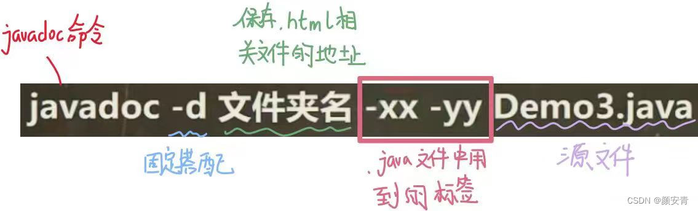

打开相应的网页文件


结果显示：
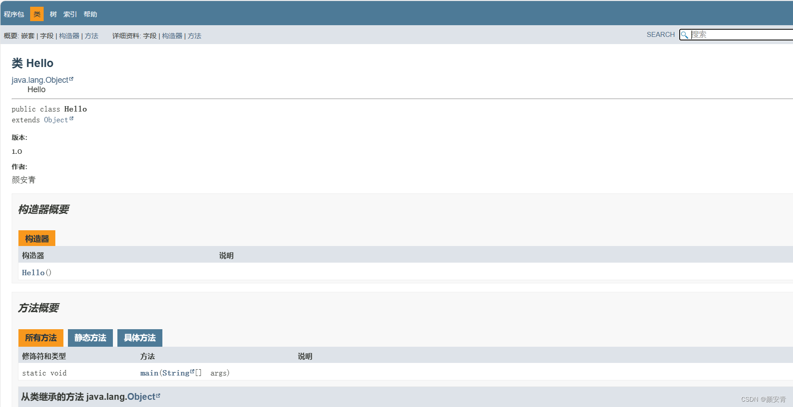

# 变量与数据类型

## 变量

**变量是程序中不可或缺的组成单位，最基本的存储单元**。

- 变量的概念：

  - 内存中的一个存储区域，该区域的数据可以在同一类型范围内不断变化

  - 变量的构成包含三个要素：`数据类型`、`变量名`、`存储的值`

  - Java中变量声明的格式：`数据类型 变量名 = 变量值`

    

- 变量的作用：用于在内存中保存数据。

- 使用变量注意：

  - Java中每个变量必须先声明，后使用。
  - 使用变量名来访问这块区域的数据。
  - 变量的作用域：其定义所在的一对{ }内。
  - 变量只有在其`作用域`内才有效。出了作用域，变量不可以再被调用。
  - 同一个作用域内，不能定义重名的变量。

## java中的数据类型

Java中变量的数据类型分为两大类：

- **基本数据类型**：包括 `整数类型`、`浮点数类型`、`字符类型`、`布尔类型`。 

- **引用数据类型**：包括`数组`、 `类`、`接口`、`枚举`、`注解`、`记录`。 

  

---

### 整数类型：byte、short、int、long


- 定义long类型的变量，赋值时需要以"`l`"或"`L`"作为后缀。

- Java程序中变量通常声明为int型，除非不足以表示较大的数，才使用long。

- Java的整型`常量默认为 int 型`。

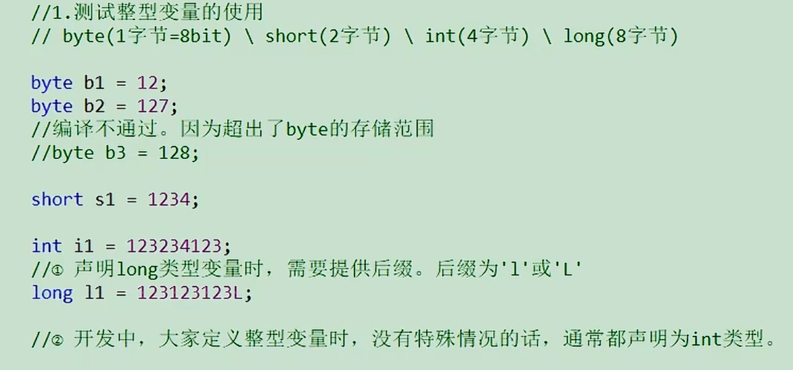

---

### 浮点类型：float、double


- 浮点型常量有两种表示形式：
  - 十进制数形式。如：5.12       512.0f        .512   (必须有小数点）
  - 科学计数法形式。如：5.12e2      512E2     100E-2
- float：`单精度`，尾数可以精确到7位有效数字。很多情况下，精度很难满足需求。    
- double：`双精度`，精度是float的两倍。通常采用此类型。
- 定义float类型的变量，赋值时需要以"`f`"或"`F`"作为后缀。
- Java 的浮点型`常量默认为double型`。

#### 添加尾缀说明

我们知道Java在变量赋值的时候，其中float、double、long数据类型变量，需要在赋值直接量后面分别添加f或F、d或D、l或L尾缀来说明。
其中，long类型最好以大写L来添加尾缀，因为小写l容易和数字1混淆。
例如：

```java
long lNum  = 1234L;
float fNum = 1.23f;
double dNum = 1.23d;
```

这是Java语法规定，不添加尾缀很容易引起编译器报错，并且程序可读性也会变差。

#### 不添加尾缀也不会报错的情况

Java语言中，整数直接量（例如：1、2、10等），JVM虚拟机是默认为int类型数据的。所以，当整数直接量赋给long、float或者double，而不添加尾缀，虚拟机也会直接将int类型数据自动转换为对应类型然后赋值。因为数据长度短的转换为长的并不会造成数据丢失，所以默认可以自动转换。　
例如：

```java
long  lNum  = 5;   //不报错，因为int自动转换为long类型，不会报错
float fNum  = 7;   //不报错，因为int自动转换为float类型，不会报错
double dNum = 10;  //同上
```

**但是，当浮点直接量（例如：1.2等），JVM虚拟机默认为double类型，如果直接赋值给float就会引起编译器报错。**

```java
float fNum  = 1.2; //报错，因为1.2虚拟机是默认为double类型，不能直接赋值给float类型变量
float fNew  = 1.3f;//正确，因为尾缀添加了f，即告诉了虚拟机1.3属于float类型变量
```

#### 关于浮点型精度的说明

- 并不是所有的小数都能可以精确的用二进制浮点数表示。二进制浮点数不能精确的表示0.1、0.01、0.001这样10的负次幂。

- 浮点类型float、double的数据不适合在`不容许舍入误差`的金融计算领域。如果需要`精确`数字计算或保留指定位数的精度，需要使用`BigDecimal类`。

- 测试用例：


```java
//测试1：（解释见章末企业真题：为什么0.1 + 0.2不等于0.3）
System.out.println(0.1 + 0.2);//0.30000000000000004

//测试2：
float ff1 = 123123123f;
float ff2 = ff1 + 1;
System.out.println(ff1);
System.out.println(ff2);
System.out.println(ff1 == ff2);
```

输出: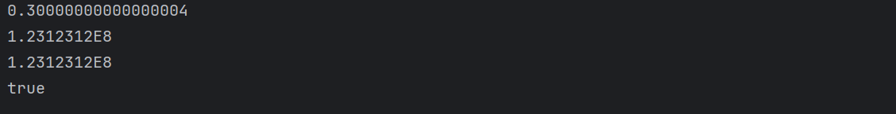

---

#### 应用举例

案例1：定义圆周率并赋值为3.14，现有3个圆的半径分别为1.2、2.5、6，求它们的面积。

```java
/**
 * @author 尚硅谷-宋红康
 * @create 12:36
 */
public class Exercise1 {
    public static void main(String[] args) {
        double PI = 3.14; //圆周率

        double radius1 = 1.2;
        double radius2 = 2.5;
        int radius3 = 6;

        System.out.println("第1个圆的面积：" + PI * radius1 * radius1);
        System.out.println("第2个圆的面积：" + PI * radius2 * radius2);
        System.out.println("第3个圆的面积：" + PI * radius3 * radius3);
    }
}
```

输出:

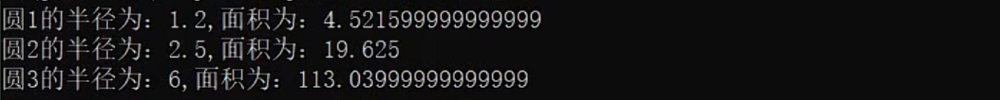

案例2：小明要到美国旅游，可是那里的温度是以华氏度为单位记录的。
它需要一个程序将华氏温度（80度）转换为摄氏度，并以华氏度和摄氏度为单位分别显示该温度。

```
℃ = (℉ - 32) / 1.8
```

```java
/**
 * @author 尚硅谷-宋红康
 * @create 12:51
 */
public class Exercise2 {
    public static void main(String[] args) {
        double hua = 80;
        double she = (hua-32)/1.8;
        System.out.println("华氏度" + hua+"℉转为摄氏度是" +she+"℃");
    }
}
```

输出:


---

### 字符类型：char

- char 型数据用来表示通常意义上“`字符`”（占2字节）

- Java中的所有字符都使用Unicode编码，故一个字符可以存储一个字母，一个汉字，或其他书面语的一个字符。

- 字符型变量的三种表现形式：

  - **形式1：**使用单引号(' ')括起来的`单个字符`。

    例如：char c1 = 'a';   char c2 = '中'; char c3 =  '9';

  - **形式2：**直接使用 `Unicode值`来表示字符型常量：‘`\uXXXX`’。其中，XXXX代表一个十六进制整数。

    例如：\u0023 表示 '#'。

  - **形式3：**Java中还允许使用`转义字符‘\’`来将其后的字符转变为特殊字符型常量。

    例如：char c3 = '\n';  // '\n'表示换行符

  | 转义字符 |  说明  | Unicode表示方式 |
  | :------: | :----: | :-------------: |
  |   `\n`   | 换行符 |     \u000a      |
  |   `\t`   | 制表符 |     \u0009      |
  |   `\"`   | 双引号 |     \u0022      |
  |   `\'`   | 单引号 |     \u0027      |
  |   `\\`   | 反斜线 |     \u005c      |
  |   `\b`   | 退格符 |     \u0008      |
  |   `\r`   | 回车符 |     \u000d      |

- char类型是可以进行运算的。因为它都对应有Unicode码，可以看做是一个数值。

```
//1.字符类型：char(2字节)

		//表示形式1：使用一对''表示，内部有且仅有一个字符
		char c1 = 'a';
		char c2 = '中';
		char c3 = '1';
		char c4 = '%';
		char c5 = 'γ';
		
		//编译不通过
		//char c6 = '';
		//char c7 = 'ab';

		//表示形式2：直接使用Unicode值来表示字符型常量。
		char c8 = '\u0036';
		System.out.println(c8);

		//表示形式3：使用转义字符
		char c9 = '\n';
		char c10 = '\t';
		System.out.println("hello" + c10 + "world");

		//表示形式4：使用具体字符对应的数值（比如ASCII码）
		char c11 = 97;
		System.out.println(c11);//a

		char c12 = '1';
		char c13 = 1;
```

输出:

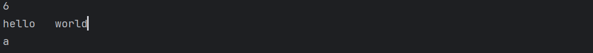

---

### 布尔类型：boolean

- boolean 类型用来判断逻辑条件，一般用于流程控制语句中：
  - if条件控制语句；                  
  - while循环控制语句；     
  - for循环控制语句；
  - do-while循环控制语句； 

- **boolean类型数据只有两个值：true、false，无其它。**
  - 不可以使用0或非 0 的整数替代false和true，这点和C语言不同。
  - 拓展：Java虚拟机中没有任何供boolean值专用的字节码指令，Java语言表达所操作的boolean值，在编译之后都使用java虚拟机中的int数据类型来代替：true用1表示，false用0表示。——《java虚拟机规范 8版》
- 举例：

```java
boolean isFlag = true;

if(isFlag){
    //true分支
}else{  
    //false分支
}
```

> 经验之谈：
>
> Less is More！建议不要这样写：if ( isFlag = = true )，只有新手才如此。关键也很容易写错成if(isFlag = true)，这样就变成赋值isFlag为true而不是判断！`老鸟的写法`是if (isFlag)或者if ( !isFlag)。

```java
//2. 布尔类型：boolean
//① 只有两个取值：true 、 false
boolean bo1 = true;
boolean bo2 = false;
//编译不通过
//boolean bo3 = 0;
//② 常使用在流程控制语句中。比如：条件判断、循环结构等
boolean isMarried = true;
if(isMarried){
    System.out.println("很遗憾，不能参加单身派对了");
}else{
    System.out.println("可以多谈几个女朋友或男朋友");
}
```

输出:


## java各数据类型之间的转换

###  自动类型提升

​		**规则：将取值范围小（或容量小）的类型自动提升为取值范围大（或容量大）的类型 。**

（1）当把存储范围小的值（常量值、变量的值、表达式计算的结果值）赋值给了存储范围大的变量时

```java
int i = 'A';//char自动升级为int，其实就是把字符的编码值赋值给i变量了
double d = 10;//int自动升级为double
long num = 1234567; //右边的整数常量值如果在int范围呢，编译和运行都可以通过，这里涉及到数据类型转换

//byte bigB = 130;//错误，右边的整数常量值超过byte范围
long bigNum = 12345678912L;//右边的整数常量值如果超过int范围，必须加L，显式表示long类型。否则编译不通过
```

（2）当存储范围小的数据类型与存储范围大的数据类型变量一起混合运算时，会按照其中最大的类型运算。

```java
int i = 1;
byte b = 1;
double d = 1.0;

double sum = i + b + d;//混合运算，升级为double
```

**（3）当byte,short,char数据类型的变量进行算术运算时，按照int类型处理。**

```java
byte b1 = 1;
byte b2 = 2;
byte b3 = b1 + b2;//编译报错，b1 + b2自动升级为int

char c1 = '0';
char c2 = 'A';
int i = c1 + c2;//至少需要使用int类型来接收
System.out.println(c1 + c2);//113 
```

###  强制类型转换

将`3.14` 赋值到`int` 类型变量会发生什么？产生编译失败，肯定无法赋值。

```java
int i = 3.14; // 编译报错
```

想要赋值成功，只有通过`强制类型转换`，将`double` 类型强制转换成`int` 类型才能赋值。

**规则：将取值范围大（或容量大）的类型强制转换成取值范围小（或容量小）的类型。**

> 自动类型提升是Java自动执行的，而强制类型转换是自动类型提升的逆运算，需要我们自己手动执行。

**转换格式：**

```java
数据类型1 变量名 = (数据类型1)被强转数据值;  //()中的数据类型必须<=变量值的数据类型
```

（1）当把存储范围大的值（常量值、变量的值、表达式计算的结果值）强制转换为存储范围小的变量时，可能会`损失精度`或`溢出`。

```java
int i = (int)3.14;//损失精度

double d = 1.2;
int num = (int)d;//损失精度

int i = 200;
byte b = (byte)i;//溢出
```

（2）当某个值想要提升数据类型时，也可以使用强制类型转换。这种情况的强制类型转换是`没有风险`的，通常省略。

```java
int i = 1;
int j = 2;
double bigger = (double)(i/j);
```

（3）声明long类型变量时，可以出现省略后缀的情况。float则不同。

```java
long l1 = 123L;
long l2 = 123;//如何理解呢？ 此时可以看做是int类型的123自动类型提升为long类型

//long l3 = 123123123123; //报错，因为123123123123超出了int的范围。
long l4 = 123123123123L;


//float f1 = 12.3; //报错，因为12.3看做是double，不能自动转换为float类型
float f2 = 12.3F;
float f3 = (float)12.3;
```

**练习：判断是否能通过编译**

```java
1）short  s = 5;
   s = s-2;                     //判断：no
2） byte b = 3;
    b = b + 4;                  //判断：no
    b = (byte)(b+4);            //判断：yes
3）char c = ‘a’;
   int  i = 5;
   float d = .314F;
   double result = c+i+d;       //判断：yes
4） byte b = 5;
    short s = 3;
    short t = s + b;            //判断：no
```

**问答：为什么标识符的声明规则里要求不能数字开头？**

```java
//如果允许数字开头，则如下的声明编译就可以通过：
int 123L = 12;
//进而，如下的声明中l的值到底是123？还是变量123L对应的取值12呢？ 出现歧义了。
long l = 123L;
```

## String类型数据

### 一、关于String的理解

1. String类，属于引用数据类型，俗称字符串。
2. String类型的变量，可以使用一对`" "`的方式进行赋值。
3. String声明的字符串内部，可以包含0个，1个或多个字符。

### 二、String与基本数据类型变量间的运算

1. 这里的基本数据类型包括boolean在内的8种。
2. String与基本数据类型变量间只能做连接运算，使用"+"表示。
3. 运算的结果是String类型。

### 运算规则

1、任意八种基本数据类型的数据与String类型只能进行连接“+”运算，且结果一定也是String类型

```java
System.out.println("" + 1 + 2);//12

int num = 10;
boolean b1 = true;
String s1 = "abc";

String s2 = s1 + num + b1;
System.out.println(s2);//abc10true

//String s3 = num + b1 + s1;//编译不通过，因为int类型不能与boolean运算
String s4 = num + (b1 + s1);//编译通过
```

2、String类型不能通过强制类型()转换，转为其他的类型

```java
String str = "123";
int num = (int)str;//错误的

int num = Integer.parseInt(str);//正确的，后面才能讲到，借助包装类的方法才能转
```

## 运算符

### 算术运算符

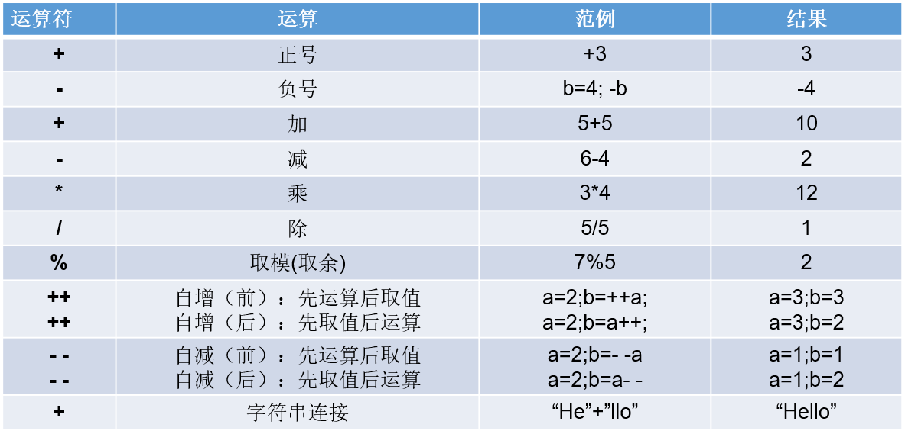

举例1：加减乘除模

```java
public class ArithmeticTest1 {
	public static void main(String[] args) {
		int a = 3;
		int b = 4;
		
		System.out.println(a + b);// 7
		System.out.println(a - b);// -1
		System.out.println(a * b);// 12
		System.out.println(a / b);// 计算机结果是0，为什么不是0.75呢？
		System.out.println(a % b);// 3
        
        //结果与被模数符号相同
        System.out.println(5%2);//1
		System.out.println(5%-2);//1
		System.out.println(-5%2);//-1
		System.out.println(-5%-2);//-1		
		//商*除数 + 余数 = 被除数
		//5%-2  ==>商是-2，余数时1    (-2)*(-2)+1 = 5
		//-5%2  ==>商是-2，余数是-1   (-2)*2+(-1) = -4-1=-5
	}
}
```

举例2：“+”号的两种用法

* 第一种：对于`+`两边都是数值的话，`+`就是加法的意思
* 第二种：对于`+`两边至少有一边是字符串的话，`+`就是拼接的意思

```java
public class ArithmeticTest2 {
	public static void main(String[] args) {
		// 字符串类型的变量基本使用
		// 数据类型 变量名称 = 数据值;
		String str1 = "Hello";
		System.out.println(str1); // Hello
		
		System.out.println("Hello" + "World"); // HelloWorld
		
		String str2 = "Java";
		// String + int --> String
		System.out.println(str2 + 520); // Java520
		// String + int + int
		// String		+ int
		// String
		System.out.println(str2 + 5 + 20); // Java520
	}
}
```

举例3：自加自减运算

理解：`++`  运算，表示`自增1`。同理，`--` 运算，表示`自减1`，用法与++ 一致。

1、单独使用

* 变量在单独运算的时候，变量`前++`和变量`后++`，是没有区别的。
* 变量`前++`   ：例如 `++a` 。
* 变量`后++`   ：例如 `a++` 。

```java
public class ArithmeticTest3 {
	public static void main(String[] args) {
		// 定义一个int类型的变量a
		int a = 3;
		//++a;
		a++;
        // 无论是变量前++还是变量后++，结果都是4
		System.out.println(a);
	}
}
```

2、复合使用

* 和`其他变量放在一起使用`或者和`输出语句放在一起使用`，`前++`和`后++`就产生了不同。

- 变量`前++` ：变量先自增1，然后再运算。
- 变量`后++` ：变量先运算，然后再自增1。

```java
public class ArithmeticTest4 {
	public static void main(String[] args) {
		// 其他变量放在一起使用
		int x = 3;
		//int y = ++x; // y的值是4，x的值是4，
		int y = x++; // y的值是3，x的值是4
		
		System.out.println(x);
		System.out.println(y);
		System.out.println("==========");
        
		// 和输出语句一起
		int z = 5;
		//System.out.println(++z);// 输出结果是6，z的值也是6
		System.out.println(z++);// 输出结果是5，z的值是6
		System.out.println(z);
        
	} 
}
```

### 赋值运算符

- 符号：= 

  - 当“=”两侧数据类型不一致时，可以使用自动类型转换或使用强制类型转换原则进行处理。
  - 支持`连续赋值`。

- 扩展赋值运算符： +=、 -=、*=、 /=、%=

  | 赋值运算符 |                           符号解释                           |
  | :--------: | :----------------------------------------------------------: |
  |    `+=`    | 将符号`左边的值`和`右边的值`进行`相加`操作，最后将结果`赋值给左边的变量` |
  |    `-=`    | 将符号`左边的值`和`右边的值`进行`相减`操作，最后将结果`赋值给左边的变量` |
  |    `*=`    | 将符号`左边的值`和`右边的值`进行`相乘`操作，最后将结果`赋值给左边的变量` |
  |    `/=`    | 将符号`左边的值`和`右边的值`进行`相除`操作，最后将结果`赋值给左边的变量` |
  |    `%=`    | 将符号`左边的值`和`右边的值`进行`取余`操作，最后将结果`赋值给左边的变量` |


```java
public class SetValueTest1 {
	public static void main(String[] args) {
		int i1 = 10;
		long l1 = i1; //自动类型转换

		byte bb1 = (byte)i1; //强制类型转换

		int i2 = i1;

		//连续赋值的测试
		//以前的写法
		int a1 = 10;
		int b1 = 10;
		
		//连续赋值的写法
		int a2,b2;
		a2 = b2 = 10;
		
		int a3 = 10,b3 = 20;

		//举例说明+=  -=  *=  /=   %=  
		int m1 = 10;
		m1 += 5; //类似于 m1 = m1 + 5的操作，但不等同于。
		System.out.println(m1);//15
		
		//练习1：开发中，如何实现一个变量+2的操作呢？
		// += 的操作不会改变变量本身的数据类型。其他拓展的运算符也如此。
		//写法1：推荐
		short s1 = 10;
		s1 += 2; //编译通过，因为在得到int类型的结果后，JVM自动完成一步强制类型转换，将int类型强转成short
		System.out.println(s1);//12
		//写法2：
		short s2 = 10;
		//s2 = s2 + 2;//编译报错，因为将int类型的结果赋值给short类型的变量s时，可能损失精度
		s2 = (short)(s2 + 2);
		System.out.println(s2);


		//练习2：开发中，如何实现一个变量+1的操作呢？
		//写法1：推荐
		int num1 = 10;
		num1++;
		System.out.println(num1);

		//写法2：
		int num2 = 10;
		num2 += 1;
		System.out.println(num2);

		//写法3：
		int num3 = 10;
		num3 = num3 + 1;
		System.out.println(num3);

	}
}
```

练习1：

```java
short s = 3; 
s = s+2;  //① 编译报错
s += 2;   //② 正常执行

//①和②有什么区别？ 
//s = s + 2; 会导致编译错误，因为 s + 2 的结果被提升为 int 类型，而不能直接赋值给 short 类型的变量。而 s += 2; 可以正常执行，因为 += 运算符在执行时会进行类型检查，确保结果可以赋值给左侧的变量。
```

练习2：

```java
int i = 1;
i *= 0.1;
System.out.println(i);//0
i++;
System.out.println(i);//1

```

练习3：

```java
int m = 2;
int n = 3;
n *= m++; 	//n = n * m++;
System.out.println("m=" + m);//3
System.out.println("n=" + n);//6

```

练习4：

```java
int n = 10;
n += (n++) + (++n);  //n = n + (n++) + (++n)
System.out.println(n);//32

```

练习5：你有几种办法实现变量值减1？变量值减2呢？

```java
public class MinusTest {
    public static void main(String[] args) {
        //练习①：变量值减1
        short s = 10;
        //方式1：
        //s = (short)(s - 1);
        //方式2：推荐
        s--; //或者 --s
        //方式3：
        s -= 1;

        //练习②：变量值减2
        short s1 = 10;
        //方式1：
        //s1 = (short)(s1 - 2);
        //方式2：推荐
        s1 -= 2;
    }
}
```

### 关系运算符


- 比较运算符的结果都是boolean型，也就是要么是true，要么是false。

- \>   <   >=  <= ：只适用于基本数据类型（除boolean类型之外）

  ==   != ：适用于基本数据类型和引用数据类型

- 比较运算符“`==`”不能误写成“`=`” 

举例：

```java
class CompareTest {
	public static void main(String[] args) {
		int i1 = 10;
		int i2 = 20;
		
		System.out.println(i1 == i2);//false
		System.out.println(i1 != i2);//true
		System.out.println(i1 >= i2);//false


		int m = 10;
		int n = 20;
		System.out.println(m == n);//false
		System.out.println(m = n);//20

		boolean b1 = false;
		boolean b2 = true;
		System.out.println(b1 == b2);//false
		System.out.println(b1 = b2);//true
	}
}
```

思考：

```java
boolean b1 = false;
//区分好==和=的区别。
if(b1 == true)  //if(b1 = true)
	System.out.println("结果为真");
else
	System.out.println("结果为假");

```

### 逻辑运算符


- 逻辑运算符，操作的都是boolean类型的变量或常量，而且运算得结果也是boolean类型的值。

- 运算符说明：
  - & 和 &&：表示"且"关系，当符号左右两边布尔值都是true时，结果才能为true。否则，为false。
  - | 和 || ：表示"或"关系，当符号两边布尔值有一边为true时，结果为true。当两边都为false时，结果为false
  - ! ：表示"非"关系，当变量布尔值为true时，结果为false。当变量布尔值为false时，结果为true。
  - ^ ：当符号左右两边布尔值不同时，结果为true。当两边布尔值相同时，结果为false。
    - 理解：`异或，追求的是“异”！`

- 逻辑运算符用于连接布尔型表达式，在Java中不可以写成 3 < x < 6，应该写成x > 3 & x < 6 。


- **区分“&”和“&&”：**

  - 相同点：如果符号左边是true，则二者都执行符号右边的操作

  - 不同点：& ： 如果符号左边是false,则继续执行符号右边的操作

  ​                     && ：如果符号左边是false,则不再继续执行符号右边的操作

  - 建议：开发中，推荐使用 && 

- **区分“|”和“||”：**


  - 相同点：如果符号左边是false，则二者都执行符号右边的操作

  - 不同点：| ： 如果符号左边是true，则继续执行符号右边的操作

    ​               || ：如果符号左边是true，则不再继续执行符号右边的操作

  - 建议：开发中，推荐使用 ||

 代码举例：

```java
public class LoginTest {
    public static void main(String[] args) {
        int a = 3;
        int b = 4;
        int c = 5;

        // & 与，且；有false则false
        System.out.println((a > b) & (a > c)); // false & false = false
        System.out.println((a > b) & (a < c)); // false & true = false
        System.out.println((a < b) & (a > c)); // true & false = false
        System.out.println((a < b) & (a < c)); // true & true = true
        System.out.println("===============");
        // | 或；有true则true
        System.out.println((a > b) | (a > c)); // false | false = false
        System.out.println((a > b) | (a < c)); // false | true = true
        System.out.println((a < b) | (a > c)); // true | false = true
        System.out.println((a < b) | (a < c)); // true | true = true
        System.out.println("===============");
        // ^ 异或；相同为false，不同为true
        System.out.println((a > b) ^ (a > c)); // false ^ false = false
        System.out.println((a > b) ^ (a < c)); // false ^ true = true
        System.out.println((a < b) ^ (a > c)); // true ^ false = true
        System.out.println((a < b) ^ (a < c)); // true ^ true = false
        System.out.println("===============");
        // ! 非；非false则true，非true则false
        System.out.println(!false); // !false = true
        System.out.println(!true); // !true = false
        
        // &和&&的区别
        System.out.println((a > b) & (a++ > c)); // false & (a++ > c) = false，a++不执行，a = 3
        System.out.println("a = " + a); // a = 3
        System.out.println((a > b) && (a++ > c)); // false && (a++ > c) = false，a++不执行，a = 3
        System.out.println("a = " + a); // a = 3
        System.out.println((a == b) && (a++ > c)); // false && (a++ > c) = false，a++不执行，a = 3
        System.out.println("a = " + a); // a = 3
        
        // |和||的区别
        System.out.println((a > b) | (a++ > c)); // false | (a++ > c) = false，a++执行，a = 4
        System.out.println("a = " + a); // a = 4
        System.out.println((a > b) || (a++ > c)); // false || (a++ > c) = true，a++执行，a = 5
        System.out.println("a = " + a); // a = 5
        System.out.println((a == b) || (a++ > c)); // false || (a++ > c) = true，a++执行，a = 6
        System.out.println("a = " + a); // a = 6
    }
}
//结果为等号后面
```

**案例：**

```
1. 定义类 CompareLogicExer
2. 定义 main方法
3. 定义一个int类型变量a,变量b,都赋值为20
4. 定义boolean类型变量bo1 , 判断++a 是否被3整除,并且a++ 是否被7整除,将结果赋值给bo1
5. 输出a的值,bo1的值
6. 定义boolean类型变量bo2 , 判断b++ 是否被3整除,并且++b 是否被7整除,将结果赋值给bo2
7. 输出b的值,bo2的值
```

```java
/**
 * @author 尚硅谷-宋红康
 * @create 12:42
 */
public class CompareLogicExer {
    public static void main(String[] args){
        int a = 20;
        int b = 20;
        boolean bo1 = ((++a % 3) == 0) && ((a++ % 7) == 0);
        System.out.println("bo1的值：" + bo1);
        System.out.println("a的值：" + a);
        System.out.println("----------------------------");
        
        boolean bo2 = ((b++ % 3) == 0) && ((++b % 7) == 0); 
        System.out.println("bo2的值：" + bo2);
        System.out.println("b的值：" + b);
    }
}
```

**练习1：**区分 & 和 && 

```java
int x = 1;
int y = 1;

if(x++ == 2 & ++y == 2){
	x = 7;
}
System.out.println("x=" + x + ",y=" + y);
//x=2,y=2
```

```java
int x = 1,y = 1;

if(x++ == 2 && ++y == 2){
	x =7;
}
System.out.println("x="+x+",y="+y);
//x=2,y=1
```

**练习2：**区分 | 和 ||

```java
int x = 1,y = 1;

if(x++==1 | ++y==1){
	x =7;
}
System.out.println("x="+x+",y="+y);
//x=7,y=2
```

```java
int x = 1,y = 1;

if(x++==1 || ++y==1){
	x =7;
}
System.out.println("x="+x+",y="+y);
//x=7,y=1
```

**练习3：**程序输出

```java
class  Test  {
	public static void main (String []  args)  {
		boolean x = true;
        boolean y = false;
        short z = 42;
        
        if ((z++ == 42) && (y = true)) {
            z++;
        }
        if ((x = false) || (++z == 45)) {
            z++;
        }

        System.out.println("z=" + z);
	}
}
```

```java
//结果为：
//z= 46
```

### 三元(条件)运算符

- 条件运算符格式：

```java
(条件表达式)? 表达式1:表达式2
```

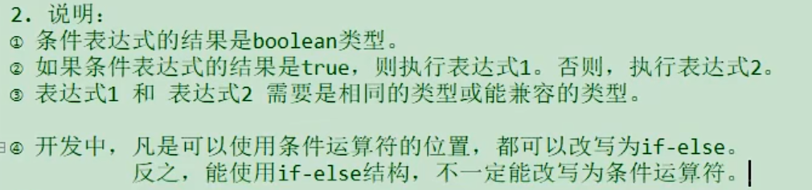

- **说明：条件表达式是boolean类型的结果，根据boolean的值选择表达式1或表达式2**

  

- 如果运算后的结果赋给新的变量，要求表达式1和表达式2为同种或兼容的类型

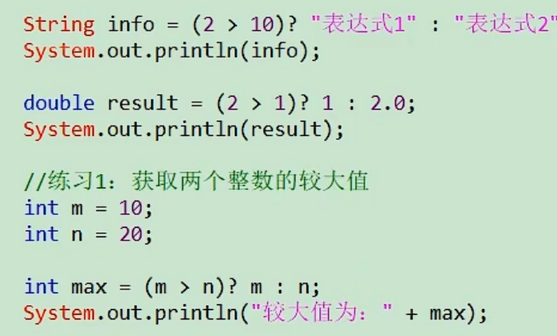

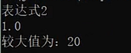

```java
public static void main(String[] args) {
    int i = (1==2 ? 100 : 200);
    System.out.println(i);//200
    
    boolean marry = false;
	System.out.println(marry ? "已婚" : "未婚"  );
    
    double d1 = (m1 > m2)? 1 : 2.0;
	System.out.println(d1);
    
    int num = 12;
    System.out.println(num > 0? true : "num非正数");
}
```

**案例1：**获取两个数中的较大值

```java
/**
 * @author 尚硅谷-宋红康
 * @create 12:40
 */
public class ConditionExer1 {
    public static void main(String[] args) {
        //获取两个数的较大值
        int m1 = 10;
        int m2 = 20;

        int max1 = (m1 > m2)? m1 : m2;
        System.out.println("m1和m2中的较大值为" + max1);
    }
}
```

**案例2：**获取三个数中的最大值

```java
/**
 * @author 尚硅谷-宋红康
 * @create 12:43
 */
public class ConditionExer2 {
    public static void main(String[] args) {
        int n1 = 23;
        int n2 = 13;
        int n3 = 33;
        //写法1：
        int tempMax = (n1 > n2)? n1:n2;
        int finalMax = (tempMax > n3)? tempMax : n3;
        System.out.println("三个数中最大值为：" + finalMax);

        //写法2：不推荐，可读性差
        int finalMax1 = (((n1 > n2)? n1:n2) > n3)? ((n1 > n2)? n1:n2) : n3;
        System.out.println("三个数中最大值为：" + finalMax1);
    }
}
```

**案例3：**今天是周2，10天以后是周几？

要求：控制台输出"今天是周2，10天以后是周x"。

```java
public class ConditionExer3 {

    public static void main(String[] args) {
        int week = 2;
        week += 10;
        week %= 7;
        System.out.println("今天是周2,10天以后是周" + (week == 0 ? "日" : week));
    }

}
```

## 分支结构

### if-else

**结构1：单分支条件判断：if**

`格式：`

```java
if(条件表达式)｛
  	语句块;
｝
```

`说明：`条件表达式必须是布尔表达式（关系表达式或逻辑表达式）或 布尔变量。

`执行流程：`

1. 首先判断条件表达式看其结果是true还是false
2. 如果是true就执行语句块
3. 如果是false就不执行语句块


**结构2：双分支条件判断：if...else**

`格式：`

```java
if(条件表达式) { 
  	语句块1;
}else {
  	语句块2;
}
```

`执行流程：`

1. 首先判断条件表达式看其结果是true还是false
2. 如果是true就执行语句块1
3. 如果是false就执行语句块2


**结构3：多分支条件判断：if...else if...else**

`格式：`

```java
if (条件表达式1) {
  	语句块1;
} else if (条件表达式2) {
  	语句块2;
}
...
}else if (条件表达式n) {
 	语句块n;
} else {
  	语句块n+1;
}
```

`说明：`一旦条件表达式为true，则进入执行相应的语句块。执行完对应的语句块之后，就跳出当前结构。

`执行流程：`

1. 首先判断关系表达式1看其结果是true还是false
2. 如果是true就执行语句块1，然后结束当前多分支
3. 如果是false就继续判断关系表达式2看其结果是true还是false
4. 如果是true就执行语句块2，然后结束当前多分支
5. 如果是false就继续判断关系表达式…看其结果是true还是false

​    …

   n.  如果没有任何关系表达式为true，就执行语句块n+1，然后结束当前多分支。


#### 应用举例

**案例1：**成年人心率的正常范围是每分钟60-100次。体检时，如果心率不在此范围内，则提示需要做进一步的检查。

```java
public class IfElseTest1 {
    public static void main(String[] args){
        int heartBeats = 89;

        if(heartBeats < 60 || heartBeats > 100){
            System.out.println("你需要做进一步的检查");
        }

        System.out.println("体检结束");
    }
}
```

**案例2：**定义一个整数，判定是偶数还是奇数    

```java
public class IfElseTest2 {
    public static void main(String[] args){
        int a = 10;

        if(a % 2 == 0) {
            System.out.println(a + "是偶数");
        } else{
            System.out.println(a + "是奇数");
        }
    }
}
```

**案例3：**

```
岳小鹏参加Java考试，他和父亲岳不群达成承诺：
如果：
成绩为100分时，奖励一辆跑车；
成绩为(80，99]时，奖励一辆山地自行车；
当成绩为[60,80]时，奖励环球影城一日游；
其它时，胖揍一顿。

说明：默认成绩是在[0,100]范围内
```

```java
public class IfElseTest3 {
    public static void main(String[] args) {

        int score = 67;//岳小鹏的期末成绩
        //写法一：默认成绩范围为[0,100]
        if(score == 100){
            System.out.println("奖励一辆跑车");
        }else if(score > 80 && score <= 99){    //错误的写法：}else if(80 < score <= 99){
            System.out.println("奖励一辆山地自行车");
        }else if(score >= 60 && score <= 80){
            System.out.println("奖励环球影城玩一日游");
        }
        //else{
        //	System.out.println("胖揍一顿");
        //}


        //写法二：
        // 默认成绩范围为[0,100]
        if(score == 100){
            System.out.println("奖励一辆跑车");
        }else if(score > 80){
            System.out.println("奖励一辆山地自行车");
        }else if(score >= 60){
            System.out.println("奖励环球影城玩一日游");
        }else{
            System.out.println("胖揍一顿");
        }
    }
}
```


> 当条件表达式之间是“`互斥`”关系时（即彼此没有交集），条件判断语句及执行语句间顺序无所谓。
>
> 当条件表达式之间是“`包含`”关系时，“`小上大下 / 子上父下`”，否则范围小的条件表达式将不可能被执行。

#### if...else嵌套

在 if 的语句块中，或者是在else语句块中，又包含了另外一个条件判断（可以是单分支、双分支、多分支），就构成了`嵌套结构`。

**执行的特点：**
（1）如果是嵌套在if语句块中的，只有当外部的if条件满足，才会去判断内部的条件
（2）如果是嵌套在else语句块中的，只有当外部的if条件不满足，进入else后，才会去判断内部的条件

**案例4：**由键盘输入三个整数分别存入变量num1、num2、num3，对它们进行排序(使用 if-else if-else)，并且从小到大输出。

```java
class IfElseTest4 {
	public static void main(String[] args) {
		
			//声明num1,num2,num3三个变量并赋值
			int num1 = 23,num2 = 32,num3 = 12;

			if(num1 >= num2){
				
				if(num3 >= num1)
					System.out.println(num2 + "-" + num1 + "-" + num3);
				else if(num3 <= num2)
					System.out.println(num3 + "-" + num2 + "-" + num1);
				else
					System.out.println(num2 + "-" + num3 + "-" + num1);
			}else{ //num1 < num2
				
				if(num3 >= num2){
					System.out.println(num1 + "-" + num2 + "-" + num3);
				}else if(num3 <= num1){
					System.out.println(num3 + "-" + num1 + "-" + num2);
				}else{
					System.out.println(num1 + "-" + num3 + "-" + num2);
				}
			}
	}
}
```

#### 注意

- 语句块只有一条执行语句时，一对`{}可以省略`，但建议保留
- 当if-else结构是“多选一”时，最后的`else是可选的`，根据需要可以省略

#### 练习

**练习1：**

```java
//1)对下列代码，若有输出，指出输出结果。
int x = 4;
int y = 1;
if (x > 2) {
       if (y > 2) 
            System.out.println(x + y);
       		System.out.println("atguigu");
} else
       System.out.println("x is " + x);


```

**练习2：**

```java
boolean b = true;
//如果写成if(b=false)能编译通过吗？如果能，结果是？
if(b == false) 	 //建议：if(!b)
	System.out.println("a");
else if(b)
	System.out.println("b");
else if(!b)
	System.out.println("c");
else
	System.out.println("d");
```

**练习3：**

定义两个整数，分别为small 和 big，如果第一个整数small大于第二个整数big，就交换。输出显示small和big变量的值。

```java
public class IfElseExer3 {
    public static void main(String[] args) {
        int small = 10;
        int big = 9;

        if (small > big) {
            int temp = small;
            small = big;
            big = temp;
        }
        System.out.println("small=" + small + ",big=" + big);
    }
}
```

**练习4：**小明参加期末Java考试，通过考试成绩，判断其Java等级，成绩范围[0,100]

- 90-100      优秀
- 80-89        好
- 70-79        良
- 60-69        及格
- 60以下    不及格

```java
import java.util.Scanner;
//写法一：
public class IfElseExer4 {
    public static void main(String[] args) {
        System.out.print("小明的期末Java成绩是：[0,100]");
        int score = 89;

        if (score < 0 || score > 100) {
            System.out.println("你的成绩是错误的");
        } else if (score >= 90 && score <= 100) {
            System.out.println("你的成绩属于优秀");
        } else if (score >= 80 && score < 90) {
            System.out.println("你的成绩属于好");
        } else if (score >= 70 && score < 80) {
            System.out.println("你的成绩属于良");
        } else if (score >= 60 && score < 70) {
            System.out.println("你的成绩属于及格");
        } else {
            System.out.println("你的成绩属于不及格");
        }
    }
}

```

```java
import java.util.Scanner;
//写法二：
public class IfElseExer4 {
    public static void main(String[] args) {
        System.out.print("小明的期末Java成绩是：[0,100]");
        int score = 89;

        if (score < 0 || score > 100) {
            System.out.println("你的成绩是错误的");
        } else if (score >= 90) {
            System.out.println("你的成绩属于优秀");
        } else if (score >= 80) {
            System.out.println("你的成绩属于好");
        } else if (score >= 70) {
            System.out.println("你的成绩属于良");
        } else if (score >= 60) {
            System.out.println("你的成绩属于及格");
        } else {
            System.out.println("你的成绩属于不及格");
        }

    }
}

```

**练习5：**

```
编写程序，声明2个int型变量并赋值。判断两数之和，如果大于等于50，打印“hello world!”
```

```java
public class IfElseExer5 {

    public static void main(String[] args) {
        int num1 = 12, num2 = 32;
        
        if (num1 + num2 >= 50) {
            System.out.println("hello world!");
        }
    }
}
```

**练习6：**

```
编写程序，声明2个double型变量并赋值。判断第一个数大于10.0，且第2个数小于20.0，打印两数之和。否则，打印两数的乘积。
```

```java
public class IfElseExer6 {

    public static void main(String[] args) {
        double d1 = 21.2,d2 = 12.3;
        
        if(d1 > 10.0 && d2 < 20.0){
            System.out.println("两数之和为：" + (d1 + d2));
        }else{
            System.out.println("两数乘积为：" + (d1 * d2));
        }
    }

}
```

**练习7：判断水的温度**

```
如果大于95℃，则打印“开水”；

如果大于70℃且小于等于95℃，则打印“热水”；

如果大于40℃且小于等于70℃，则打印“温水”；

如果小于等于40℃，则打印“凉水”。
```

```java
public class IfElseExer7 {

    public static void main(String[] args) {
        int waterTemperature = 85;
        
        if(waterTemperature > 95){
            System.out.println("开水");
        }else if(waterTemperature > 70 && waterTemperature <= 95){
            System.out.println("热水");
        }else if(waterTemperature > 40 && waterTemperature <= 70){
            System.out.println("温水");
        }else{
            System.out.println("凉水");
        }
    }

}
```

## java输入语句

next():只读取输入直到空格。它不能读两个由空格或符号隔开的单词。此外，next()在读取输入后将光标放在同一行中。(next()只读空格之前的数据,并且光标指向本行)

nextLine():读取输入，包括单词之间的空格和除回车以外的所有符号(即。它读到行尾)。读取输入后，nextLine()将光标定位在下一行。

类型一:

```java
public class Text {
	public static void main(String []args) {
		Scanner input = new Scanner(System.in);
		System.out.println("请输入一个字符串(中间能加空格或符号)");
		String a = input.nextLine();
		System.out.println("请输入一个字符串(中间不能加空格或符号)");
		String b = input.next();
		System.out.println("请输入一个整数");
		int c;
		c = input.nextInt();
		System.out.println("请输入一个double类型的小数");
		double d = input.nextDouble();
		System.out.println("请输入一个float类型的小数");
		float f = input.nextFloat();
		System.out.println("按顺序输出abcdf的值：");
		System.out.println(a);
		System.out.println(b);
		System.out.println(c);
		System.out.println(d);
		System.out.println(f);
	}
}
```

运行结果：

```java
请输入一个字符串(中间能加空格或符号)
我爱祖国！
请输入一个字符串(中间不能加空格或符号)
ILoveChina
请输入一个整数
520
请输入一个double类型的小数
12.26e3
请输入一个float类型的小数
3.1415926
按顺序输出abcdf的值：
我爱祖国！
ILoveChina
520
12260.0
3.1415925
```

---

类型二:

```java
public class inputInformation {
	public static void main(String args[]) {
		Scanner scan = new Scanner(System.in);	//构造Scanner类的对象scan，接收从控制台输入的信息
		System.out.println("请输入你的姓名");
		String name = scan.nextLine();//接收一个字符串，可以加除Enter以外的所有符号，包括空格和Tab
		System.out.println("请输入你的ID");
		String ID ;
		while(scan.hasNextLine()) {// hasNextLine()方法判断当前是否有输入，当键盘有输入后执行循环
			if(scan.hasNextInt()) {// 判断输入的值是否为整数类型，当为整数类型时执行循环
				ID = scan.nextLine();
				System.out.println("你输入的姓名为："+name);
				System.out.println("你输入的ID为："+ID);
				break;
			}else {
				System.out.println("请输入数字哦！");
				ID = scan.nextLine();
				continue;
			}
		}
	}
}
```

运行结果如下：

```java
请输入你的姓名
西地那非
请输入你的ID
q764323221
请输入数字哦！
764323221

```

## java获取随机数

如何产生一个指定范围的随机整数？

1、Math类的random()的调用，会返回一个[0,1)范围的一个double型值

2、Math.random() * 100  --->  [0,100)
      (int)(Math.random() * 100)	---> [0,99]
      (int)(Math.random() * 100) + 5  ----> [5,104]

3、如何获取`[a,b]`范围内的随机整数呢？`(int)(Math.random() * (b - a + 1)) + a`

4、举例

```java
class MathRandomTest {
	public static void main(String[] args) {
		double value = Math.random();
		System.out.println(value);

		//[1,6]
		int number = (int)(Math.random() * 6) + 1; //
		System.out.println(number);
	}
}

```

---

### switch-case

**语法格式：**

```java
switch(表达式){
    case 常量值1:
        语句块1;
        //break;
    case 常量值2:
        语句块2;
        //break; 
    // ...
   [default:
        语句块n+1;
        break;
   ]
}
```

**执行流程图：**


**执行过程：**

第1步：根据switch中表达式的值，依次匹配各个case。如果表达式的值等于某个case中的常量值，则执行对应case中的执行语句。

第2步：执行完此case的执行语句以后，
​              情况1：如果遇到break,则执行break并跳出当前的switch-case结构
​		        情况2：如果没有遇到break，则会继续执行当前case之后的其它case中的执行语句。--->case穿透
​		         ...
​		        直到遇到break关键字或执行完所有的case及default的执行语句，跳出当前的switch-case结构

**使用注意点：**

- switch(表达式)中表达式的值必须是下述几种类型之一：byte，short，char，int，枚举 (jdk 5.0)，String (jdk 7.0)；

- case子句中的值必须是常量，不能是变量名或不确定的表达式值或范围；

- 同一个switch语句，所有case子句中的常量值互不相同；

- break语句用来在执行完一个case分支后使程序跳出switch语句块；

  如果没有break，程序会顺序执行到switch结尾；

- default子句是可选的。同时，位置也是灵活的。当没有匹配的case时，执行default语句。

#### 应用举例

**案例1：**

```java
public class SwitchCaseTest1 {
    public static void main(String args[]) {
        int num = 1;
		switch(num){
			case 0:
				System.out.println("zero");
				break;
			case 1:
				System.out.println("one");
				break;
			case 2:
				System.out.println("two");
				break;
			case 3:
				System.out.println("three");
				break;
			default:
				System.out.println("other");
				//break;
		}
    }
}
```

**案例2：**

```java
public class SwitchCaseTest2 {
    public static void main(String args[]) {
        String season = "summer";
        switch (season) {
            case "spring":
                System.out.println("春暖花开");
                break;
            case "summer":
                System.out.println("夏日炎炎");
                break;
            case "autumn":
                System.out.println("秋高气爽");
                break;
            case "winter":
                System.out.println("冬雪皑皑");
                break;
            default:
                System.out.println("季节输入有误");
                break;
        }
    }
}
```

错误举例：

```java
int key = 10;
switch(key){
	case key > 0 :
        System.out.println("正数");
        break;
    case key < 0:
        System.out.println("负数");
        break;
    default:
        System.out.println("零");
        break;
}
```

**案例3：**使用switch-case实现：对学生成绩大于60分的，输出“合格”。低于60分的，输出“不合格”。

```java
class SwitchCaseTest3 {
	public static void main(String[] args) {
		
		int score = 67;
		/*
		写法1：极不推荐
		switch(score){
			case 0:
				System.out.println("不及格");
				break;
			case 1:
				System.out.println("不及格");
				break;
			//...

			case 60:
				System.out.println("及格");
				break;
			//...略...
		
		}
		*/

		//写法2：
		switch(score / 10){
			case 0:
			case 1:
			case 2:
			case 3:
			case 4:
			case 5:
				System.out.println("不及格");
				break;
			case 6:
			case 7:
			case 8:
			case 9:
			case 10:
				System.out.println("及格");
				break;
			default:
				System.out.println("输入的成绩有误");
				break;
		}

		//写法3：
		switch(score / 60){
			case 0:
				System.out.println("不及格");
				break;
			case 1:
				System.out.println("及格");
				break;
			default:
				System.out.println("输入的成绩有误");
				break;
		}
	}
}
```

#### 利用case的穿透性

在switch语句中，如果case的后面不写break，将出现穿透现象，也就是一旦匹配成功，不会在判断下一个case的值，直接向后运行，直到遇到break或者整个switch语句结束，执行终止。

**案例4：**编写程序：从键盘上输入2023年的“month”和“day”，要求通过程序输出输入的日期为2023年的第几天。

```java
import java.util.Scanner;

class SwitchCaseTest4 {
	public static void main(String[] args) {
		
		Scanner scan = new Scanner(System.in);

		System.out.println("请输入2023年的month:");
		int month = scan.nextInt();

		System.out.println("请输入2023年的day:");
		int day = scan.nextInt();

		//这里就不针对month和day进行合法性的判断了，以后可以使用正则表达式进行校验。

		int sumDays = 0;//记录总天数
		
		//写法1 ：不推荐（存在冗余的数据）
		/*
		switch(month){
			case 1:
				sumDays = day;
				break;
			case 2:
				sumDays = 31 + day;
				break;
			case 3:
				sumDays = 31 + 28 + day;
				break;
			//....
		
			case 12:
				//sumDays = 31 + 28 + ... + 30 + day;
				break;
		}
		*/

		//写法2：推荐
		switch(month){
			case 12:
				sumDays += 30;//这个30是代表11月份的满月天数
			case 11:
				sumDays += 31;//这个31是代表10月份的满月天数
			case 10:
				sumDays += 30;//这个30是代表9月份的满月天数
			case 9:
				sumDays += 31;//这个31是代表8月份的满月天数
			case 8:
				sumDays += 31;//这个31是代表7月份的满月天数
			case 7:
				sumDays += 30;//这个30是代表6月份的满月天数
			case 6:
				sumDays += 31;//这个31是代表5月份的满月天数
			case 5:
				sumDays += 30;//这个30是代表4月份的满月天数
			case 4:
				sumDays += 31;//这个31是代表3月份的满月天数
			case 3:
				sumDays += 28;//这个28是代表2月份的满月天数
			case 2:
				sumDays += 31;//这个31是代表1月份的满月天数
			case 1:
				sumDays += day;//这个day是代表当月的第几天
		}
		
		System.out.println(month + "月" + day + "日是2023年的第" + sumDays + "天");
        //关闭资源
		scan.close();
	}
}
```

**拓展：**

```
从键盘分别输入年、月、日，判断这一天是当年的第几天
 
注：判断一年是否是闰年的标准：
   1）可以被4整除，但不可被100整除
	  或
   2）可以被400整除
   
例如：1900，2200等能被4整除，但同时能被100整除，但不能被400整除，不是闰年
```

```java
import java.util.Scanner;

public class SwitchCaseTest04 {

    public static void main(String[] args) {

        Scanner scanner = new Scanner(System.in);
        System.out.print("请输入year:");
        int year = scanner.nextInt();

        System.out.print("请输入month:");
        int month = scanner.nextInt();

        System.out.print("请输入day:");
        int day = scanner.nextInt();

        //判断这一天是当年的第几天==>从1月1日开始，累加到xx月xx日这一天
        //(1)[1,month-1]个月满月天数
        //(2)单独考虑2月份是否是29天（依据是看year是否是闰年）
        //(3)第month个月的day天

        //声明一个变量days，用来存储总天数
        int sumDays = 0;

        //累加[1,month-1]个月满月天数
        switch (month) {
            case 12:
                //累加的1-11月
                sumDays += 30;//这个30是代表11月份的满月天数
                //这里没有break，继续往下走
            case 11:
                //累加的1-10月
                sumDays += 31;//这个31是代表10月的满月天数
                //这里没有break，继续往下走
            case 10:
                sumDays += 30;//9月
            case 9:
                sumDays += 31;//8月
            case 8:
                sumDays += 31;//7月
            case 7:
                sumDays += 30;//6月
            case 6:
                sumDays += 31;//5月
            case 5:
                sumDays += 30;//4月
            case 4:
                sumDays += 31;//3月
            case 3:
                sumDays += 28;//2月
                //在这里考虑是否可能是29天
                if (year % 4 == 0 && year % 100 != 0 || year % 400 == 0) {
                    sumDays++;//多加1天
                }
            case 2:
                sumDays += 31;//1月
            case 1:
                sumDays += day;//第month月的day天
        }

        //输出结果
        System.out.println(year + "年" + month + "月" + day + "日是这一年的第" + sumDays + "天");

        scanner.close();
    }
}
```

**案例5：**根据指定的月份输出对应季节

```java
import java.util.Scanner;

/*
 * 需求：指定一个月份，输出该月份对应的季节。一年有四季:
 * 		3,4,5	春季
 * 		6,7,8	夏季
 * 		9,10,11	秋季
 * 		12,1,2	冬季
 */
public class SwitchCaseTest5 {
    public static void main(String[] args) {
        Scanner input = new Scanner(System.in);
        System.out.print("请输入月份：");
        int month = input.nextInt();

        /*
		switch(month) {
            case 1:
                System.out.println("冬季");
                break;
            case 2:
                System.out.println("冬季");
                break;
            case 3:
                System.out.println("春季");
                break;
            case 4:
                System.out.println("春季");
                break;
            case 5:
                System.out.println("春季");
                break;
            case 6:
                System.out.println("夏季");
                break;
            case 7:
                System.out.println("夏季");
                break;
            case 8:
                System.out.println("夏季");
                break;
            case 9:
                System.out.println("秋季");
                break;
            case 10:
                System.out.println("秋季");
                break;
            case 11:
                System.out.println("秋季");
                break;
            case 12:
                System.out.println("冬季");
                break;
            default:
                System.out.println("你输入的月份有误");
                break;
		}
		*/

        // 改进版
        switch(month) {
            case 1:
            case 2:
            case 12:
                System.out.println("冬季");
                break;
            case 3:
            case 4:
            case 5:
                System.out.println("春季");
                break;
            case 6:
            case 7:
            case 8:
                System.out.println("夏季");
                break;
            case 9:
            case 10:
            case 11:
                System.out.println("秋季");
                break;
            default:
                System.out.println("你输入的月份有误");
                break;
        }

        input.close();
    }
}

```

常见错误实现：

```java
switch(month){
    case 3|4|5://3|4|5 用了位运算符，11 | 100 | 101结果是 111是7
        System.out.println("春季");
        break;
    case 6|7|8://6|7|8用了位运算符，110 | 111 | 1000结果是1111是15
        System.out.println("夏季");
        break;
    case 9|10|11://9|10|11用了位运算符，1001 | 1010 | 1011结果是1011是11
        System.out.println("秋季");
        break;
    case 12|1|2://12|1|2 用了位运算符，1100 | 1 | 10 结果是1111，是15
        System.out.println("冬季");
        break;
    default:
        System.out.println("输入有误");
}
```

使用if-else实现：

```java
if ((month == 1) || (month == 2) || (month == 12)) {
    System.out.println("冬季");
} else if ((month == 3) || (month == 4) || (month == 5)) {
    System.out.println("春季");
} else if ((month == 6) || (month == 7) || (month == 8)) {
    System.out.println("夏季");
} else if ((month == 9) || (month == 10) || (month == 11)) {
    System.out.println("秋季");
} else {
    System.out.println("你输入的月份有误");
}
```

#### if-else语句与switch-case语句比较

- 结论：凡是使用switch-case的结构都可以转换为if-else结构。反之，不成立。

- 开发经验：如果既可以使用switch-case，又可以使用if-else，建议使用switch-case。因为效率稍高。

- 细节对比：

  - if-else语句优势
    - if语句的条件是一个布尔类型值，if条件表达式为true则进入分支，可以用于范围的判断，也可以用于等值的判断，`使用范围更广`。
    - switch语句的条件是一个常量值（byte,short,int,char,枚举,String），只能判断某个变量或表达式的结果是否等于某个常量值，`使用场景较狭窄`。
  - switch语句优势
    - 当条件是判断某个变量或表达式是否等于某个固定的常量值时，使用if和switch都可以，习惯上使用switch更多。因为`效率稍高`。当条件是区间范围的判断时，只能使用if语句。
    - 使用switch可以利用`穿透性`，同时执行多个分支，而if...else没有穿透性。

- **案例：只能使用 if-else**

  从键盘输入一个整数，判断是正数、负数、还是零。

```java
import java.util.Scanner;

public class IfOrSwitchDemo {
    public static void main(String[] args) {
        Scanner input = new Scanner(System.in);

        System.out.print("请输入整数：");
        int num = input.nextInt();

        if (num > 0) {
            System.out.println(num + "是正整数");
        } else if (num < 0) {
            System.out.println(num + "是负整数");
        } else {
            System.out.println(num + "是零");
        }

        input.close();
    }
}
```

#### 练习

**练习1：**从键盘输入星期的整数值，输出星期的英文单词

```java
import java.util.Scanner;

public class SwitchCaseExer1 {
    public static void main(String[] args) {
        //定义指定的星期
        Scanner input = new Scanner(System.in);
        System.out.print("请输入星期值：");
        int weekday = input.nextInt();

        //switch语句实现选择
        switch(weekday) {
            case 1:
                System.out.println("Monday");
                break;
            case 2:
                System.out.println("Tuesday");
                break;
            case 3:
                System.out.println("Wednesday");
                break;
            case 4:
                System.out.println("Thursday");
                break;
            case 5:
                System.out.println("Friday");
                break;
            case 6:
                System.out.println("Saturday");
                break;
            case 7:
                System.out.println("Sunday");
                break;
            default:
                System.out.println("你输入的星期值有误！");
                break;
        }

        input.close();
    }
}
```

**练习2：**

```java
使用 switch 把小写类型的 char型转为大写。只转换 a, b, c, d, e. 其它的输出 “other”。
```

```java
public class SwitchCaseExer2 {

    public static void main(String[] args) {

        char word = 'c';
        switch (word) {
            case 'a':
                System.out.println("A");
                break;
            case 'b':
                System.out.println("B");
                break;
            case 'c':
                System.out.println("C");
                break;
            case 'd':
                System.out.println("D");
                break;
            case 'e':
                System.out.println("E");
                break;
            default :
                System.out.println("other");
        }
    }
}
```

**练习3：**

```
编写程序：从键盘上读入一个学生成绩，存放在变量score中，根据score的值输出其对应的成绩等级：

score>=90           等级:  A
70<=score<90        等级:  B    
60<=score<70        等级:  C
score<60            等级:  D

方式一：使用if-else
方式二：使用switch-case:  score / 10:   0 - 10

```

```java
public class SwitchCaseExer3 {

    public static void main(String[] args) {

        Scanner scan = new Scanner(System.in);
        System.out.println("请输入学生成绩：");
        int score = scan.nextInt();

        char grade;//记录学生等级
        //方式1：
//        if(score >= 90){
//            grade = 'A';
//        }else if(score >= 70 && score < 90){
//            grade = 'B';
//        }else if(score >= 60 && score < 70){
//            grade = 'C';
//        }else{
//            grade = 'D';
//        }

        //方式2：
        switch(score / 10){
            case 10:
            case 9:
                grade = 'A';
                break;
            case 8:
            case 7:
                grade = 'B';
                break;
            case 6:
                grade = 'C';
                break;
            default :
                grade = 'D';
        }

        System.out.println("学生成绩为" + score + ",对应的等级为" + grade);

        scan.close();
    }
}
```

**练习4：**

```
编写一个程序，为一个给定的年份找出其对应的中国生肖。中国的生肖基于12年一个周期，每年用一个动物代表：rat、ox、tiger、rabbit、dragon、snake、horse、sheep、monkey、rooster、dog、pig。

提示：2022年：虎   2022 % 12 == 6 

```

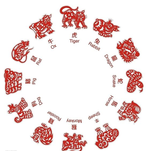

```java
/**
 * @author 尚硅谷-宋红康
 * @create 18:55
 */
public class SwitchCaseExer4 {
    public static void main(String[] args){
        //从键盘输入一个年份
        Scanner input = new Scanner(System.in);
        System.out.print("请输入年份：");
        int year = input.nextInt();
        input.close();

        //判断
        switch(year % 12){
            case 0:
                System.out.println(year + "是猴年");
                break;
            case 1:
                System.out.println(year + "是鸡年");
                break;
            case 2:
                System.out.println(year + "是狗年");
                break;
            case 3:
                System.out.println(year + "是猪年");
                break;
            case 4:
                System.out.println(year + "是鼠年");
                break;
            case 5:
                System.out.println(year + "是牛年");
                break;
            case 6:
                System.out.println(year + "是虎年");
                break;
            case 7:
                System.out.println(year + "是兔年");
                break;
            case 8:
                System.out.println(year + "是龙年");
                break;
            case 9:
                System.out.println(year + "是蛇年");
                break;
            case 10:
                System.out.println(year + "是马年");
                break;
            case 11:
                System.out.println(year + "是羊年");
                break;
            default:
                System.out.println(year + "输入错误");
        }
    }
}
```

**练习5：押宝游戏**

```
随机产生3个1-6的整数，如果三个数相等，那么称为“豹子”，如果三个数之和大于9，称为“大”，如果三个数之和小于等于9，称为“小”，用户从键盘输入押的是“豹子”、“大”、“小”，并判断是否猜对了

提示：随机数  Math.random()产生 [0,1)范围内的小数
     如何获取[a,b]范围内的随机整数呢？(int)(Math.random() * (b - a + 1)) + a
```


```java
import java.util.Scanner;

public class SwitchCaseExer5 {
    public static void main(String[] args) {
        //1、随机产生3个1-6的整数
        int a = (int)(Math.random()*6 + 1);
        int b = (int)(Math.random()*6 + 1);
        int c = (int)(Math.random()*6 + 1);

        //2、押宝
        Scanner input = new Scanner(System.in);
        System.out.print("请押宝（豹子、大、小）：");
        String ya = input.next();
        input.close();

        //3、判断结果
        boolean result = false;
        //switch支持String类型
        switch (ya){
            case "豹子": result = a == b && b == c; break;
            case "大": result = a + b + c > 9; break;
            case "小": result = a + b + c <= 9; break;
            default:System.out.println("输入有误！");
        }

        System.out.println("a,b,c分别是：" + a +"," + b +"," + c );
        System.out.println(result ? "猜中了" : "猜错了");
    }
}
```

**练习6：**

```java
使用switch语句改写下列if语句：

int a = 3;
int x = 100;
if(a==1)
	x+=5;
else if(a==2)
	x+=10;
else if(a==3)
	x+=16;
else
	x+=34;
```

```java
int a = 3;
int x = 100;

switch(a){
    case 1:
        x += 5;
        break;
    case 2:
        x += 10;
        break;
    case 3:
        x += 16;
        break;
    default :
        x += 34;

}
```

## 

## 循环结构

### for 

#### **语法格式：**


```java
for (①初始化部分; ②循环条件部分; ④迭代部分)｛
         	③循环体部分;
｝
```

**执行过程：**①-②-③-④-②-③-④-②-③-④-.....-②

**图示：**


**说明：**

- for(;;)中的两个；不能多也不能少
- ①初始化部分可以声明多个变量，但必须是同一个类型，用逗号分隔
- ②循环条件部分为boolean类型表达式，当值为false时，退出循环
- ④可以有多个变量更新，用逗号分隔

**案例1：使用for循环重复执行某些语句**

题目：输出5行HelloWorld

```java
public class ForTest1 {
    public static void main(String[] args) {
        //需求1：控制台输出5行Hello World!
		//写法1：
		//System.out.println("Hello World!");
		//System.out.println("Hello World!");
		//System.out.println("Hello World!");
		//System.out.println("Hello World!");
		//System.out.println("Hello World!");

		//写法2：
		for(int i = 1;i <= 5;i++){
			System.out.println("Hello World!");
		}
    }
}
```

**案例2：格式的多样性**

题目：写出输出的结果

```java
public class ForTest2 {
	public static void main(String[] args) {
        int num = 1;
        for(System.out.print("a");num < 3;System.out.print("c"),num++){
            System.out.print("b");

        }
    }
}
```

**案例3：累加的思想**

题目：遍历1-100以内的偶数，并获取偶数的个数，获取所有的偶数的和

```java
public class ForTest3 {
	public static void main(String[] args) {
        int count = 0;//记录偶数的个数
        int sum = 0;//记录偶数的和

        for(int i = 1;i <= 100;i++){

            if(i % 2 == 0){
                System.out.println(i);
                count++;
                sum += i;
            }	

            //System.out.println("偶数的个数为：" + count);
        }

        System.out.println("偶数的个数为：" + count);	
        System.out.println("偶数的总和为：" + sum);
    }
}
```

**案例4：结合分支结构使用**

题目：输出所有的水仙花数，所谓水仙花数是指一个3位数，其各个位上数字立方和等于其本身。例如： `153 = 1*1*1 + 3*3*3 + 5*5*5`

```java
public class ForTest4 {
	public static void main(String[] args) {
		//定义统计变量，初始化值是0
		int count = 0;
		
		//获取三位数，用for循环实现
		for(int x = 100; x < 1000; x++) {
			//获取三位数的个位，十位，百位
			int ge = x % 10;
			int shi = x / 10 % 10;
			int bai = x / 100;
			
			//判断这个三位数是否是水仙花数，如果是，统计变量++
			if((ge*ge*ge+shi*shi*shi+bai*bai*bai) == x) {
                System.out.println("水仙花数：" + x);
				count++;
			}
		}
		
		//输出统计结果就可以了
		System.out.println("水仙花数共有"+count+"个");
	}
}
```

拓展：

```
打印出四位数字中“个位+百位”等于“十位+千位”并且个位数为偶数，千位数为奇数的数字，并打印符合条件的数字的个数。
```

**案例5：结合break的使用**

说明：输入两个正整数m和n，求其最大公约数和最小公倍数。

比如：12和20的最大公约数是4，最小公倍数是60。

```java
/**
 * @author 尚硅谷-宋红康
 * @create 17:43
 */
public class ForTest5 {
    public static void main(String[] args) {
        //需求1：最大公约数
        int m = 12, n = 20;
        //取出两个数中的较小值
        int min = (m < n) ? m : n;

        for (int i = min; i >= 1; i--) {//for(int i = 1;i <= min;i++){

            if (m % i == 0 && n % i == 0) {
                System.out.println("最大公约数是：" + i); //公约数

                break; //跳出当前循环结构
            }
        }


        //需求2：最小公倍数
        //取出两个数中的较大值
        int max = (m > n) ? m : n;

        for (int i = max; i <= m * n; i++) {

            if (i % m == 0 && i % n == 0) {

                System.out.println("最小公倍数是：" + i);//公倍数

                break;
            }
        }

    }
}
```

> 说明：
>
> 1、我们可以在循环中使用break。一旦执行break，就跳出当前循环结构。
>
> 2、小结：如何结束一个循环结构？
>
> ​      结束情况1：循环结构中的循环条件部分返回false
>
> ​      结束情况2：循环结构中执行了break。
>
> 3、如果一个循环结构不能结束，那就是一个死循环！我们开发中要避免出现死循环。

#### 练习

**练习1：**打印1~100之间所有奇数的和

```java
public class ForExer1 {

    public static void main(String[] args) {

        int sum = 0;//记录奇数的和
        for (int i = 1; i < 100; i++) {
            if(i % 2 != 0){
                sum += i;
            }
        }
        System.out.println("奇数总和为：" + sum);
    }
}
```

**练习2：**打印1~100之间所有是7的倍数的整数的个数及总和（体会设置计数器的思想）

```java
public class ForExer2 {

    public static void main(String[] args) {

        int sum = 0;//记录总和
        int count = 0;//记录个数
        for (int i = 1; i < 100; i++) {
            if(i % 7 == 0){
                sum += i;
                count++;
            }
        }
        System.out.println("1~100之间所有是7的倍数的整数的和为：" + sum);
        System.out.println("1~100之间所有是7的倍数的整数的个数为：" + count);
    }
}
```

**练习3：**

编写程序从1循环到150，并在每行打印一个值，另外在每个3的倍数行上打印出“foo”,在每个5的倍数行上打印“biz”,在每个7的倍数行上打印输出“baz”。


```java
public class ForExer3 {

    public static void main(String[] args) {

        for (int i = 1; i < 150; i++) {
            System.out.print(i + "\t");
            if(i % 3 == 0){
                System.out.print("foo\t");
            }
            if(i % 5 == 0){
                System.out.print("biz\t");
            }
            if(i % 7 == 0){
                System.out.print("baz\t");
            }

            System.out.println();
        }
    }
}
```

### while

**语法格式：**

```java
①初始化部分
while(②循环条件部分)｛
    ③循环体部分;
    ④迭代部分;
}
```

**执行过程：**①-②-③-④-②-③-④-②-③-④-...-②

**图示：**


**说明：**

- while(循环条件)中循环条件必须是boolean类型。
- 注意不要忘记声明④迭代部分。否则，循环将不能结束，变成死循环。
- for循环和while循环可以相互转换。二者没有性能上的差别。实际开发中，根据具体结构的情况，选择哪个格式更合适、美观。
- for循环与while循环的区别：初始化条件部分的作用域不同。

#### 应用举例

**案例1：**输出5行HelloWorld!

```java
class WhileTest1 {
	public static void main(String[] args) {
		
		int i = 1;
		while(i <= 5){
			System.out.println("Hello World!");
			i++;
		}
	}
}
```

**案例2：**遍历1-100的偶数，并计算所有偶数的和、偶数的个数（累加的思想）

```java
class WhileTest2 {
	public static void main(String[] args) {
		//遍历1-100的偶数，并计算所有偶数的和、偶数的个数（累加的思想）
		int num = 1;

		int sum = 0;//记录1-100所有的偶数的和
		int count = 0;//记录1-100之间偶数的个数

		while(num <= 100){
			
			if(num % 2 == 0){
				System.out.println(num);
				sum += num;
				count++;
			}
			
			//迭代条件
			num++;
		}
	
		System.out.println("偶数的总和为：" + sum);
		System.out.println("偶数的个数为：" + count);
	}
}
```

**案例3：**猜数字游戏

```
随机生成一个100以内的数，猜这个随机数是多少？

从键盘输入数，如果大了，提示大了；如果小了，提示小了；如果对了，就不再猜了，并统计一共猜了多少次。

提示：生成一个[a,b] 范围的随机数的方式：(int)(Math.random() * (b - a + 1) + a)
```

```java
/**
 * @author 尚硅谷-宋红康
 * @create 16:42
 */
public class GuessNumber {
    public static void main(String[] args) {
        //获取一个随机数
        int random = (int) (Math.random() * 100) + 1;

        //记录猜的次数
        int count = 1;

        //实例化Scanner
        Scanner scan = new Scanner(System.in);
        System.out.println("请输入一个整数(1-100):");
        int guess = scan.nextInt();

        while (guess != random) {

            if (guess > random) {
                System.out.println("猜大了");
            } else if (guess < random) {
                System.out.println("猜小了");
            }

            System.out.println("请输入一个整数(1-100):");
            guess = scan.nextInt();
			//累加猜的次数
            count++;

        }

        System.out.println("猜中了！");
        System.out.println("一共猜了" + count + "次");
    }
}
```

**案例4：折纸珠穆朗玛峰**

```
世界最高山峰是珠穆朗玛峰，它的高度是8848.86米，假如我有一张足够大的纸，它的厚度是0.1毫米。
请问，我折叠多少次，可以折成珠穆朗玛峰的高度?
```

```java
/**
 * @author 尚硅谷-宋红康
 * @create 19:08
 */
public class ZFTest {
    public static void main(String[] args) {
        //定义一个计数器，初始值为0
        int count = 0;

        //定义珠穆朗玛峰的高度
        int zf = 8848860;//单位：毫米

        double paper = 0.1;//单位：毫米

        while(paper < zf){
            //在循环中执行累加，对应折叠了多少次
            count++;
            paper *= 2;//循环的执行过程中每次纸张折叠，纸张的厚度要加倍
        }

        //打印计数器的值
        System.out.println("需要折叠：" + count + "次");
        System.out.println("折纸的高度为" + paper/1000 + "米，超过了珠峰的高度");
    }
}
```

#### 练习

**练习：**从键盘输入整数，输入0结束，统计输入的正数、负数的个数。

```java
import java.util.Scanner;

public class Test05While {
    public static void main(String[] args) {
        Scanner input = new Scanner(System.in);

        int positive = 0; //记录正数的个数
        int negative = 0;  //记录负数的个数
        int num = 1; //初始化为特殊值，使得第一次循环条件成立
        while(num != 0){
            System.out.print("请输入整数（0表示结束）：");
            num = input.nextInt();

            if(num > 0){
                positive++;
            }else if(num < 0){
                negative++;
            }
        }
        System.out.println("正数个数：" + positive);
        System.out.println("负数个数：" + negative);

        input.close();
    }
}

```

### do - while

**语法格式：**

```java
①初始化部分;
do{
	③循环体部分
	④迭代部分
}while(②循环条件部分); 
```

**执行过程：**①-③-④-②-③-④-②-③-④-...-②

**图示：**


**说明：**

- 结尾while(循环条件)中循环条件必须是boolean类型
- do{}while();最后有一个分号
- do-while结构的循环体语句是至少会执行一次，这个和for和while是不一样的
- 循环的三个结构for、while、do-while三者是可以相互转换的。

#### 应用举例

**案例1：**遍历1-100的偶数，并计算所有偶数的和、偶数的个数（累加的思想）

```java
class DoWhileTest1 {
	public static void main(String[] args) {

		//遍历1-100的偶数，并计算所有偶数的和、偶数的个数（累加的思想）
		//初始化部分
		int num = 1;
		
		int sum = 0;//记录1-100所有的偶数的和
		int count = 0;//记录1-100之间偶数的个数

		do{
			//循环体部分
			if(num % 2 == 0){
				System.out.println(num);
				sum += num;
				count++;
			}
			
			num++;//迭代部分


		}while(num <= 100); //循环条件部分


		System.out.println("偶数的总和为：" + sum);
		System.out.println("偶数的个数为：" + count);
	}
}

```

**案例2：**体会do-while至少会执行一次循环体

```java
class DoWhileTest2 {
	public static void main(String[] args) {
        //while循环:
		int num1 = 10;
		while(num1 > 10){
			System.out.println("hello:while");
			num1--;
		}

		//do-while循环:
		int num2 = 10;
		do{
			System.out.println("hello:do-while");
			num2--;
		}while(num2 > 10);

	}
}
```

**案例3：ATM取款**

```
声明变量balance并初始化为0，用以表示银行账户的余额，下面通过ATM机程序实现存款，取款等功能。

=========ATM========
   1、存款
   2、取款
   3、显示余额
   4、退出
请选择(1-4)：
```

```java
import java.util.Scanner;

/**
 * @author 尚硅谷-宋红康
 * @create 19:12
 */
public class ATM {
	public static void main(String[] args) {

		//初始化条件
		double balance = 0.0;//表示银行账户的余额
		Scanner scan = new Scanner(System.in);
		boolean isFlag = true;//用于控制循环的结束

		do{
			System.out.println("=========ATM========");
			System.out.println("\t1、存款");
			System.out.println("\t2、取款");
			System.out.println("\t3、显示余额");
			System.out.println("\t4、退出");
			System.out.print("请选择(1-4)：");

			int selection = scan.nextInt();
			
			switch(selection){
				case 1:
					System.out.print("要存款的额度为：");
					double addMoney = scan.nextDouble();
					if(addMoney > 0){
						balance += addMoney;
					}
					break;
				case 2:
					System.out.print("要取款的额度为：");
					double minusMoney = scan.nextDouble();
					if(minusMoney > 0 && balance >= minusMoney){
						balance -= minusMoney;
					}else{
						System.out.println("您输入的数据非法或余额不足");
					}
					break;
				case 3:
					System.out.println("当前的余额为：" + balance);
					break;
				case 4:
					System.out.println("欢迎下次进入此系统。^_^");
					isFlag = false;
					break;
				default:
					System.out.println("请重新选择！");
					break;	
			}
		
		}while(isFlag);

		//资源关闭
		scan.close();
		
	}
}
```

#### 练习

**练习1：**随机生成一个100以内的数，猜这个随机数是多少？

从键盘输入数，如果大了提示，大了；如果小了，提示小了；如果对了，就不再猜了，并统计一共猜了多少次。

```java
import java.util.Scanner;

public class DoWhileExer {
    public static void main(String[] args) {
        //随机生成一个100以内的整数
		/*
		Math.random() ==> [0,1)的小数
		Math.random()* 100 ==> [0,100)的小数
		(int)(Math.random()* 100) ==> [0,100)的整数
		*/
        int num = (int)(Math.random()* 100);
        //System.out.println(num);

        //声明一个变量，用来存储猜的次数
        int count = 0;

        Scanner input = new Scanner(System.in);
        int guess;//提升作用域
        do{
            System.out.print("请输入100以内的整数：");
            guess = input.nextInt();

            //输入一次，就表示猜了一次
            count++;

            if(guess > num){
                System.out.println("大了");
            }else if(guess < num){
                System.out.println("小了");
            }
        }while(num != guess);

        System.out.println("一共猜了：" + count+"次");

        input.close();
    }
}
```

### 
