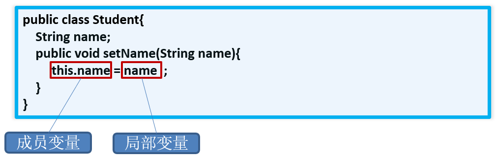
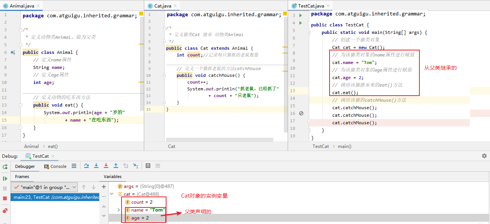

## 姓名：席崇援

## 学习任务：

**构造器**

**this关键字**

**面向对象编程**（重点）

* 面对对象三大特征：继承性
  * 共同父类：object
    * object类中的常重写方法toString，equals，hashcode（了解）
  * super关键字
  * 方法的重写
  * this关键字和super关键字调用被重写的方法，构造器，属性
* 面对对象三大特征：多态性
  * 为什么要有多态性
  * 面向对象多态性的应用

**关键字：static**

* 设计模式中单例模式两种实现方式：饿汉式，懒汉式
  * 两种实现方式的描述
  * 区别
* 类的成员之四：代码块
  * 代码块的运行时机

## 完成情况:

已完成上述

## 笔记：

## **构造器**

###  构造器的作用

**new对象，并在new对象的时候为实例变量赋值。**
**举例：`Person` p = new `Person(“Peter”,15) `;**

### 构造器的语法格式

```java
[修饰符] class 类名{
	[修饰符] 构造器名(){
		// 实例初始化代码
	}
	[修饰符] 构造器名(参数列表){
		// 实例初始化代码
	}
}
```

说明：
1. 构造器名必须与它所在的类名必须相同。
2. 它没有返回值，所以不需要返回值类型，也不需要void。
3. 构造器的修饰符只能是权限修饰符，不能被其他任何修饰。比如，不能被static、final、synchronized、abstract、native修饰，不能有return语句返回值。

示例代码:

```java
public class Student {
	private String name;
	private int age;
// 无参构造
	public Student() {
	}
// 有参构造
	public Student(String n, int a) {
		name = n;
		age = a;
	}
	public String getName() {
		return name;
	}
	public void setName(String n) {
		name = n;
	}
	public int getAge() {
		return age;
	}
	public void setAge(int a) {
		age = a;
	}
	public String getInfo() {
		return "姓名：" + name + "，年龄：" + age;
	}
}
```

```java
public class TestStudent {
	public static void main(String[] args) {
//调用无参构造创建学生对象
		Student s1 = new Student();
//调用有参构造创建学生对象
		Student s2 = new Student("张三", 23);
		System.out.println(s1.getInfo());
		System.out.println(s2.getInfo());
	}
}

```

### 练习:

**写一个名为Account的类模拟账户。该类的属性和方法如下图所示。**
**该类包括的属性：账号id，余额balance，年利率annualInterestRate；**
**包含的方法：访问器方法（getter和setter方法），取款方法withdraw()，存款方法deposit()。**


```java
account类

public class Account {
    private int id;//账号
    private double balance; //余额
    private double annualInterestRate;//年利率
    public Account(int i, double b, double a) {
        id = i;
        balance = b;
        annualInterestRate = a;
    }
    public void setId(int i) {
        id = i;
    }
    public int getId() {
        return id;
    }
    public void setBalance(double b) {
        balance = b;
    }
    public double getBalance() {
        return balance;
    }
    public void setAnnualInterestRate(double a) {
        annualInterestRate = a;
    }
    public double getAnnualInterestRate() {
        return annualInterestRate;
    }
    //取钱
    public void withdraw(double amount){
        if(amount <= balance && amount > 0){
            balance -= amount;
            System.out.println("成功取出：" + amount);
        }else{
            System.out.println("余额不足，取款失败");
        }
    }
    //存款
    public void deposit(double amount){
        if(amount > 0){
            balance += amount;
            System.out.println("成功存入：" + amount);
        }
    }
}
```

```java
customer类
public class Customer {
    private String firstName;
    private String lastName;
    private Account account;
    public Customer(String f,String l){
        firstName = f;
        lastName = l;
    }
    public String getFirstName(){
        return firstName;
    }
    public String getLastName(){
        return lastName;
    }
    public void setAccount(Account a){
        account = a;
    }
    public Account getAccount(){
        return account;
    }
}
```

```java
public class CustomerTest {
    public static void main(String[] args) {
        //创建Customer实例
        Customer customer = new Customer("Jane","Smith");
//        Account account = new Account(1000,2000,0.0123);
//        customer.setAccount(account);
        //或
        customer.setAccount(new Account(1000,2000,0.0123));
        //针对于客户的账户进行取钱、存钱的操作
        customer.getAccount().deposit(100);
        customer.getAccount().withdraw(960);
        customer.getAccount().withdraw(2000);
        //输出客户信息
        //Customer [Smith, Jane] has a account: id is 1000,
        // annualInterestRate is 1.23％, balance is 1140.0
        System.out.println("Customer [" + customer.getLastName() + "," + customer.getFirstName() +
                "] has a account:id is " + customer.getAccount().getId() + ",annualInterestRate is " +
                customer.getAccount().getAnnualInterestRate()*100 + "%,balance is " +
                customer.getAccount().getBalance());
        /*
         * 关于匿名对象
         *
         * 1. 匿名对象往往只能被调用一次
         * 2. 匿名对象常常作为实参传递给方法的形参。
         * */
        new Account(1001,2000,0.0123).withdraw(1000);
        System.out.println(new Account(1001, 2000, 0.0123).getBalance());
        int num = 10;
    }
}
```

## this关键字

- 它在方法（准确的说是实例方法或非static的方法）内部使用，表示调用该方法的对象
- 它在构造器内部使用，表示该构造器正在初始化的对象。
- this可以调用的结构：成员变量、方法和构造器

当形参与成员变量同名时，如果在方法内或构造器内需要使用成员变量，必须添加this来表明该变量是类的成员变量。即：我们可以用this来区分`成员变量`和`局部变量`。比如：



另外，使用this访问属性和方法时，如果在本类中未找到，会从父类中查找。这个在继承中会讲到。

举例1：

```java
class Person{		// 定义Person类
	private String name ;	
	private int age ;			
	public Person(String name,int age){	
		this.name = name ;   
		this.age = age ;  
    }
    public void setName(String name){
        this.name = name;
    }
    public void setAge(int age){
        this.age = age;
    }
	public void getInfo(){	
		System.out.println("姓名：" + name) ;
		this.speak();
	}
	public void speak(){
		System.out.println(“年龄：” + this.age);	
	}
}

```

举例2：

```java
public class Rectangle {
    int length;
    int width;

    public int area() {
        return this.length * this.width;
    }

    public int perimeter(){
        return 2 * (this.length + this.width);
    }

    public void print(char sign) {
        for (int i = 1; i <= this.width; i++) {
            for (int j = 1; j <= this.length; j++) {
                System.out.print(sign);
            }
            System.out.println();
        }
    }

    public String getInfo(){
        return "长：" + this.length + "，宽：" + this.width +"，面积：" + this.area() +"，周长：" + this.perimeter();
    }
}

```

测试类：

```java
public class TestRectangle {
    public static void main(String[] args) {
        Rectangle r1 = new Rectangle();
        Rectangle r2 = new Rectangle();

        System.out.println("r1对象：" + r1.getInfo());
        System.out.println("r2对象：" + r2.getInfo());

        r1.length = 10;
        r1.width = 2;
        System.out.println("r1对象：" + r1.getInfo());
        System.out.println("r2对象：" + r2.getInfo());

        r1.print('#');
        System.out.println("---------------------");
        r1.print('&');

        System.out.println("---------------------");
        r2.print('#');
        System.out.println("---------------------");
        r2.print('%');
    }
}
```

### 同一个类中构造器互相调用

this可以作为一个类中构造器相互调用的特殊格式。

- this()：调用本类的无参构造器
- this(实参列表)：调用本类的有参构造器

```java
public class Student {
    private String name;
    private int age;

    // 无参构造
    public Student() {
//        this("",18);//调用本类有参构造器
    }

    // 有参构造
    public Student(String name) {
        this();//调用本类无参构造器
        this.name = name;
    }
    // 有参构造
    public Student(String name,int age){
        this(name);//调用本类中有一个String参数的构造器
        this.age = age;
    }

    public String getName() {
        return name;
    }
    public void setName(String name) {
        this.name = name;
    }
    public int getAge() {
        return age;
    }
    public void setAge(int age) {
        this.age = age;
    }

    public String getInfo(){
        return "姓名：" + name +"，年龄：" + age;
    }
}
```

注意：

- 不能出现递归调用。比如，调用自身构造器。
  - 推论：如果一个类中声明了n个构造器，则最多有 n - 1个构造器中使用了"this(形参列表)"
- this()和this(实参列表)只能声明在构造器首行。
  - 推论：在类的一个构造器中，最多只能声明一个"this(参数列表)"

---

## super关键字

### 子类中调用父类被重写的方法

- 如果子类没有重写父类的方法，只要权限修饰符允许，在子类中完全可以直接调用父类的方法；
- 如果子类重写了父类的方法，在子类中需要通过`super.`才能调用父类被重写的方法，否则默认调用的子类重写的方法

举例：

```java
package com.atguigu.inherited.method;

public class Phone {
    public void sendMessage(){
        System.out.println("发短信");
    }
    public void call(){
        System.out.println("打电话");
    }
    public void showNum(){
        System.out.println("来电显示号码");
    }
}

//smartphone：智能手机
public class SmartPhone extends Phone{
    //重写父类的来电显示功能的方法
    public void showNum(){
        //来电显示姓名和图片功能
        System.out.println("显示来电姓名");
        System.out.println("显示头像");

        //保留父类来电显示号码的功能
        super.showNum();//此处必须加super.，否则就是无限递归，那么就会栈内存溢出
    }
}
```

总结：

* **方法前面没有super.和this.**
  * 先从子类找匹配方法，如果没有，再从直接父类找，再没有，继续往上追溯

* **方法前面有this.**
  * 先从子类找匹配方法，如果没有，再从直接父类找，再没有，继续往上追溯

* **方法前面有super.**
  * 从当前子类的直接父类找，如果没有，继续往上追溯

### 子类中调用父类中同名的成员变量

- 如果实例变量与局部变量重名，可以在实例变量前面加this.进行区别
- 如果子类实例变量和父类实例变量重名，并且父类的该实例变量在子类仍然可见，在子类中要访问父类声明的实例变量需要在父类实例变量前加super.，否则默认访问的是子类自己声明的实例变量
- 如果父子类实例变量没有重名，只要权限修饰符允许，在子类中完全可以直接访问父类中声明的实例变量，也可以用this.实例访问，也可以用super.实例变量访问

举例：

```java
class Father{
	int a = 10;
	int b = 11;
}
class Son extends Father{
	int a = 20;
    
    public void test(){
		//子类与父类的属性同名，子类对象中就有两个a
		System.out.println("子类的a：" + a);//20  先找局部变量找，没有再从本类成员变量找
        System.out.println("子类的a：" + this.a);//20   先从本类成员变量找
        System.out.println("父类的a：" + super.a);//10    直接从父类成员变量找
		
		//子类与父类的属性不同名，是同一个b
		System.out.println("b = " + b);//11  先找局部变量找，没有再从本类成员变量找，没有再从父类找
		System.out.println("b = " + this.b);//11   先从本类成员变量找，没有再从父类找
		System.out.println("b = " + super.b);//11  直接从父类局部变量找
	}
	
	public void method(int a, int b){
		//子类与父类的属性同名，子类对象中就有两个成员变量a，此时方法中还有一个局部变量a		
		System.out.println("局部变量的a：" + a);//30  先找局部变量
        System.out.println("子类的a：" + this.a);//20  先从本类成员变量找
        System.out.println("父类的a：" + super.a);//10  直接从父类成员变量找

        System.out.println("b = " + b);//13  先找局部变量
		System.out.println("b = " + this.b);//11  先从本类成员变量找
		System.out.println("b = " + super.b);//11  直接从父类局部变量找
    }
}
class Test{
    public static void main(String[] args){
        Son son = new Son();
		son.test();
		son.method(30,13);  
    }
}
```

总结：起点不同（就近原则）

* **变量前面没有super.和this.**
  * 在构造器、代码块、方法中如果出现使用某个变量，先查看是否是当前块声明的`局部变量`，
  * 如果不是局部变量，先从当前执行代码的`本类去找成员变量`
  * 如果从当前执行代码的本类中没有找到，会往上找`父类声明的成员变量`（权限修饰符允许在子类中访问的）

* **变量前面有this.** 
  * 通过this找成员变量时，先从当前执行代码的==本类去找成员变量==
  * 如果从当前执行代码的本类中没有找到，会往上找==父类声明的成员变量（==权限修饰符允许在子类中访问的）

* **变量前面super.** 
  * 通过super找成员变量，直接从当前执行代码的直接父类去找成员变量（权限修饰符允许在子类中访问的）
  * 如果直接父类没有，就去父类的父类中找（权限修饰符允许在子类中访问的）

**<font color='red'>特别说明：应该避免子类声明和父类重名的成员变量</font>**

### :red_circle:子类构造器中调用父类构造器

① 子类继承父类时，不会继承父类的构造器。只能通过“super(形参列表)”的方式调用父类指定的构造器。

② 规定：“super(形参列表)”，必须声明在构造器的首行。

③ 我们前面讲过，在构造器的首行可以使用"this(形参列表)"，调用本类中重载的构造器，
     结合②，结论：在构造器的首行，"this(形参列表)" 和 "super(形参列表)"只能二选一。

④ 如果在子类构造器的首行既没有显示调用"this(形参列表)"，也没有显式调用"super(形参列表)"，
​     则子类此构造器默认调用"super()"，即调用父类中空参的构造器。

⑤ 由③和④得到结论：子类的任何一个构造器中，要么会调用本类中重载的构造器，要么会调用父类的构造器。
     只能是这两种情况之一。

⑥ 由⑤得到：一个类中声明有n个构造器，最多有n-1个构造器中使用了"this(形参列表)"，则剩下的那个一定使用"super(形参列表)"。

> 开发中常见错误：
>
> 如果子类构造器中既未显式调用父类或本类的构造器，且父类中又没有空参的构造器，则`编译出错`。

情景举例1：

```java
class A{

}
class B extends A{

}

class Test{
    public static void main(String[] args){
        B b = new B();
        //A类和B类都是默认有一个无参构造，B类的默认无参构造中还会默认调用A类的默认无参构造
        //但是因为都是默认的，没有打印语句，看不出来
    }
}
```

情景举例2：

```java
class A{
	A(){
		System.out.println("A类无参构造器");
	}
}
class B extends A{

}
class Test{
    public static void main(String[] args){
        B b = new B();
        //A类显示声明一个无参构造，
		//B类默认有一个无参构造，
		//B类的默认无参构造中会默认调用A类的无参构造
        //可以看到会输出“A类无参构造器"
    }
}
```

情景举例3：

```java
class A{
	A(){
		System.out.println("A类无参构造器");
	}
}
class B extends A{
	B(){
		System.out.println("B类无参构造器");
	}
}
class Test{
    public static void main(String[] args){
        B b = new B();
        //A类显示声明一个无参构造，
		//B类显示声明一个无参构造，        
		//B类的无参构造中虽然没有写super()，但是仍然会默认调用A类的无参构造
        //可以看到会输出“A类无参构造器"和"B类无参构造器")
    }
}
```

情景举例4：

```java
class A{
	A(){
		System.out.println("A类无参构造器");
	}
}
class B extends A{
	B(){
        super();
		System.out.println("B类无参构造器");
	}
}
class Test{
    public static void main(String[] args){
        B b = new B();
        //A类显示声明一个无参构造，
		//B类显示声明一个无参构造，        
		//B类的无参构造中明确写了super()，表示调用A类的无参构造
        //可以看到会输出“A类无参构造器"和"B类无参构造器")
    }
}
```

情景举例5：

```java
class A{
	A(int a){
		System.out.println("A类有参构造器");
	}
}
class B extends A{
	B(){
		System.out.println("B类无参构造器");
	}
}
class Test05{
    public static void main(String[] args){
        B b = new B();
        //A类显示声明一个有参构造，没有写无参构造，那么A类就没有无参构造了
		//B类显示声明一个无参构造，        
		//B类的无参构造没有写super(...)，表示默认调用A类的无参构造
        //编译报错，因为A类没有无参构造
    }
}
```


情景举例6：

```java
class A{
	A(int a){
		System.out.println("A类有参构造器");
	}
}
class B extends A{
	B(){
		super();
		System.out.println("B类无参构造器");
	}
}
class Test06{
    public static void main(String[] args){
        B b = new B();
        //A类显示声明一个有参构造，没有写无参构造，那么A类就没有无参构造了
		//B类显示声明一个无参构造，        
		//B类的无参构造明确写super()，表示调用A类的无参构造
        //编译报错，因为A类没有无参构造
    }
}
```


情景举例7：

```java
class A{
	A(int a){
		System.out.println("A类有参构造器");
	}
}
class B extends A{
	B(int a){
		super(a);
		System.out.println("B类有参构造器");
	}
}
class Test07{
    public static void main(String[] args){
        B b = new B(10);
        //A类显示声明一个有参构造，没有写无参构造，那么A类就没有无参构造了
		//B类显示声明一个有参构造，        
		//B类的有参构造明确写super(a)，表示调用A类的有参构造
        //会打印“A类有参构造器"和"B类有参构造器"
    }
}
```

情景举例8：

```java
class A{
    A(){
        System.out.println("A类无参构造器");
    }
	A(int a){
		System.out.println("A类有参构造器");
	}
}
class B extends A{
    B(){
        super();//可以省略，调用父类的无参构造
        System.out.println("B类无参构造器");
    }
	B(int a){
		super(a);//调用父类有参构造
		System.out.println("B类有参构造器");
	}
}
class Test8{
    public static void main(String[] args){
        B b1 = new B();
        B b2 = new B(10);
    }
}
```

## 小结：this与super

**1、this和super的意义**

this：当前对象

- 在构造器和非静态代码块中，表示正在new的对象
- 在实例方法中，表示调用当前方法的对象

super：引用父类声明的成员

**2、this和super的使用格式**

- this
  - this.成员变量：表示当前对象的某个成员变量，而不是局部变量
  - this.成员方法：表示当前对象的某个成员方法，完全可以省略this.
  - this()或this(实参列表)：调用另一个构造器协助当前对象的实例化，只能在构造器首行，只会找本类的构造器，找不到就报错
- super
  - super.成员变量：表示当前对象的某个成员变量，该成员变量在父类中声明的
  - super.成员方法：表示当前对象的某个成员方法，该成员方法在父类中声明的
  - super()或super(实参列表)：调用父类的构造器协助当前对象的实例化，只能在构造器首行，只会找直接父类的对应构造器，找不到就报错

---

## 面对对象三大特征：继承性

### 继承中的语法格式

通过 `extends` 关键字，可以声明一个类B继承另外一个类A，定义格式如下：

```java
[修饰符] class 类A {
	...
}

[修饰符] class 类B extends 类A {
	...
}

```

### 代码举例

**1、父类**

```java
package com.atguigu.inherited.grammar;

/*
 * 定义动物类Animal，做为父类
 */
public class Animal {
    // 定义name属性
    String name;
    // 定义age属性
    int age;

    // 定义动物的吃东西方法
    public void eat() {
        System.out.println(age + "岁的"
                + name + "在吃东西");
    }
}

```

**2、子类**

```java
package com.atguigu.inherited.grammar;

/*
 * 定义猫类Cat 继承 动物类Animal
 */
public class Cat extends Animal {
    int count;//记录每只猫抓的老鼠数量

    // 定义一个猫抓老鼠的方法catchMouse
    public void catchMouse() {
        count++;
        System.out.println("抓老鼠，已经抓了"
                + count + "只老鼠");
    }
}
```

**3、测试类**

```java
package com.atguigu.inherited.grammar;

public class TestCat {
    public static void main(String[] args) {
        // 创建一个猫类对象
        Cat cat = new Cat();
        // 为该猫类对象的name属性进行赋值
        cat.name = "Tom";
        // 为该猫类对象的age属性进行赋值
        cat.age = 2;
        // 调用该猫继承来的eat()方法
        cat.eat();
        // 调用该猫的catchMouse()方法
        cat.catchMouse();
        cat.catchMouse();
        cat.catchMouse();
    }
}
```

### 继承性的细节说明

**1、子类会继承父类所有的实例变量和实例方法**

从类的定义来看，类是一类具有相同特性的事物的抽象描述。父类是所有子类共同特征的抽象描述。而实例变量和实例方法就是事物的特征，那么父类中声明的实例变量和实例方法代表子类事物也有这个特征。

- 当子类对象被创建时，在堆中给对象申请内存时，就要看子类和父类都声明了什么实例变量，这些实例变量都要分配内存。
- 当子类对象调用方法时，编译器会先在子类模板中看该类是否有这个方法，如果没找到，会看它的父类甚至父类的父类是否声明了这个方法，遵循`从下往上`找的顺序，找到了就停止，一直到根父类都没有找到，就会报编译错误。

所以继承意味着子类的对象除了看子类的类模板还要看父类的类模板。



**2、子类不能直接访问父类中私有的(private)的成员变量和方法**

子类虽会继承父类私有(private)的成员变量，但子类不能对继承的私有成员变量直接进行访问，可通过继承的get/set方法进行访问。如图所示：


**3、在Java 中，继承的关键字用的是“extends”，即子类不是父类的子集，而是对父类的“扩展”**

子类在继承父类以后，还可以定义自己特有的方法，这就可以看做是对父类功能上的扩展。

**4、Java支持多层继承(继承体系)**


```java
class A{}
class B extends A{}
class C extends B{}
```

> 说明：
>
> - 子类和父类是一种相对的概念
>
> - 顶层父类是Object类。所有的类默认继承Object，作为父类。

**5、一个父类可以同时拥有多个子类**

```java
class A{}
class B extends A{}
class D extends A{}
class E extends A{}
```

**6、Java只支持单继承，不支持多重继承**


```java
public class A{}
class B extends A{}

//一个类只能有一个父类，不可以有多个直接父类。
class C extends B{} 	//ok
class C extends A,B...	//error
```

## 方法的重写

子类可以对从父类中继承来的方法进行改造，我们称为方法的`重写 (override、overwrite)`。也称为方法的`重置`、`覆盖`。

在程序执行时，子类的方法将覆盖父类的方法。

### 方法重写举例

比如新的手机增加来电显示头像的功能，代码如下：

```java
package com.atguigu.inherited.method;

public class Phone {
    public void sendMessage(){
        System.out.println("发短信");
    }
    public void call(){
        System.out.println("打电话");
    }
    public void showNum(){
        System.out.println("来电显示号码");
    }
}

```

```java
package com.atguigu.inherited.method;

//SmartPhone：智能手机
public class SmartPhone extends Phone{
    //重写父类的来电显示功能的方法
	@Override
    public void showNum(){
        //来电显示姓名和图片功能
        System.out.println("显示来电姓名");
        System.out.println("显示头像");
    }
    //重写父类的通话功能的方法
    @Override
    public void call() {
        System.out.println("语音通话 或 视频通话");
    }
}
```

```java
package com.atguigu.inherited.method;

public class TestOverride {
    public static void main(String[] args) {
        // 创建子类对象
        SmartPhone sp = new SmartPhone();

        // 调用父类继承而来的方法
        sp.call();

        // 调用子类重写的方法
        sp.showNum();
    }
}
```

### 方法重写的要求

1. 子类重写的方法`必须`和父类被重写的方法具有相同的`方法名称`、`参数列表`。

2. 子类重写的方法的返回值类型`不能大于`父类被重写的方法的返回值类型。（例如：Student < Person）。

> 注意：如果返回值类型是基本数据类型和void，那么必须是相同

3. 子类重写的方法使用的访问权限`不能小于`父类被重写的方法的访问权限。（public > protected > 缺省 > private）

> 注意：① 父类私有方法不能重写   ② 跨包的父类缺省的方法也不能重写

4. 子类方法抛出的异常不能大于父类被重写方法的异常


此外，子类与父类中同名同参数的方法必须同时声明为非static的(即为重写)，或者同时声明为static的（不是重写）。因为static方法是属于类的，子类无法覆盖父类的方法。

### 方法的重载与重写

方法的重载：方法名相同，形参列表不同。不看返回值类型。

方法的重写：见上面。

（1）同一个类中

```java
package com.atguigu.inherited.method;

public class TestOverload {
    public int max(int a, int b){
        return a > b ? a : b;
    }
    public double max(double a, double b){
        return a > b ? a : b;
    }
    public int max(int a, int b,int c){
        return max(max(a,b),c);
    }
}
```

（2）父子类中

```java
package com.atguigu.inherited.method;

public class TestOverloadOverride {
    public static void main(String[] args) {
        Son s = new Son();
        s.method(1);//只有一个形式的method方法

        Daughter d = new Daughter();
        d.method(1);
        d.method(1,2);//有两个形式的method方法
    }
}

class Father{
    public void method(int i){
        System.out.println("Father.method");
    }
}
class Son extends Father{
    public void method(int i){//重写
        System.out.println("Son.method");
    }
}
class Daughter extends Father{
    public void method(int i,int j){//重载
        System.out.println("Daughter.method");
    }
}
```

## 再谈封装性中的4种权限修饰

权限修饰符：public,protected,缺省,private

| 修饰符    | 本类 | 本包                      | 其他包子类                  | 其他包非子类 |
| --------- | ---- | ------------------------- | --------------------------- | ------------ |
| private   | √    | ×                         | ×                           | ×            |
| 缺省      | √    | √（本包子类非子类都可见） | ×                           | ×            |
| protected | √    | √（本包子类非子类都可见） | √（其他包仅限于子类中可见） | ×            |
| public    | √    | √                         | √                           | √            |

## 面向对象特征三：多态性

#### 对象的多态性

多态性，是面向对象中最重要的概念，在Java中的体现：**对象的多态性：父类的引用指向子类的对象**

格式：（父类类型：指子类继承的父类类型，或者实现的接口类型）

```java
父类类型 变量名 = 子类对象；
```

举例：

```java
Person p = new Student();

Object o = new Person();//Object类型的变量o，指向Person类型的对象

o = new Student(); //Object类型的变量o，指向Student类型的对象
```

对象的多态：在Java中，子类的对象可以替代父类的对象使用。所以，一个引用类型变量可能指向(引用)多种不同类型的对象。

#### 多态的理解

Java引用变量有两个类型：`编译时类型`和`运行时类型`。编译时类型由`声明`该变量时使用的类型决定，运行时类型由`实际赋给该变量的对象`决定。简称：**编译时，看左边；运行时，看右边。**

- 若编译时类型和运行时类型不一致，就出现了对象的多态性(Polymorphism)
- 多态情况下，“看左边”：看的是父类的引用（父类中不具备子类特有的方法）
      “看右边”：看的是子类的对象（实际运行的是子类重写父类的方法）

多态的使用前提：① 类的继承关系  ② 方法的重写

#### 举例

```java
package com.atguigu.polymorphism.grammar;

public class Pet {
    private String nickname; //昵称

    public String getNickname() {
        return nickname;
    }

    public void setNickname(String nickname) {
        this.nickname = nickname;
    }

    public void eat(){
        System.out.println(nickname + "吃东西");
    }
}
```

```java
package com.atguigu.polymorphism.grammar;

public class Cat extends Pet {
    //子类重写父类的方法
    @Override
    public void eat() {
        System.out.println("猫咪" + getNickname() + "吃鱼仔");
    }

    //子类扩展的方法
    public void catchMouse() {
        System.out.println("抓老鼠");
    }
}
```

```java
package com.atguigu.polymorphism.grammar;

public class Dog extends Pet {
    //子类重写父类的方法
    @Override
    public void eat() {
        System.out.println("狗子" + getNickname() + "啃骨头");
    }

    //子类扩展的方法
    public void watchHouse() {
        System.out.println("看家");
    }
}
```

**1、方法内局部变量的赋值体现多态**

```java
package com.atguigu.polymorphism.grammar;

public class TestPet {
    public static void main(String[] args) {
        //多态引用
        Pet pet = new Dog();
        pet.setNickname("小白");

        //多态的表现形式
        /*
        编译时看父类：只能调用父类声明的方法，不能调用子类扩展的方法；
        运行时，看“子类”，如果子类重写了方法，一定是执行子类重写的方法体；
         */
        pet.eat();//运行时执行子类Dog重写的方法
//      pet.watchHouse();//不能调用Dog子类扩展的方法

        pet = new Cat();
        pet.setNickname("雪球");
        pet.eat();//运行时执行子类Cat重写的方法
    }
}
```

**2、方法的形参声明体现多态**

```java
package com.atguigu.polymorphism.grammar;

public class Person{
    private Pet pet;
    public void adopt(Pet pet) {//形参是父类类型，实参是子类对象
        this.pet = pet;
    }
    public void feed(){
        pet.eat();//pet实际引用的对象类型不同，执行的eat方法也不同
    }
}
```

```java
package com.atguigu.polymorphism.grammar;

public class TestPerson {
    public static void main(String[] args) {
        Person person = new Person();

        Dog dog = new Dog();
        dog.setNickname("小白");
        person.adopt(dog);//实参是dog子类对象，形参是父类Pet类型
        person.feed();

        Cat cat = new Cat();
        cat.setNickname("雪球");
        person.adopt(cat);//实参是cat子类对象，形参是父类Pet类型
        person.feed();
    }
}
```

**3、方法返回值类型体现多态**

```java
package com.atguigu.polymorphism.grammar;

public class PetShop {
    //返回值类型是父类类型，实际返回的是子类对象
    public Pet sale(String type){
        switch (type){
            case "Dog":
                return new Dog();
            case "Cat":
                return new Cat();
        }
        return null;
    }
}
```

```java
package com.atguigu.polymorphism.grammar;

public class TestPetShop {
    public static void main(String[] args) {
        PetShop shop = new PetShop();

        Pet dog = shop.sale("Dog");
        dog.setNickname("小白");
        dog.eat();

        Pet cat = shop.sale("Cat");
        cat.setNickname("雪球");
        cat.eat();
    }
}
```

### 多态的好处和弊端

**好处**：变量引用的子类对象不同，执行的方法就不同，实现动态绑定。代码编写更灵活、功能更强大，可维护性和扩展性更好了。

**弊端**：一个引用类型变量如果声明为父类的类型，但实际引用的是子类对象，那么该变量就不能再访问子类中添加的属性和方法。

```java
Student m = new Student();
m.school = "pku"; 	//合法,Student类有school成员变量
Person e = new Student(); 
e.school = "pku";	//非法,Person类没有school成员变量

// 属性是在编译时确定的，编译时e为Person类型，没有school成员变量，因而编译错误。
```

> 开发中：
>
> 使用父类做方法的形参，是多态使用最多的场合。即使增加了新的子类，方法也无需改变，提高了扩展性，符合开闭原则。

## 向上转型与向下转型

​		**首先，一个对象在new的时候创建是哪个类型的对象，它从头至尾都不会变。即这个对象的运行时类型，本质的类型用于不会变。但是，把这个对象赋值给不同类型的变量时，这些变量的编译时类型却不同。**

#### 为什么要类型转换

因为多态，就一定会有把子类对象赋值给父类变量的时候，这个时候，在`编译期间`，就会出现类型转换的现象。

但是，使用父类变量接收了子类对象之后，我们就`不能调用`子类拥有，而父类没有的方法了。这也是多态给我们带来的一点"小麻烦"。所以，想要调用子类特有的方法，必须做类型转换，使得`编译通过`。


* **向上转型**：当左边的变量的类型（父类） > 右边对象/变量的类型（子类），我们就称为向上转型
  * 此时，编译时按照左边变量的类型处理，就只能调用父类中有的变量和方法，不能调用子类特有的变量和方法了
  * 但是，**运行时，仍然是对象本身的类型**，所以执行的方法是子类重写的方法体。
  * 此时，一定是安全的，而且也是自动完成的

* **向下转型**：当左边的变量的类型（子类）<右边对象/变量的编译时类型（父类），我们就称为向下转型
  * 此时，编译时按照左边变量的类型处理，就可以调用子类特有的变量和方法了
  * 但是，**运行时，仍然是对象本身的类型**
  * 不是所有通过编译的向下转型都是正确的，可能会发生ClassCastException，为了安全，可以通过isInstanceof关键字进行判断

#### 如何向上或向下转型

向上转型：自动完成

向下转型：（子类类型）父类变量

```java
package com.atguigu.polymorphism.grammar;

public class ClassCastTest {
    public static void main(String[] args) {
        //没有类型转换
        Dog dog = new Dog();//dog的编译时类型和运行时类型都是Dog

        //向上转型
        Pet pet = new Dog();//pet的编译时类型是Pet，运行时类型是Dog
        pet.setNickname("小白");
        pet.eat();//可以调用父类Pet有声明的方法eat，但执行的是子类重写的eat方法体
//        pet.watchHouse();//不能调用父类没有的方法watchHouse

        Dog d = (Dog) pet;
        System.out.println("d.nickname = " + d.getNickname());
        d.eat();//可以调用eat方法
        d.watchHouse();//可以调用子类扩展的方法watchHouse

        Cat c = (Cat) pet;//编译通过，因为从语法检查来说，pet的编译时类型是Pet，Cat是Pet的子类，所以向下转型语法正确
        //这句代码运行报错ClassCastException，因为pet变量的运行时类型是Dog，Dog和Cat之间是没有继承关系的
    }
}
```

## Object 类的使用

#### 1、(重点)equals()

**= =：** 

- 基本类型比较值:只要两个变量的值相等，即为true。

  ```java
  int a=5; 
  if(a==6){…}
  ```

- 引用类型比较引用(是否指向同一个对象)：只有指向同一个对象时，==才返回true。

  ```java
  Person p1=new Person();  	    
  Person p2=new Person();
  if (p1==p2){…}
  ```

  - 用“==”进行比较时，符号两边的`数据类型必须兼容`(可自动转换的基本数据类型除外)，否则编译出错

**equals()：**所有类都继承了Object，也就获得了equals()方法。还可以重写。

- 只能比较引用类型，Object类源码中equals()的作用与“==”相同：比较是否指向同一个对象。	 

  

- 格式:obj1.equals(obj2)

- 特例：当用equals()方法进行比较时，对类File、String、Date及包装类（Wrapper Class）来说，是比较类型及内容而不考虑引用的是否是同一个对象；

  - 原因：在这些类中重写了Object类的equals()方法。

- 当自定义使用equals()时，可以重写。用于比较两个对象的“内容”是否都相等

- 重写equals()方法的原则

  - `对称性`：如果x.equals(y)返回是“true”，那么y.equals(x)也应该返回是“true”。

  - `自反性`：x.equals(x)必须返回是“true”。

  - `传递性`：如果x.equals(y)返回是“true”，而且y.equals(z)返回是“true”，那么z.equals(x)也应该返回是“true”。

  - `一致性`：如果x.equals(y)返回是“true”，只要x和y内容一直不变，不管你重复x.equals(y)多少次，返回都是“true”。

  - 任何情况下，x.equals(null)，永远返回是“false”；

    ​    x.equals(和x不同类型的对象)永远返回是“false”。

- 重写举例：

```java
class User{
	private String host;
	private String username;
	private String password;
	public User(String host, String username, String password) {
		super();
		this.host = host;
		this.username = username;
		this.password = password;
	}
	public User() {
		super();
	}
	public String getHost() {
		return host;
	}
	public void setHost(String host) {
		this.host = host;
	}
	public String getUsername() {
		return username;
	}
	public void setUsername(String username) {
		this.username = username;
	}
	public String getPassword() {
		return password;
	}
	public void setPassword(String password) {
		this.password = password;
	}
	@Override
	public String toString() {
		return "User [host=" + host + ", username=" + username + ", password=" + password + "]";
	}
	@Override
	public boolean equals(Object obj) {
		if (this == obj)
			return true;
		if (obj == null)
			return false;
		if (getClass() != obj.getClass())
			return false;
		User other = (User) obj;
		if (host == null) {
			if (other.host != null)
				return false;
		} else if (!host.equals(other.host))
			return false;
		if (password == null) {
			if (other.password != null)
				return false;
		} else if (!password.equals(other.password))
			return false;
		if (username == null) {
			if (other.username != null)
				return false;
		} else if (!username.equals(other.username))
			return false;
		return true;
	}
	
}
```

**练习1：**

1.

```java
int it = 65;
float fl = 65.0f;
System.out.println("65和65.0f是否相等？" + (it == fl)); // true

char ch1 = 'A';
char ch2 = 12;
System.out.println("65和'A'是否相等？" + (it == ch1)); // false
System.out.println("12和ch2是否相等？" + (12 == ch2)); // true

String str1 = new String("hello");
String str2 = new String("hello");
System.out.println("str1和str2是否相等？" + (str1 == str2)); // false

System.out.println("str1是否equals str2？" + (str1.equals(str2))); // true

System.out.println("hello" == new java.util.Date()); // false

------------------------------------------------------------------
it == fl：true，因为int类型的65和float类型的65.0f在数值上相等。
it == ch1：false，因为it是int类型，而ch1是char类型，'A'的ASCII值是65，但类型不同，所以不相等。
12 == ch2：true，因为ch2被赋值为整数12，所以与整数12相等。
str1 == str2：false，因为str1和str2是两个不同的对象，即使它们的内容相同，对象的引用不同。
str1.equals(str2)：true，因为equals方法比较的是对象的内容，str1和str2的内容都是"hello"，所以相等。
"hello" == new java.util.Date()：false，因为字符串"hello"和java.util.Date对象是完全不同的类型，不能相等
```

2.请根据以下代码自行定义能满足需要的MyDate类,在MyDate类中覆盖equals方法，使其判断当两个MyDate类型对象的年月日都相同时，结果为true，否则为false。  public boolean equals(Object o)

```java
public class EqualsTest {
    public static void main(String[] args) {
        MyDate m1 = new MyDate(14, 3, 1976);
        MyDate m2 = new MyDate(14, 3, 1976);
        if (m1 == m2) {
            System.out.println("m1==m2");
        } else {
            System.out.println("m1!=m2"); // m1 != m2
        }

        if (m1.equals(m2)) {
            System.out.println("m1 is equal to m2");// m1 is equal to m2
        } else {
            System.out.println("m1 is not equal to m2");
        }
    }
}

```

#### 2、(重点)toString()

方法签名：public String toString()

① 默认情况下，toString()返回的是“对象的运行时类型 @ 对象的hashCode值的十六进制形式"

② 在进行String与其它类型数据的连接操作时，自动调用toString()方法

```java
Date now=new Date();
System.out.println(“now=”+now);  //相当于
System.out.println(“now=”+now.toString()); 
```

③ 如果我们直接System.out.println(对象)，默认会自动调用这个对象的toString()

> 因为Java的引用数据类型的变量中存储的实际上时对象的内存地址，但是Java对程序员隐藏内存地址信息，所以不能直接将内存地址显示出来，所以当你打印对象时，JVM帮你调用了对象的toString()。

④ 可以根据需要在用户自定义类型中重写toString()方法
	如String 类重写了toString()方法，返回字符串的值。

```java
s1="hello";
System.out.println(s1);//相当于System.out.println(s1.toString());
```

例如自定义的Person类：

```java
public class Person {  
    private String name;
    private int age;

    @Override
    public String toString() {
        return "Person{" + "name='" + name + '\'' + ", age=" + age + '}';
    }
}
```

## **关键字：static**

- 使用范围：
  - 在Java类中，可用static修饰属性、方法、代码块、内部类

- 被修饰后的成员具备以下特点：
  - 随着类的加载而加载
  - 优先于对象存在
  - 修饰的成员，被所有对象所共享
  - 访问权限允许时，可不创建对象，直接被类调用

#### 语法格式

使用static修饰的成员变量就是静态变量（或类变量、类属性）

```java
[修饰符] class 类{
	[其他修饰符] static 数据类型 变量名;
}
```

#### 静态变量的特点

- 静态变量的默认值规则和实例变量一样。
- 静态变量值是所有对象共享。

- 静态变量在本类中，可以在任意方法、代码块、构造器中直接使用。
- 如果权限修饰符允许，在其他类中可以通过“`类名.静态变量`”直接访问，也可以通过“`对象.静态变量`”的方式访问（但是更推荐使用类名.静态变量的方式）。
- 静态变量的get/set方法也静态的，当局部变量与静态变量`重名时`，使用“`类名.静态变量`”进行区分。

#### 举例

举例1：

```java
class Chinese{
    //实例变量
    String name;
    int age;
    //类变量
    static String nation;//国籍

    public Chinese() {
    }

    public Chinese(String name, int age) {
        this.name = name;
        this.age = age;
    }

    @Override
    public String toString() {
        return "Chinese{" +
                "name='" + name + '\'' +
                ", age=" + age +
                ", nation='" + nation + '\'' +
                '}';
    }
}
public class StaticTest {
    public static void main(String[] args) {
        Chinese c1 = new Chinese("康师傅",36);
        c1.nation = "中华人民共和国";

        Chinese c2 = new Chinese("老干妈",66);

        System.out.println(c1);
        System.out.println(c2);

        System.out.println(Chinese.nation);
    }
}
```

对应的内存结构：（以经典的JDK6内存解析为例，此时静态变量存储在方法区）


举例2：

```java
package com.atguigu.keyword;

public class Employee {
    private static int total;//这里私有化，在类的外面必须使用get/set方法的方式来访问静态变量
    static String company; //这里缺省权限修饰符，是为了方便类外以“类名.静态变量”的方式访问
    private int id;
    private String name;

    public Employee() {
        total++;
        id = total;//这里使用total静态变量的值为id属性赋值
    }

    public Employee(String name) {
        this();
        this.name = name;
    }

    public void setId(int id) {
        this.id = id;
    }

    public int getId() {
        return id;
    }

    public String getName() {
        return name;
    }

    public void setName(String name) {
        this.name = name;
    }

    public static int getTotal() {
        return total;
    }

    public static void setTotal(int total) {
        Employee.total = total;
    }

    @Override
    public String toString() {
        return "Employee{company = " + company + ",id = " + id + " ,name=" + name +"}";
    }
}
```

```java
package com.atguigu.keyword;

public class TestStaticVariable {
    public static void main(String[] args) {
        //静态变量total的默认值是0
        System.out.println("Employee.total = " + Employee.getTotal());

        Employee e1 = new Employee("张三");
        Employee e2 = new Employee("李四");
        System.out.println(e1);//静态变量company的默认值是null
        System.out.println(e2);//静态变量company的默认值是null
        System.out.println("Employee.total = " + Employee.getTotal());//静态变量total值是2

        Employee.company = "尚硅谷";
        System.out.println(e1);//静态变量company的值是尚硅谷
        System.out.println(e2);//静态变量company的值是尚硅谷

        //只要权限修饰符允许,虽然不推荐，但是也可以通过“对象.静态变量”的形式来访问
        e1.company = "超级尚硅谷";

        System.out.println(e1);//静态变量company的值是超级尚硅谷
        System.out.println(e2);//静态变量company的值是超级尚硅谷
    }
}
```

#### 内存解析


### 静态方法

#### 语法格式

用static修饰的成员方法就是静态方法。

```java
[修饰符] class 类{
	[其他修饰符] static 返回值类型 方法名(形参列表){
        方法体
    }
}
```

#### 静态方法的特点

- 静态方法在本类的任意方法、代码块、构造器中都可以直接被调用。
- 只要权限修饰符允许，静态方法在其他类中可以通过“类名.静态方法“的方式调用。也可以通过”对象.静态方法“的方式调用（但是更推荐使用类名.静态方法的方式）。
- 在static方法内部只能访问类的static修饰的属性或方法，不能访问类的非static的结构。
- 静态方法可以被子类继承，但不能被子类重写。
- 静态方法的调用都只看编译时类型。
- 因为不需要实例就可以访问static方法，因此static方法内部不能有this，也不能有super。如果有重名问题，使用“类名.”进行区别。

#### 举例

```java
package com.atguigu.keyword;

public class Father {
    public static void method(){
        System.out.println("Father.method");
    }

    public static void fun(){
        System.out.println("Father.fun");
    }
}
```

```java
package com.atguigu.keyword;

public class Son extends Father{
//    @Override //尝试重写静态方法，加上@Override编译报错，去掉Override不报错，但是也不是重写
    public static void fun(){
        System.out.println("Son.fun");
    }
}
```

```java
package com.atguigu.keyword;

public class TestStaticMethod {
    public static void main(String[] args) {
        Father.method();
        Son.method();//继承静态方法

        Father f = new Son();
        f.method();//执行Father类中的method
    }
}
```

## 单例(Singleton)设计模式

所谓类的单例设计模式，就是采取一定的方法保证在整个的软件系统中，对某个类**只能存在一个对象实例**，并且该类只提供一个取得其对象实例的方法。

:black_circle:**如果我们要让类在一个虚拟机中只能产生一个对象，我们首先必须将`类的构造器的访问权限设置为private`，这样，就不能用new操作符在类的外部产生类的对象了，但在类内部仍可以产生该类的对象。因为在类的外部开始还无法得到类的对象，`只能调用该类的某个静态方法`以返回类内部创建的对象，静态方法只能访问类中的静态成员变量，所以，指向类内部产生的`该类对象的变量也必须定义成静态的`。**

#### 饿汉式

```java
class Singleton {
    // 1.私有化构造器
    private Singleton() {
    }

    // 2.内部提供一个当前类的实例
    // 4.此实例也必须静态化
    private static Singleton single = new Singleton();

    // 3.提供公共的静态的方法，返回当前类的对象
    public static Singleton getInstance() {
        return single;
    }
}

```

#### 

#### 懒汉式

```java
class Singleton {
    // 1.私有化构造器
    private Singleton() {
    }
    // 2.内部提供一个当前类的实例
    // 4.此实例也必须静态化
    private static Singleton single;
    // 3.提供公共的静态的方法，返回当前类的对象
    public static Singleton getInstance() {
        if(single == null) {
            single = new Singleton();
        }
        return single;
    }
}

```

#### 饿汉式 vs 懒汉式

饿汉式：

- 特点：`立即加载`，即在使用类的时候已经将对象创建完毕。
- 优点：实现起来`简单`；没有多线程安全问题。
- 缺点：当类被加载的时候，会初始化static的实例，静态变量被创建并分配内存空间，从这以后，这个static的实例便一直占着这块内存，直到类被卸载时，静态变量被摧毁，并释放所占有的内存。因此在某些特定条件下会`耗费内存`。

懒汉式：

- 特点：`延迟加载`，即在调用静态方法时实例才被创建。
- 优点：实现起来比较简单；当类被加载的时候，static的实例未被创建并分配内存空间，当静态方法第一次被调用时，初始化实例变量，并分配内存，因此在某些特定条件下会`节约内存`。
- 缺点：在多线程环境中，这种实现方法是完全错误的，`线程不安全`，根本不能保证单例的唯一性。
  - 说明：在多线程章节，会将懒汉式改造成线程安全的模式。

## 类的成员之四：代码块

如果成员变量想要初始化的值不是一个硬编码的常量值，而是需要通过复杂的计算或读取文件、或读取运行环境信息等方式才能获取的一些值，该怎么办呢？此时，可以考虑代码块（或初始化块）。

- 代码块(或初始化块)的`作用`：
- 对Java类或对象进行初始化
- 代码块(或初始化块)的`分类`：

  - 一个类中代码块若有修饰符，则只能被static修饰，称为静态代码块(static block)

  - 没有使用static修饰的，为非静态代码块。

### 静态代码块

如果想要为静态变量初始化，可以直接在静态变量的声明后面直接赋值，也可以使用静态代码块。

#### 语法格式

在代码块的前面加static，就是静态代码块。

```java
【修饰符】 class 类{
	static{
        静态代码块
    }
}
```

#### 静态代码块的特点

1. 可以有输出语句。

  2. 可以对类的属性、类的声明进行初始化操作。

  3. 不可以对非静态的属性初始化。即：不可以调用非静态的属性和方法。

  4. 若有多个静态的代码块，那么按照从上到下的顺序依次执行。

  5. 静态代码块的执行要先于非静态代码块。

  6. 静态代码块随着类的加载而加载，且只执行一次。

```java
package com.atguigu.keyword;

public class Chinese {
//    private static String country = "中国";

    private static String country;
    private String name;

    {
        System.out.println("非静态代码块，country = " + country);
    }

    static {
        country = "中国";
        System.out.println("静态代码块");
    }

    public Chinese(String name) {
        this.name = name;
    }
}
```

```java
package com.atguigu.keyword;

public class TestStaticBlock {
    public static void main(String[] args) {
        Chinese c1 = new Chinese("张三");
        Chinese c2 = new Chinese("李四");
    }
}

```

### 非静态代码块

#### 语法格式

```java
【修饰符】 class 类{
    {
        非静态代码块
    }
    【修饰符】 构造器名(){
    	// 实例初始化代码
    }
    【修饰符】 构造器名(参数列表){
        // 实例初始化代码
    }
}
```

#### 非静态代码块的作用

和构造器一样，也是用于实例变量的初始化等操作。

#### 非静态代码块的意义

如果多个重载的构造器有公共代码，并且这些代码都是先于构造器其他代码执行的，那么可以将这部分代码抽取到非静态代码块中，减少冗余代码。

#### 非静态代码块的执行特点

1. 可以有输出语句。

  2. 可以对类的属性、类的声明进行初始化操作。

  3. 除了调用非静态的结构外，还可以调用静态的变量或方法。

  4. 若有多个非静态的代码块，那么按照从上到下的顺序依次执行。

  5. 每次创建对象的时候，都会执行一次。且先于构造器执行。

### 举例

**举例1：**

（1）声明User类，

- 包含属性：username（String类型），password（String类型），registrationTime（long类型），私有化

- 包含get/set方法，其中registrationTime没有set方法

- 包含无参构造，
  - 输出“新用户注册”，
  - registrationTime赋值为当前系统时间，
  - username就默认为当前系统时间值，
  - password默认为“123456”

- 包含有参构造(String username, String password)，
  - 输出“新用户注册”，
  - registrationTime赋值为当前系统时间，
  - username和password由参数赋值

- 包含public String getInfo()方法，返回：“用户名：xx，密码：xx，注册时间：xx”

（2）编写测试类，测试类main方法的代码如下：

```java
    public static void main(String[] args) {
        User u1 = new User();
        System.out.println(u1.getInfo());

        User u2 = new User("song","8888");
        System.out.println(u2.getInfo());
    }
```

如果不用非静态代码块，User类是这样的：

```java
package com.atguigu.block.no;

public class User {
    private String username;
    private String password;
    private long registrationTime;

    public User() {
        System.out.println("新用户注册");
        registrationTime = System.currentTimeMillis();
        username = registrationTime+"";
        password = "123456";
    }

    public User(String username,String password) {
        System.out.println("新用户注册");
        registrationTime = System.currentTimeMillis();
        this.username = username;
        this.password = password;
    }

    public String getUsername() {
        return username;
    }

    public void setUsername(String username) {
        this.username = username;
    }

    public String getPassword() {
        return password;
    }

    public void setPassword(String password) {
        this.password = password;
    }

    public long getRegistrationTime() {
        return registrationTime;
    }
    public String getInfo(){
        return "用户名：" + username + "，密码：" + password + "，注册时间：" + registrationTime;
    }
}
```

如果提取构造器公共代码到非静态代码块，User类是这样的：

```java
package com.atguigu.block.use;

public class User {
    private String username;
    private String password;
    private long registrationTime;

    {
        System.out.println("新用户注册");
        registrationTime = System.currentTimeMillis();
    }

    public User() {
        username = registrationTime+"";
        password = "123456";
    }

    public User(String username, String password) {
        this.username = username;
        this.password = password;
    }

    public String getUsername() {
        return username;
    }

    public void setUsername(String username) {
        this.username = username;
    }

    public String getPassword() {
        return password;
    }

    public void setPassword(String password) {
        this.password = password;
    }

    public long getRegistrationTime() {
        return registrationTime;
    }
    public String getInfo(){
        return "用户名：" + username + "，密码：" + password + "，注册时间：" + registrationTime;
    }
}
```

**举例2：**

```java
private static DataSource dataSource = null;

static{
	InputStream is = null;
	try {
		is = DBCPTest.class.getClassLoader().getResourceAsStream("dbcp.properties");
		Properties pros = new Properties();
		pros.load(is);
		//调用BasicDataSourceFactory的静态方法，获取数据源。
		dataSource = BasicDataSourceFactory.createDataSource(pros);
	} catch (Exception e) {
		e.printStackTrace();
	}finally{
		if(is != null){
			try {
				is.close();
			} catch (IOException e) {
				e.printStackTrace();
			}		
		}		
	}		
}
```

### 练习

练习1：分析加载顺序

```java
class Root{
	static{
		System.out.println("Root的静态初始化块");
	}
	{
		System.out.println("Root的普通初始化块");
	}
	public Root(){
		System.out.println("Root的无参数的构造器");
	}
}
class Mid extends Root{
	static{
		System.out.println("Mid的静态初始化块");
	}
	{
		System.out.println("Mid的普通初始化块");
	}
	public Mid(){
		System.out.println("Mid的无参数的构造器");
	}
	public Mid(String msg){
		//通过this调用同一类中重载的构造器
		this();
		System.out.println("Mid的带参数构造器，其参数值："
			+ msg);
	}
}
class Leaf extends Mid{
	static{
		System.out.println("Leaf的静态初始化块");
	}
	{
		System.out.println("Leaf的普通初始化块");
	}	
	public Leaf(){
		//通过super调用父类中有一个字符串参数的构造器
		super("尚硅谷");
		System.out.println("Leaf的构造器");
	}
}
public class LeafTest{
	public static void main(String[] args){
		new Leaf(); 
		//new Leaf();
	}
}
```

练习2：分析加载顺序

```java
class Father {
	static {
		System.out.println("11111111111");
	}
	{
		System.out.println("22222222222");
	}

	public Father() {
		System.out.println("33333333333");

	}

}

public class Son extends Father {
	static {
		System.out.println("44444444444");
	}
	{
		System.out.println("55555555555");
	}
	public Son() {
		System.out.println("66666666666");
	}


	public static void main(String[] args) { 
		System.out.println("77777777777");
		System.out.println("************************");
		new Son();
		System.out.println("************************");

		new Son();
		System.out.println("************************");
		new Father();
	}

}

```

练习3：

```java
package com.atguigu05.field.interview;

/**
 * @author 尚硅谷-宋红康
 * @create 16:04
 */
public class Test04 {
    public static void main(String[] args) {
        Zi zi = new Zi();
    }
}
class Fu{
    private static int i = getNum("（1）i");
    private int j = getNum("（2）j");
    static{
        print("（3）父类静态代码块");
    }
    {
        print("（4）父类非静态代码块，又称为构造代码块");
    }
    Fu(){
        print("（5）父类构造器");
    }
    public static void print(String str){
        System.out.println(str + "->" + i);
    }
    public static int getNum(String str){
        print(str);
        return ++i;
    }
}
class Zi extends Fu{
    private static int k = getNum("（6）k");
    private int h = getNum("（7）h");
    static{
        print("（8）子类静态代码块");
    }
    {
        print("（9）子类非静态代码块，又称为构造代码块");
    }
    Zi(){
        print("（10）子类构造器");
    }
    public static void print(String str){
        System.out.println(str + "->" + k);
    }
    public static int getNum(String str){
        print(str);
        return ++k;
    }
}

```


## 
