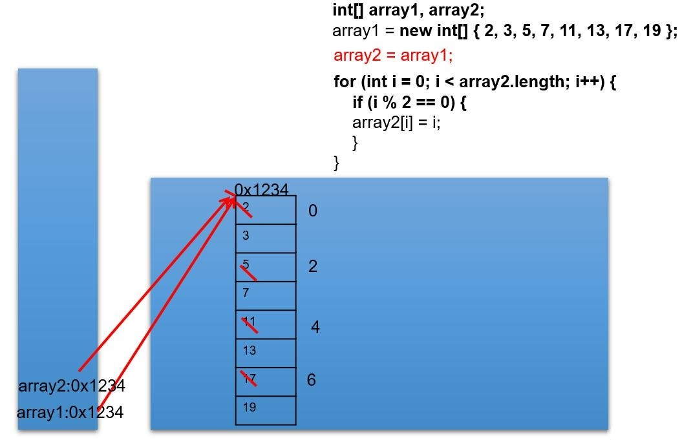
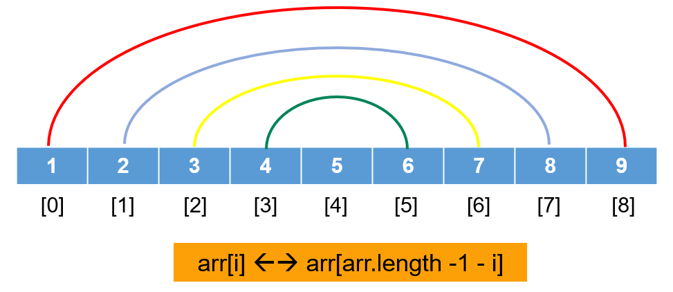
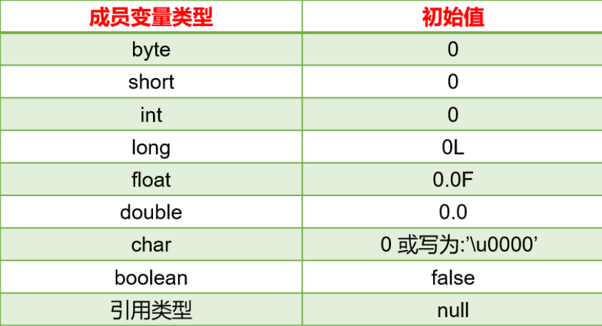
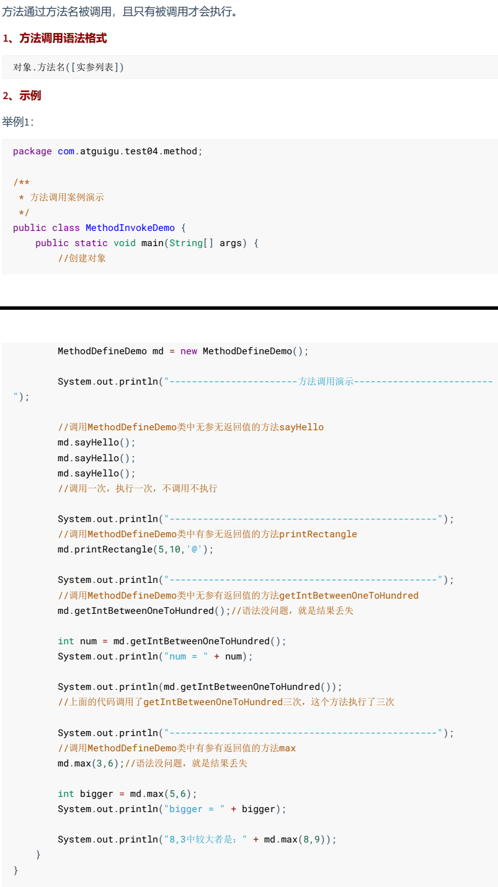
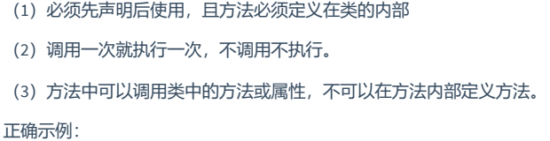
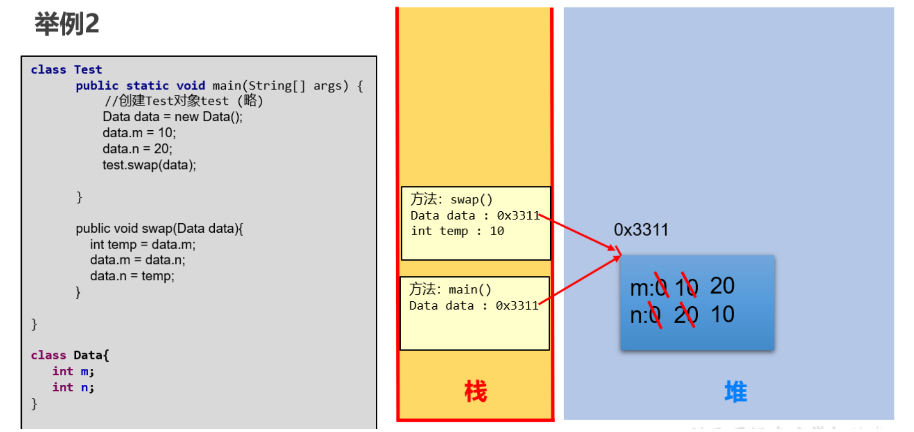

## 姓名：席崇援

## 学习任务：

* 数组基础
  * 初识数组
  * 数组的基本使用
  * 数组练习
  * 二维数组
* 数组进阶
  * 数组的复制
  * 元素查找
  * 交换算法
  * 选择排序，冒泡排序
* **面向对象编程（重点）**
  * 类与对象
  * 类的成员变量，属性
  * 类的方法
    * 如何定义方法
    * 方法的重载
    * 掌握数组作为参数的使用
    * 可变形参个数

## 完成情况:

构造器

this关键字

static关键字

这几个下周再弄,其他的已完成.

## 笔记：

## 数组

### **数组的特点：**

- 数组本身是`引用数据类型`，而数组中的元素可以是`任何数据类型`，包括基本数据类型和引用数据类型。
- 创建数组对象会在内存中开辟一整块`连续的空间`。占据的空间的大小，取决于数组的长度和数组中元素的类型。
- 数组中的元素在内存中是依次紧密排列的，有序的。
- 数组，一旦初始化完成，其长度就是确定的。数组的`长度一旦确定，就不能修改`。
- 我们可以直接通过下标(或索引)的方式调用指定位置的元素，速度很快。
- 数组名中引用的是这块连续空间的首地址。

---

### 一维数组

---

#### 声明

**格式：**


```java
//推荐
元素的数据类型[] 一维数组的名称;

//不推荐
元素的数据类型  一维数组名[];
```

**举例：**

```java
int[] arr;
int arr1[];
double[] arr2;
String[] arr3;  //引用类型变量数组
```

**数组的声明，需要明确：**

（1）数组的维度：在Java中数组的符号是[]，[]表示一维，\[]\[]表示二维。

（2）数组的元素类型：即创建的数组容器可以存储什么数据类型的数据。元素的类型可以是任意的Java的数据类型。例如：int、String、Student等。

（3）数组名：就是代表某个数组的标识符，数组名其实也是变量名，按照变量的命名规范来命名。数组名是个引用数据类型的变量，因为它代表一组数据。

**举例：**

```java
public class ArrayTest1 {
    public static void main(String[] args) {
        //比如，要存储一个小组的成绩
        int[] scores;
        int grades[];
//        System.out.println(scores);//未初始化不能使用

        //比如，要存储一组字母
        char[] letters;

        //比如，要存储一组姓名
        String[] names;

        //比如，要存储一组价格
        double[] prices;

    }
}
```

注意：Java语言中声明数组时不能指定其长度(数组中元素的个数)。 例如： int a[5]; //非法

---

#### 静态初始化

- 如果数组变量的初始化和数组元素的赋值操作同时进行，那就称为静态初始化。

- 静态初始化，本质是用静态数据（编译时已知）为数组初始化。此时数组的长度由静态数据的个数决定。

- **一维数组声明和静态初始化格式1：**

  ```java
  数据类型[] 数组名 = new 数据类型[]{元素1,元素2,元素3,...};
  
  或
      
  数据类型[] 数组名;
  数组名 = new 数据类型[]{元素1,元素2,元素3,...};
  ```

  - new：关键字，创建数组使用的关键字。因为数组本身是引用数据类型，所以要用new创建数组实体。

例如，定义存储1，2，3，4，5整数的数组容器。

```java
int[] arr = new int[]{1,2,3,4,5};//正确
//或
int[] arr;
arr = new int[]{1,2,3,4,5};//正确
```

- **一维数组声明和静态初始化格式2：**

```java
数据类型[] 数组名 = {元素1,元素2,元素3...};//必须在一个语句中完成，不能分成两个语句写
```

例如，定义存储1，2，3，4，5整数的数组容器

```java
int[] arr = {1,2,3,4,5};//正确

int[] arr;
arr = {1,2,3,4,5};//错误
```

**举例：**

```java
public class ArrayTest2 {
    public static void main(String[] args) {
        int[] arr = {1,2,3,4,5};//右边不需要写new int[]

        int[] nums;
        nums = new int[]{10,20,30,40}; //声明和初始化在两个语句完成，就不能使用new int[]

        char[] word = {'h','e','l','l','o'};

        String[] heros = {"袁隆平","邓稼先","钱学森"};

        System.out.println("arr数组：" + arr);//arr数组：[I@1b6d3586
        System.out.println("nums数组：" + nums);//nums数组：[I@4554617c
        System.out.println("word数组：" + word);//word数组：[C@74a14482
        System.out.println("heros数组：" + heros);//heros数组：[Ljava.lang.String;@1540e19d
    }
}
```

#### 动态初始化

数组变量的初始化和数组元素的赋值操作分开进行，即为动态初始化。


动态初始化中，只确定了元素的个数（即数组的长度），而元素值此时只是默认值，还并未真正赋自己期望的值。真正期望的数据需要后续单独一个一个赋值。

**格式：**

```java
数组存储的元素的数据类型[] 数组名字 = new 数组存储的元素的数据类型[长度];

或

数组存储的数据类型[] 数组名字;
数组名字 = new 数组存储的数据类型[长度];
```

- [长度]：数组的长度，表示数组容器中可以最多存储多少个元素。

- **注意：数组有定长特性，长度一旦指定，不可更改。**和水杯道理相同，买了一个2升的水杯，总容量就是2升是固定的。

**举例1：正确写法**


```java
int[] arr = new int[5];

int[] arr;
arr = new int[5];

```

**举例2：错误写法**

```java
int[] arr = new int[5]{1,2,3,4,5};//错误的，后面有{}指定元素列表，就不需要在[]中指定元素个数了。
```

#### 数组的长度

- 数组的元素总个数，即数组的长度
- 每个数组都有一个属性length指明它的长度，例如：arr.length 指明数组arr的长度(即元素个数)
- 每个数组都具有长度，而且一旦初始化，其长度就是确定，且是不可变的。

---

#### 遍历

将数组中的每个元素分别获取出来，就是`遍历`。for循环与数组的遍历是绝配。

**举例1**

```java
public class ArrayTest4 {
    public static void main(String[] args) {
        int[] arr = new int[]{1,2,3,4,5};
        //打印数组的属性，输出结果是5
        System.out.println("数组的长度：" + arr.length);

        //遍历输出数组中的元素
        System.out.println("数组的元素有：");
        for(int i=0; i<arr.length; i++){
            System.out.println(arr[i]);
        }
    }
}
```

**举例2**


```java
public class ArrayTest5 {
    public static void main(String[] args) {
        int[] arr = new int[5];

        System.out.println("arr数组的长度：" + arr.length);
        System.out.print("存储数据到arr数组之前：[");
        for (int i = 0; i < arr.length; i++) {
            if(i==0){
                System.out.print(arr[i]);
            }else{
                System.out.print("," + arr[i]);
            }
        }
        System.out.println("]");

        //初始化
 		/* 
 		arr[0] = 2;
        arr[1] = 4;
        arr[2] = 6;
        arr[3] = 8;
        arr[4] = 10;
        */

        for (int i = 0; i < arr.length; i++) {
            arr[i] = (i+1) * 2;
        }

        System.out.print("存储数据到arr数组之后：[");
        for (int i = 0; i < arr.length; i++) {
            if(i==0){
                System.out.print(arr[i]);
            }else{
                System.out.print("," + arr[i]);
            }
        }
        System.out.println("]");
    }
}
```

## 数组元素的默认值

数组是引用类型，当我们使用动态初始化方式创建数组时，元素值只是默认值。例如：

```java
public class ArrayTest6 {
	public static void main(String argv[]){
		int a[]= new int[5]; 
		System.out.println(a[3]); //a[3]的默认值为0
	}
} 
```

对于基本数据类型而言，默认初始化值各有不同。

对于引用数据类型而言，默认初始化值为null（注意与0不同！)


```java
public class ArrayTest7 {
    public static void main(String[] args) {
        //存储26个字母
        char[] letters = new char[26];
        System.out.println("letters数组的长度：" + letters.length);
        System.out.print("存储字母到letters数组之前：[");
        for (int i = 0; i < letters.length; i++) {
            if(i==0){
                System.out.print(letters[i]);
            }else{
                System.out.print("," + letters[i]);
            }
        }
        System.out.println("]");

       //存储5个姓名
        String[] names = new String[5];
        System.out.println("names数组的长度：" + names.length);
        System.out.print("存储姓名到names数组之前：[");
        for (int i = 0; i < names.length; i++) {
            if(i==0){
                System.out.print(names[i]);
            }else{
                System.out.print("," + names[i]);
            }
        }
        System.out.println("]");
    }
}
```

## 

### 一维数组练习

**案例1：**升景坊单间短期出租4个月，550元/月（水电煤公摊，网费35元/月），空调、卫生间、厨房齐全。屋内均是IT行业人士，喜欢安静。所以要求来租者最好是同行或者刚毕业的年轻人，爱干净、安静。

```java
public class ArrayTest {
      public static void main(String[] args) {
      int[] arr = new int[]{8,2,1,0,3};
      int[] index = new int[]{2,0,3,2,4,0,1,3,2,3,3};
      String tel = "";
      for(int i = 0;i < index.length;i++){
            tel += arr[index[i]];
      }
      System.out.println("联系方式：" + tel);
      }
}

```

案例2：输出英文星期几

用一个数组，保存星期一到星期天的7个英语单词，从键盘输入1-7，显示对应的单词
{"Monday","Tuesday","Wednesday","Thursday","Friday","Saturday","Sunday"}

```java
import java.util.Scanner;

/**
 * @author 尚硅谷-宋红康
 * @create 14:37
 */
public class WeekArrayTest {
    public static void main(String[] args) {

        //1. 声明并初始化星期的数组
        String[] weeks = {"Monday","Tuesday","Wednesday","Thursday","Friday","Saturday","Sunday"};

        //2. 使用Scanner从键盘获取1-7范围的整数
        Scanner scanner = new Scanner(System.in);
        System.out.println("请输入[1-7]范围的整数：");
        int number = scanner.nextInt();

        if(number < 1 || number > 7){
            System.out.println("你输入的输入非法");
        }else{

            //3. 根据输入的整数，到数组中相应的索引位置获取指定的元素（即：星期几）
            System.out.println("对应的星期为：" + weeks[number - 1]);

        }
        
        scanner.close();

    }
}
```

**案例3：**从键盘读入学生成绩，找出最高分，并输出学生成绩等级。

- 成绩>=最高分-10  等级为’A’  

- 成绩>=最高分-20  等级为’B’

- 成绩>=最高分-30  等级为’C’  

- 其余            等级为’D’

提示：先读入学生人数，根据人数创建int数组，存放学生成绩。


```java
/**
 * @author 尚硅谷-宋红康
 * @create 14:55
 */
public class ScoreTest1 {
    public static void main(String[] args) {

        //1. 根据提示，获取学生人数
        System.out.print("请输入学生人数：");
        Scanner scanner = new Scanner(System.in);
        int count = scanner.nextInt();

        //2. 根据学生人数，创建指定长度的数组 (使用动态初始化)
        int[] scores = new int[count];

        //3. 使用循环，依次给数组的元素赋值
        int maxScore = 0; //记录最高分
        System.out.println("请输入" + count + "个成绩");
        for (int i = 0; i < scores.length; i++) {
            scores[i] = scanner.nextInt();
            //4. 获取数组中元素的最大值，即为最高分
            if(maxScore < scores[i]){
                maxScore = scores[i];
            }
        }

        System.out.println("最高分是：" + maxScore);

        //5. 遍历数组元素，输出各自的分数，并根据其分数与最高分的差值，获取各自的等级
        char grade;
        for (int i = 0; i < scores.length; i++) {

            if(scores[i] >= maxScore - 10){
                grade = 'A';
            }else if(scores[i] >= maxScore - 20){
                grade = 'B';
            }else if(scores[i] >= maxScore - 30){
                grade = 'C';
            }else{
                grade = 'D';
            }
            System.out.println("student " + i + " socre is " + scores[i] + ", grade is " + grade);
        }
        //关闭资源
        scanner.close();

    }
}
```

### 二维数组

- **应用举例1：**

  某公司2022年全年各个月份的销售额进行登记。按月份存储，可以使用一维数组。如下：

  ```java
  int[] monthData = new int[]{23,43,22,34,55,65,44,67,45,78,67,66};
  ```

  如果改写为按`季度`为单位存储怎么办呢？

  ```java
  int[][] quarterData = new int[][]{{23,43,22},{34,55,65},{44,67,45},{78,67,66}};
  ```

- **应用举例2：**

高一年级三个班级均由多个学生姓名构成一个个数组。如下：

```java
String[] class1 = new String[]{"段誉","令狐冲","任我行"};

String[] class2 = new String[]{"张三丰","周芷若"};

String[] class3 = new String[]{"赵敏","张无忌","韦小宝","杨过"};

```

那从整个年级看，我们可以声明一个二维数组。如下：

```java
String[][] grade = new String[][]{{"段誉","令狐冲","任我行"},{"张三丰","周芷若"},{"赵敏","张无忌","韦小宝","杨过"}};
```

#### 声明

二维数组声明的语法格式：

```java
//推荐
元素的数据类型[][] 二维数组的名称;

//不推荐
元素的数据类型  二维数组名[][];
//不推荐
元素的数据类型[]  二维数组名[];
```

例如：

```java
public class Test20TwoDimensionalArrayDefine {
    public static void main(String[] args) {
        //存储多组成绩
        int[][] grades;

        //存储多组姓名
        String[][] names;
    }
}
```

面试：

```
int[] x, y[];
//x是一维数组，y是二维数组
```

#### 静态初始化

**格式：**

```java
int[][] arr = new int[][]{{3,8,2},{2,7},{9,0,1,6}};
```

定义一个名称为arr的二维数组，二维数组中有三个一维数组

- 每一个一维数组中具体元素也都已初始化
  - 第一个一维数组 arr[0] = {3,8,2};
  - 第二个一维数组 arr[1] = {2,7};
  - 第三个一维数组 arr[2] = {9,0,1,6};
- 第三个一维数组的长度表示方式：arr[2].length;

> - 注意特殊写法情况：int[] x,y[]; x是一维数组，y是二维数组。

- 举例1：


```java
int[][] arr = {{1,2,3},{4,5,6},{7,8,9,10}};//声明与初始化必须在一句完成

int[][] arr = new int[][]{{1,2,3},{4,5,6},{7,8,9,10}};

int[][] arr;
arr = new int[][]{{1,2,3},{4,5,6},{7,8,9,10}};

arr = new int[3][3]{{1,2,3},{4,5,6},{7,8,9,10}};//错误，静态初始化右边new 数据类型[][]中不能写数字
```

- 举例2：


```java
public class TwoDimensionalArrayInitialize {
    public static void main(String[] args) {
        //存储多组成绩
        int[][] grades = {
                    {89,75,99,100},
                    {88,96,78,63,100,86},
                    {56,63,58},
                    {99,66,77,88}
                };

        //存储多组姓名
        String[][] names = {
            {"张三","李四", "王五", "赵六"},
            {"刘备","关羽","张飞","诸葛亮","赵云","马超"},
            {"曹丕","曹植","曹冲"},
            {"孙权","周瑜","鲁肃","黄盖"}
        };
    }
}
```

#### 动态初始化

如果二维数组的每一个数据，甚至是每一行的列数，需要后期单独确定，那么就只能使用动态初始化方式了。动态初始化方式分为两种格式：

**格式1：规则二维表：每一行的列数是相同的**

```java
//（1）确定行数和列数
元素的数据类型[][] 二维数组名 = new 元素的数据类型[m][n];
	//其中，m:表示这个二维数组有多少个一维数组。或者说一共二维表有几行
	//其中，n:表示每一个一维数组的元素有多少个。或者说每一行共有一个单元格

//此时创建完数组，行数、列数确定，而且元素也都有默认值

//（2）再为元素赋新值
二维数组名[行下标][列下标] = 值;
```

举例：

```java
int[][] arr = new int[3][2];
```

-  定义了名称为arr的二维数组

-  二维数组中有3个一维数组

-  每一个一维数组中有2个元素

-  一维数组的名称分别为arr[0], arr[1], arr[2]

-  给第一个一维数组1脚标位赋值为78写法是：`arr[0][1] = 78;`

**格式2：不规则：每一行的列数不一样**

```java
//（1）先确定总行数
元素的数据类型[][] 二维数组名 = new 元素的数据类型[总行数][];

//此时只是确定了总行数，每一行里面现在是null

//（2）再确定每一行的列数，创建每一行的一维数组
二维数组名[行下标] = new 元素的数据类型[该行的总列数];

//此时已经new完的行的元素就有默认值了，没有new的行还是null

//(3)再为元素赋值
二维数组名[行下标][列下标] = 值;
```

举例：

```java
int[][] arr = new int[3][];
```

-  二维数组中有3个一维数组。
-  每个一维数组都是默认初始化值null (注意：区别于格式1）
-  可以对这个三个一维数组分别进行初始化：arr[0] = new int[3];    arr[1] = new int[1];   arr[2] = new int[2];
-  注：`int[][]arr = new int[][3]; ` //非法

练习：

```java
/*
 1
 2 2
 3 3 3
 4 4 4 4
 5 5 5 5 5
 */
public class Test25DifferentElementCount {
    public static void main(String[] args){
        //1、声明一个二维数组，并且确定行数
        //因为每一行的列数不同，这里无法直接确定列数
        int[][]  arr = new int[5][];

        //2、确定每一行的列数
        for(int i=0; i<arr.length; i++){
			/*
			arr[0] 的列数是1
			arr[1] 的列数是2
			arr[2] 的列数是3
			arr[3] 的列数是4
			arr[4] 的列数是5
			*/
            arr[i] = new int[i+1];
        }

        //3、确定元素的值
        for(int i=0; i<arr.length; i++){
            for(int j=0; j<arr[i].length; j++){
                arr[i][j] = i+1;
            }
        }

        //4、遍历显示
        for(int i=0; i<arr.length; i++){
            for(int j=0; j<arr[i].length; j++){
                System.out.print(arr[i][j] + " ");
            }
            System.out.println();
        }

    }
}
```

#### 二维数组的长度和角标

- 二维数组的长度/行数：二维数组名.length
- 二维数组的某一行：二维数组名[行下标]，此时相当于获取其中一组数据。它本质上是一个一维数组。行下标的范围：[0, 二维数组名.length-1]。此时把二维数组看成一维数组的话，元素是行对象。
- 某一行的列数：二维数组名[行下标].length，因为二维数组的每一行是一个一维数组。
- 某一个元素：二维数组名\[行下标\]\[列下标\]，即先确定行/组，再确定列。

```java
public class Test22TwoDimensionalArrayUse {
    public static void main(String[] args){
        //存储3个小组的学员的成绩，分开存储，使用二维数组。
		/*
		int[][] scores1;
		int scores2[][];
		int[] scores3[];*/

        int[][] scores = {
                {85,96,85,75},
                {99,96,74,72,75},
                {52,42,56,75}
        };

        System.out.println(scores);//[[I@15db9742
        System.out.println("一共有" + scores.length +"组成绩.");

        //[[：代表二维数组，I代表元素类型是int
        System.out.println(scores[0]);//[I@6d06d69c
        //[：代表一维数组，I代表元素类型是int
        System.out.println(scores[1]);//[I@7852e922
        System.out.println(scores[2]);//[I@4e25154f
        //System.out.println(scores[3]);//ArrayIndexOutOfBoundsException: 3

        System.out.println("第1组有" + scores[0].length +"个学员.");
        System.out.println("第2组有" + scores[1].length +"个学员.");
        System.out.println("第3组有" + scores[2].length +"个学员.");

        System.out.println("第1组的每一个学员成绩如下：");
        //第一行的元素
        System.out.println(scores[0][0]);//85
        System.out.println(scores[0][1]);//96
        System.out.println(scores[0][2]);//85
        System.out.println(scores[0][3]);//75
        //System.out.println(scores[0][4]);//java.lang.ArrayIndexOutOfBoundsException: 4
    }
}
```

#### 二维数组的遍历

- 格式：

```java
for(int i=0; i<二维数组名.length; i++){ //二维数组对象.length
    for(int j=0; j<二维数组名[i].length; j++){//二维数组行对象.length
        System.out.print(二维数组名[i][j]);
    }
    System.out.println();
}
```

- 举例：

```java
public class Test23TwoDimensionalArrayIterate {
    public static void main(String[] args) {
        //存储3个小组的学员的成绩，分开存储，使用二维数组。
        int[][] scores = {
                {85,96,85,75},
                {99,96,74,72,75},
                {52,42,56,75}
        };

        System.out.println("一共有" + scores.length +"组成绩.");
        for (int i = 0; i < scores.length; i++) {
            System.out.print("第" + (i+1) +"组有" + scores[i].length + "个学员，成绩如下：");
            for (int j = 0; j < scores[i].length; j++) {
                System.out.print(scores[i][j]+"\t");
            }
            System.out.println();
        }
    }
}
```

### &#x27A4;内存解析

二维数组本质上是元素类型是一维数组的一维数组。

```java
int[][] arr = {
    {1},
    {2,2},
    {3,3,3},
    {4,4,4,4},
    {5,5,5,5,5}
};
```


```java
//1、声明二维数组，并确定行数和列数
int[][] arr = new int[4][5];

//2、确定元素的值
for (int i = 0; i < arr.length; i++) {
    for (int j = 0; j < arr.length; j++) {
        arr[i][j] = i + 1;
    }
}
```


```java
//1、声明一个二维数组，并且确定行数
//因为每一行的列数不同，这里无法直接确定列数
int[][]  arr = new int[5][];

//2、确定每一行的列数
for(int i=0; i<arr.length; i++){
    /*
			arr[0] 的列数是1
			arr[1] 的列数是2
			arr[2] 的列数是3
			arr[3] 的列数是4
			arr[4] 的列数是5
			*/
    arr[i] = new int[i+1];
}

//3、确定元素的值
for(int i=0; i<arr.length; i++){
    for(int j=0; j<arr[i].length; j++){
        arr[i][j] = i+1;
    }
}
```


### 二维数组练习

**案例1：**获取arr数组中所有元素的和。

提示：使用for的嵌套循环即可。


**案例2：**声明：int[] x,y[]; 在给x,y变量赋值以后，以下选项允许通过编译的是： 

```java
声明：int[] x,y[]; 在给x,y变量赋值以后，以下选项允许通过编译的是：
a)    x[0] = y;                 //no
b)    y[0] = x;                 //yes
c)    y[0][0] = x;              //no
d)    x[0][0] = y;              //no
e)    y[0][0] = x[0];           //yes
f)    x = y;                    //no

提示：
一维数组：int[] x  或者int x[]   
二维数组：int[][] y 或者  int[] y[]  或者 int  y[][]

```

**案例3：**使用二维数组打印一个 10 行杨辉三角。

提示：

1. 第一行有 1 个元素, 第 n 行有 n 个元素

2. 每一行的第一个元素和最后一个元素都是 1

3. 从第三行开始, 对于非第一个元素和最后一个元素的元素。即：

   ```
   yanghui[i][j] = yanghui[i-1][j-1] + yanghui[i-1][j];
   ```


```java
/**
 * @author 尚硅谷-宋红康
 * @create 10:11
 */
public class YangHuiTest {
    public static void main(String[] args) {

        //1. 动态初始化的方式创建二维数组
        int[][] yangHui = new int[10][];

        for (int i = 0; i < yangHui.length; i++) {
            yangHui[i] = new int[i + 1];

            //2. 给数组元素赋值
            // 2.1 给外层数组元素中的首元素和末元素赋值
            yangHui[i][0] = yangHui[i][i] = 1;

            //2.2 给外层数组元素中的非首元素和非末元素赋值（难）
            //if(i > 1){ //从 i == 2 开始执行
                for(int j = 1;j < yangHui[i].length - 1;j++){ //非首元素和非末元素的角标范围
                    yangHui[i][j] = yangHui[i-1][j-1] + yangHui[i-1][j];

                }
            //}
        }


        //3. 遍历二维数组
        for (int i = 0; i < yangHui.length; i++) {
            for (int j = 0; j < yangHui[i].length; j++) {
                System.out.print(yangHui[i][j] + "\t");
            }

            System.out.println();
        }

    }
}
```

## 数组进阶

### 数组的复制

**举例2：**使用简单数组

(1)创建一个名为ArrayTest的类，在main()方法中声明array1和array2两个变量，他们是int[]类型的数组。

(2)使用大括号{}，把array1初始化为8个素数：2,3,5,7,11,13,17,19。

(3)显示array1的内容。

(4)赋值array2变量等于array1，修改array2中的偶索引元素，使其等于索引值(如array[0]=0,array[2]=2)。打印出array1。  array2 = array1;

> **思考：**array1和array2是什么关系？
>
> **拓展：**修改题目，实现array2对array1数组的复制



**举例3：**一个数组，让数组的每个元素去除第一个元素，得到的商作为被除数所在位置的新值。

```java
public class Test3 {
	public static void main(String[] args) {
		int[] arr = new int[]{12,43,65,3,-8,64,2};
		
//		for(int i = 0;i < arr.length;i++){
//			arr[i] = arr[i] / arr[0];
//		}
		for(int i = arr.length -1;i >= 0;i--){
			arr[i] = arr[i] / arr[0];
		}
		//遍历arr
		for(int i = 0;i < arr.length;i++){
			System.out.print(arr[i] + " ");
		}
	}
}
```

**举例4：**创建一个长度为6的int型数组，要求数组元素的值都在1-30之间，且是随机赋值。同时，要求元素的值各不相同。 

```java
public class Test4 {
	// 5-67 Math.random() * 63 + 5;
	@Test
	public void test1() {
		int[] arr = new int[6];
		for (int i = 0; i < arr.length; i++) {// [0,1) [0,30) [1,31)
			arr[i] = (int) (Math.random() * 30) + 1;

			boolean flag = false;
			while (true) {
				for (int j = 0; j < i; j++) {
					if (arr[i] == arr[j]) {
						flag = true;
						break;
					}
				}
				if (flag) {
					arr[i] = (int) (Math.random() * 30) + 1;
					flag = false;
					continue;
				}
				break;
			}
		}

		for (int i = 0; i < arr.length; i++) {
			System.out.println(arr[i]);
		}
	}
	//更优的方法
	@Test
	public void test2(){
		int[] arr = new int[6];
		for (int i = 0; i < arr.length; i++) {// [0,1) [0,30) [1,31)
			arr[i] = (int) (Math.random() * 30) + 1;
			
				for (int j = 0; j < i; j++) {
					if (arr[i] == arr[j]) {
						i--;
						break;
					}
				}
			}

		for (int i = 0; i < arr.length; i++) {
			System.out.println(arr[i]);
		}
	}
}
```

**举例5：**扑克牌

案例：遍历扑克牌

遍历扑克牌，效果如图所示：


提示：使用两个字符串数组，分别保存花色和点数，再用一个字符串数组保存最后的扑克牌。
String[] hua = {"黑桃","红桃","梅花","方片"};
String[] dian = {"A","2","3","4","5","6","7","8","9","10","J","Q","K"};

```java
package com.atguigu3.common_algorithm.exer5;

/**
 * @author 尚硅谷-宋红康
 * @create 17:16
 */
public class ArrayExer05 {
    public static void main(String[] args) {
        String[] hua = {"黑桃","红桃","梅花","方片"};
        String[] dian = {"A","2","3","4","5","6","7","8","9","10","J","Q","K"};


        String[] pai = new String[hua.length * dian.length];
        int k = 0;
        for(int i = 0;i < hua.length;i++){
            for(int j = 0;j < dian.length;j++){
                pai[k++] = hua[i] + dian[j];
            }
        }

        for (int i = 0; i < pai.length; i++) {
            System.out.print(pai[i] + "  ");
            if(i % 13 == 12){
                System.out.println();
            }
        }

    }
}

```

### 元素反转交换

数组对称位置的元素互换。



```java
public class TestArrayReverse1 {
    public static void main(String[] args) {
        int[] arr = {1,2,3,4,5};
        System.out.println("反转之前：");
        for (int i = 0; i < arr.length; i++) {
            System.out.println(arr[i]);
        }

        //反转
         /*
        思路：首尾对应位置的元素交换
        （1）确定交换几次
           次数 = 数组.length / 2
        （2）谁和谁交换
        for(int i=0; i<次数; i++){
             int temp = arr[i];
             arr[i] = arr[arr.length-1-i];
             arr[arr.length-1-i] = temp;
        }
         */
        for(int i=0; i<arr.length/2; i++){
            int temp = arr[i];
            arr[i] = arr[arr.length-1-i];
            arr[arr.length-1-i] = temp;
        }

        System.out.println("反转之后：");
        for (int i = 0; i < arr.length; i++) {
            System.out.println(arr[i]);
        }
    }

}
```

或


```java
public class TestArrayReverse2 {
    public static void main(String[] args) {
        int[] arr = {1,2,3,4,5};
        System.out.println("反转之前：");
        for (int i = 0; i < arr.length; i++) {
            System.out.println(arr[i]);
        }

        //反转
        //左右对称位置交换
        for(int left=0,right=arr.length-1; left<right; left++,right--){
            //首  与  尾交换
            int temp = arr[left];
            arr[left] = arr[right];
            arr[right] = temp;
        }

        System.out.println("反转之后：");
        for (int i = 0; i < arr.length; i++) {
            System.out.println(arr[i]);
        }
    }
}
```

### 数组的扩容与缩容

#### **扩容**

题目：现有数组 int[] arr = new int[]{1,2,3,4,5}; ，现将数组长度扩容1倍，并将10,20,30三个数据添加到arr数组中，如何操作？

```java
public class ArrTest1 {
    public static void main(String[] args) {

        int[] arr = new int[]{1,2,3,4,5};
        int[] newArr = new int[arr.length << 1];

        for(int i = 0;i < arr.length;i++){
            newArr[i] = arr[i];
        }

        newArr[arr.length] = 10;
        newArr[arr.length + 1] = 20;
        newArr[arr.length + 2] = 30;

        arr = newArr;

        //遍历arr
        for (int i = 0; i < arr.length; i++) {
            System.out.println(arr[i]);
        }
    }
}
```

---

#### 缩容

题目：现有数组 int[] arr={1,2,3,4,5,6,7}。现需删除数组中索引为4的元素。

```java
public class ArrTest2 {
    public static void main(String[] args) {
 
        int[] arr = {1, 2, 3, 4, 5, 6, 7};
        //删除数组中索引为4的元素
        int delIndex = 4;
        //方案1：
        /*//创建新数组
        int[] newArr = new int[arr.length - 1];

        for (int i = 0; i < delIndex; i++) {
            newArr[i] = arr[i];
        }
        for (int i = delIndex + 1; i < arr.length; i++) {
            newArr[i - 1] = arr[i];
        }

        arr = newArr;
        for (int i = 0; i < arr.length; i++) {
            System.out.println(arr[i]);
        }*/

        //方案2：
        for (int i = delIndex; i < arr.length - 1; i++) {
            arr[i] = arr[i + 1];
        }
        arr[arr.length - 1] = 0;

        for (int i = 0; i < arr.length; i++) {
            System.out.println(arr[i]);
        }
    }
}
```

### 元素查找

**1、顺序查找**

顺序查找：挨个查看

要求：对数组元素的顺序没要求

```java
public class TestArrayOrderSearch {
    //查找value第一次在数组中出现的index
    public static void main(String[] args){
        int[] arr = {4,5,6,1,9};
        int value = 1;
        int index = -1;

        for(int i=0; i<arr.length; i++){
            if(arr[i] == value){
                index = i;
                break;
            }
        }

        if(index==-1){
            System.out.println(value + "不存在");
        }else{
            System.out.println(value + "的下标是" + index);
        }
    }
}
```

**2、二分查找**

举例：


实现步骤：


```java
//二分法查找：要求此数组必须是有序的。
int[] arr3 = new int[]{-99,-54,-2,0,2,33,43,256,999};
boolean isFlag = true;
int value = 256;
//int value = 25;
int head = 0;//首索引位置
int end = arr3.length - 1;//尾索引位置
while(head <= end){
    int middle = (head + end) / 2;
    if(arr3[middle] == value){
        System.out.println("找到指定的元素，索引为：" + middle);
        isFlag = false;
        break;
    }else if(arr3[middle] > value){
        end = middle - 1;
    }else{//arr3[middle] < value
        head = middle + 1;
    }
}

if(isFlag){
    System.out.println("未找打指定的元素");
}

```

### 冒泡排序

**排序思想：**

1. 比较相邻的元素。如果第一个比第二个大（升序），就交换他们两个。

2. 对每一对相邻元素作同样的工作，从开始第一对到结尾的最后一对。这步做完后，最后的元素会是最大的数。

3. 针对所有的元素重复以上的步骤，除了最后一个。

4. 持续每次对越来越少的元素重复上面的步骤，直到没有任何一对数字需要比较为止。


**动态演示：**https://visualgo.net/zh/sorting

**冒泡排序优化（选讲）**

```java
/*
思考：冒泡排序是否可以优化
*/
class Test19BubbleSort2{
	public static void main(String[] args) {
        int[] arr = {1, 3, 5, 7, 9};

        //从小到大排序
        for (int i = 0; i < arr.length - 1; i++) {
            boolean flag = true;//假设数组已经是有序的
            for (int j = 0; j < arr.length - 1 - i; j++) {
                //希望的是arr[j] < arr[j+1]
                if (arr[j] > arr[j + 1]) {
                    //交换arr[j]与arr[j+1]
                    int temp = arr[j];
                    arr[j] = arr[j + 1];
                    arr[j + 1] = temp;

                    flag = false;//如果元素发生了交换，那么说明数组还没有排好序
                }
            }
            if (flag) {
                break;
            }
        }

        //完成排序，遍历结果
        for (int i = 0; i < arr.length; i++) {
            System.out.print(arr[i] + "  ");
        }
    }
}
```

### 选择排序

 [选择排序](https://edu.csdn.net/course/detail/40020?utm_source=glcblog&spm=1001.2101.3001.7020)原理即是，遍历元素找到一个最小（或最大）的元素，把它放在第一个位置，然后再在剩余元素中找到最小（或最大）的元素，把它放在第二个位置，依次下去，完成排序。

    public class SortDemo {
     
        public static void main(String[] args) {
            int[] arr = new int[] { 5, 3, 6, 2, 10, 2, 1 };
            selectSort(arr);
            for (int i = 0; i < arr.length; i++) {
                System.out.print(arr[i] + " ");
            }
        }
     
        public static void selectSort(int[] arr) {
            for (int i = 0; i < arr.length - 1; i++) {
                int minIndex = i; // 用来记录最小值的索引位置，默认值为i
                for (int j = i + 1; j < arr.length; j++) {
                    if (arr[j] < arr[minIndex]) {
                        minIndex = j; // 遍历 i+1~length 的值，找到其中最小值的位置
                    }
                }
                // 交换当前索引 i 和最小值索引 minIndex 两处的值
                if (i != minIndex) {
                    int temp = arr[i];
                    arr[i] = arr[minIndex];
                    arr[minIndex] = temp;
                }
                // 执行完一次循环，当前索引 i 处的值为最小值，直到循环结束即可完成排序
            }
        }
     
    }

## &#x27A4;Arrays工具类的使用

java.util.Arrays类即为操作数组的工具类，包含了用来操作数组（比如排序和搜索）的各种方法。 比如：

* `数组元素拼接`
  * static String toString(int[] a) ：字符串表示形式由数组的元素列表组成，括在方括号（"[]"）中。相邻元素用字符 ", "（逗号加空格）分隔。形式为：[元素1，元素2，元素3。。。]
  * static String toString(Object[] a) ：字符串表示形式由数组的元素列表组成，括在方括号（"[]"）中。相邻元素用字符 ", "（逗号加空格）分隔。元素将自动调用自己从Object继承的toString方法将对象转为字符串进行拼接，如果没有重写，则返回类型@hash值，如果重写则按重写返回的字符串进行拼接。
* `数组排序`
  * static void sort(int[] a) ：将a数组按照从小到大进行排序
  * static void sort(int[] a, int fromIndex, int toIndex) ：将a数组的[fromIndex, toIndex)部分按照升序排列
  * static void sort(Object[] a) ：根据元素的自然顺序对指定对象数组按升序进行排序。
  * static <T> void sort(T[] a, Comparator<? super T> c) ：根据指定比较器产生的顺序对指定对象数组进行排序。
* `数组元素的二分查找`
  * static int binarySearch(int[] a, int key)  、static int binarySearch(Object[] a, Object key) ：要求数组有序，在数组中查找key是否存在，如果存在返回第一次找到的下标，不存在返回负数。
* `数组的复制`
  * static int[] copyOf(int[] original, int newLength)  ：根据original原数组复制一个长度为newLength的新数组，并返回新数组
  * static <T> T[] copyOf(T[] original,int newLength)：根据original原数组复制一个长度为newLength的新数组，并返回新数组
  * static int[] copyOfRange(int[] original, int from, int to) ：复制original原数组的[from,to)构成新数组，并返回新数组
  * static <T> T[] copyOfRange(T[] original,int from,int to)：复制original原数组的[from,to)构成新数组，并返回新数组
* `比较两个数组是否相等`
  * static boolean equals(int[] a, int[] a2) ：比较两个数组的长度、元素是否完全相同
  * static boolean equals(Object[] a,Object[] a2)：比较两个数组的长度、元素是否完全相同
* `填充数组`
  * static void fill(int[] a, int val) ：用val值填充整个a数组
  * static void fill(Object[] a,Object val)：用val对象填充整个a数组
  * static void fill(int[] a, int fromIndex, int toIndex, int val)：将a数组[fromIndex,toIndex)部分填充为val值
  * static void fill(Object[] a, int fromIndex, int toIndex, Object val) ：将a数组[fromIndex,toIndex)部分填充为val对象

举例：java.util.Arrays类的sort()方法提供了数组元素排序功能：

```java
import java.util.Arrays;
public class SortTest {
	public static void main(String[] args) {
		int[] arr = {3, 2, 5, 1, 6};
        System.out.println("排序前" + Arrays.toString(arr));
        Arrays.sort(arr);
        System.out.println("排序后" + Arrays.toString(arr));
	}
}

```

## **面向对象编程（基础）**

### 类与对象


### 面向对象完成功能的三步骤

**步骤1：类的定义**
类的定义使用关键字：class。格式如下：

```java
[修饰符] class 类名{
	属性声明;
	方法声明;
}
```

举例1:

```java
public class Person{
	//声明属性age
	int age ;
	//声明方法showAge()
	public void eat() {
		System.out.println("人吃饭");
	}
}
```

举例2:

```java
public class Dog{
	//声明属性
	String type; //种类
	String nickName; //昵称
	String hostName; //主人名称
	//声明方法
	public void eat(){ //吃东西
		System.out.println("狗狗进食");
	}
}
```


举例:

```java
class PersonTest{
	public static void main(String[] args){
	//创建Person类的对象
	Person per = new Person();
	//创建Dog类的对象
		Dog dog = new Dog();
	}
}

```

**步骤3：对象调用属性或方法**

- 

- 步骤3：对象调用属性或方法对象是类的一个实例，必然具备该类事物的属性和行为（即方法）。
- 使用`对象名.属性 `或 `对象名.方法 `的方式访问对象成员（包括属性和方法）

举例1:

```java
//声明Animal类
public class Animal { //动物类
	public int legs;
	public void eat() {
		System.out.println("Eating.");
	}
	public void move() {
		System.out.println("Move.");
	}
}

```

```java
//声明测试类
public class AnimalTest {
	public static void main(String args[]) {
	//创建对象
	Animal xb = new Animal();
	xb.legs = 4;//访问属性
	System.out.println(xb.legs);
	xb.eat();//访问方法
	xb.move();//访问方法
	}
}
```


### 类的成员变量，属性

#### 如何声明成员变量


举例:

```java
public class Person{
	private int age; //声明private变量 age
	public String name = “Lila”; //声明public变量 name
}
```

#### 成员变量 vs 局部变量

1. 变量的分类：成员变量与局部变量

   - 在方法体外，类体内声明的变量称为成员变量。
   - 在方法体内部等位置声明的变量称为局部变量。

   

2. `成员变量` 与 `局部变量` 的对比

   - 相同点
     - 变量声明的格式相同： 数据类型 变量名 = 初始化值
     - 变量必须先声明、后初始化、再使用。
     - 变量都有其对应的作用域。只在其作用域内是有效的
   - 不同点
     - 声明位置和方式 （1）实例变量：在类中方法外 （2）局部变量：在方法体{}中或方法的形参列表、代码块中
     - 在内存中存储的位置不同 （1）实例变量：堆 （2）局部变量：栈
     - 生命周期 （1）实例变量：和对象的生命周期一样，随着对象的创建而存在，随着对象被GC回收而消亡， 而且每一个对象的实例变量是独立的。 （2）局部变量：和方法调用的生命周期一样，每一次方法被调用而在存在，随着方法执行的结束而消亡， 而且每一次方法调用都是独立。
     - 作用域 （1）实例变量：通过对象就可以使用，本类中直接调用，其他类中“对象.实例变量” （2）局部变量：出了作用域就不能使用
     - 修饰符（后面来讲） （1）实例变量:public,protected,private,final,volatile,transient等 （2）局部变量：final
     - 默认值 （1）实例变量：有默认值 （2）局部变量：没有，必须手动初始化。其中的形参比较特殊，
       靠实参给它初始化。

3. 对象属性的默认初始化赋值

   **当一个对象被创建时，会对其中各种类型的成员变量自动进行初始化赋值。**

   

举例:

```java
class Person {//人类
	//1.属性
	String name;//姓名
	int age = 1;//年龄
	boolean isMale;//是否是男性
	public void show(String nation) {
	//nation:局部变量
		String color;//color:局部变量
		color = "yellow";
	}
}
//测试类
class PersonTest {
	public static void main(String[] args) {
	Person p = new Person();
	p.show("CHN");
	}
}
```

### 类的方法

- 方法 是类或对象行为特征的抽象，用来完成某个功能操作。在某些语言中也称为 函数 或 过程 。
- 将功能封装为方法的目的是，可以 实现代码重用，减少冗余，简化代码
- Java里的方法 不能独立存在 ，所有的方法必须定义在类里。

举例1：

- Math.random()的random()方法
- Math.sqrt(x)的sqrt(x)方法
- System.out.println(x)的println(x)方法
- new Scanner(System.in).nextInt()的nextInt()方法
- Arrays类中的binarySearch()方法、sort()方法、equals()方法

举例2:

```java
public class Person{
	private int age;
	public int getAge() { //声明方法getAge()
	return age;
	}
	public void setAge(int i) { //声明方法setAge
		age = i; //将参数i的值赋给类的成员变量age
	}
}

```

#### 如何声明与定义方法


代码示例:

```java
package com.atguigu.test04.method;
    /**
    * 方法定义案例演示
    */
	public class MethodDefineDemo {
        /**
        * 无参无返回值方法的演示
        */
		public void sayHello(){
            System.out.println("hello");
		}
        /**
        * 有参无返回值方法的演示
        * @param length int 第一个参数，表示矩形的长
        * @param width int 第二个参数，表示矩形的宽
        * @param sign char 第三个参数，表示填充矩形图形的符号
        */
		public void printRectangle(int length, int width, char sign){
        for (int i = 1; i <= length ; i++) {
       		 for(int j=1; j <= width; j++){
        		System.out.print(sign);
        		}
        		System.out.println();
        }
     }
    /**
    * 无参有返回值方法的演示
    * @return
    */
public int getIntBetweenOneToHundred(){
	return (int)(Math.random()*100+1);
}
    /**
    * 有参有返回值方法的演示
    * @param a int 第一个参数，要比较大小的整数之一
    * @param b int 第二个参数，要比较大小的整数之二
    * @return int 比较大小的两个整数中较大者的值
    */
	public int max(int a, int b){
		return a > b ? a : b;
	}
}
```

#### 如何调用实例方法




##### 调用注意:



```java
类{
	方法1(){
	}
	方法2(){
	}
}
```


```java
类{
	方法1(){
		方法2(){ //位置错误
		}
	}
}
```

#### 关键字return的使用

- return在方法中的作用：
  - 作用1：结束一个方法
  - 作用2：结束一个方法的同时，可以返回数据给方法的调用者
- 注意点：在return关键字的直接后面不能声明执行语句

#### 对象数组

数组的元素可以是基本数据类型，也可以是引用数据类型。当元素是引用类型中的类时，我们称为对象数组。

1、案例
定义类Student，包含三个属性：学号number(int)，年级state(int)，成绩score(int)。 创建20个学生对象，
学号为1到20，年级和成绩都由随机数确定。
问题一：打印出3年级(state值为3）的学生信息。
问题二：使用冒泡排序按学生成绩排序，并遍历所有学生信息
提示：
1) 生成随机数：Math.random()，返回值类型double;

2) 四舍五入取整：Math.round(double d)，返回值类型long。

```java
/*
* 定义类Student，包含三个属性：学号number(int)，年级state(int)，成绩score(int)。
*/
public class Student {
	int number;//学号
	int state;//年级
	int score;//成绩
	public void info(){
	System.out.println("number : " + number
	+ ",state : " + state + ",score : " + score);
	}
}
```

```java
public class StudentTest {
    public static void main(String[] args) {
// Student s1 = new Student();
// s1.number = 1;
// s1.state = (int)(Math.random() * 6 + 1);//[1,6]
// s1.score = (int)(Math.random() * 101);//[0,100]
//
// Student s2 = new Student();
// s2.number = 2;
// s2.state = (int)(Math.random() * 6 + 1);//[1,6]
// s2.score = (int)(Math.random() * 101);//[0,100]
//
// //....
// 对象数组
// String[] arr = new String[10];
// 数组的创建
        Student[] students = new Student[20];
// 通过循环结构给数组的属性赋值
        for (int i = 0; i < students.length; i++) {
// 数组元素的赋值
            students[i] = new Student();
// 数组元素是一个对象，给对象的各个属性赋值
            students[i].number = (i + 1);
            students[i].state = (int) (Math.random() * 6 + 1);// [1,6]
            students[i].score = (int) (Math.random() * 101);// [0,100]
        }
// 问题一：打印出3年级(state值为3）的学生信息。
        for (int i = 0; i < students.length; i++) {
            if (students[i].state == 3) {
// System.out.println(
// "number:" + students[i].number + ",state:" + students[i].state
                + ",score:" + students[i].score);
                students[i].info();
            }
        }
        System.out.println("******************************");
// 问题二：使用冒泡排序按学生成绩排序，并遍历所有学生信息
// 排序前
        for (int i = 0; i < students.length; i++) {
// System.out.println(
// "number:" + students[i].number + ",state:" +
// students[i].state + ",score:" + students[i].score);
            students[i].info();
        }
        System.out.println();
// 排序：
        for (int i = 0; i < students.length - 1; i++) {
            for (int j = 0; j < students.length - 1 - i; j++) {
                if (students[j].score > students[j + 1].score) {
                    Student temp = students[j];
                    students[j] = students[j + 1];
                    students[j + 1] = temp;
                }
            }
        }
// 排序后：
        for (int i = 0; i < students.length; i++) {
// System.out.println(
// "number:" + students[i].number + ",state:" +
// students[i].state + ",score:" + students[i].score);
            students[i].info();
        }
    }
}
```

内存解析:


#### 方法的重载


**练习**


#### 可变形参个数


**案例1：n个字符串进行拼接，每一个字符串之间使用某字符进行分割，如果没有传入字符串，那么返回空字符串""**

```java
public class StringTools {
    String concat(char seperator, String... args){
        String str = "";
        for (int i = 0; i < args.length; i++) {
            if(i==0){
                str += args[i];
            }else{
                str += seperator + args[i];
            }
        }
        return str;
    }
}

```

```java
public class StringToolsTest {
    public static void main(String[] args) {
        StringTools tools = new StringTools();
        System.out.println(tools.concat('-'));
        System.out.println(tools.concat('-',"hello"));
        System.out.println(tools.concat('-',"hello","world"));
        System.out.println(tools.concat('-',"hello","world","java"));
    }
}

```

案例2：求n个整数的和

```java
public class NumberTools {
    public int total(int[] nums){
        int sum = 0;
        for (int i = 0; i < nums.length; i++) {
            sum += nums[i];
        }
        return sum;
    }
    public int sum(int... nums){
        int sum = 0;
        for (int i = 0; i < nums.length; i++) {
            sum += nums[i];
        }
        return sum;
    }
}
```

```java
public class TestVarParam {
    public static void main(String[] args) {
        NumberTools tools = new NumberTools();
        System.out.println(tools.sum());//0个实参
        System.out.println(tools.sum(5));//1个实参
        System.out.println(tools.sum(5,6,2,4));//4个实参
        System.out.println(tools.sum(new int[]{5,6,2,4}));//传入数组实参
        System.out.println("------------------------------------");
        System.out.println(tools.total(new int[]{}));//0个元素的数组
        System.out.println(tools.total(new int[]{5}));//1个元素的数组
        System.out.println(tools.total(new int[]{5,6,2,4}));//传入数组实参
    }
}
```

#### 掌握数组作为参数的使用(:red_circle:参数传递)


 **Java里方法的参数传递方式只有一种::white_check_mark:值传递:white_check_mark: 。 即将实际参数值的副本（复制品）传入方法内，而参数本身不受影响**。

- 形参是基本数据类型：将实参基本数据类型变量的“数据值”传递给形参
- 形参是引用数据类型：将实参引用数据类型变量的“地址值”传递给形参

**1**、**形参是基本数据类型**

案例：编写方法，交换两个整型变量的值

```java
public class Test {
    public static void main(String[] args) {
        int m = 10;
        int n = 20;
        System.out.println("m = " + m + ", n = " + n);
//交换m和n的值
// int temp = m;
// m = n;
// n = temp;
        ValueTransferTest1 test = new ValueTransferTest1();
        test.swap(m, n);
        System.out.println("m = " + m + ", n = " + n);
    }
    public void swap(int m,int n){
        int temp = m;
        m = n;
        n = temp;
    }
}
```


2、**形参是引用数据类型**



**数组作为参数:**

```java
public class ty {
    public static void main(String[] args) {
// 调用方法时传递一个数组
        int [] arrayData = {1 ,2 ,3 };
        arrayManage(arrayData);
    }
    public static void arrayManage(int [] data){
        for(int i = 0 ; i < data.length ;i++){
// 打印数组
            System.out.println(data[i]);
        }
    }

}

```

