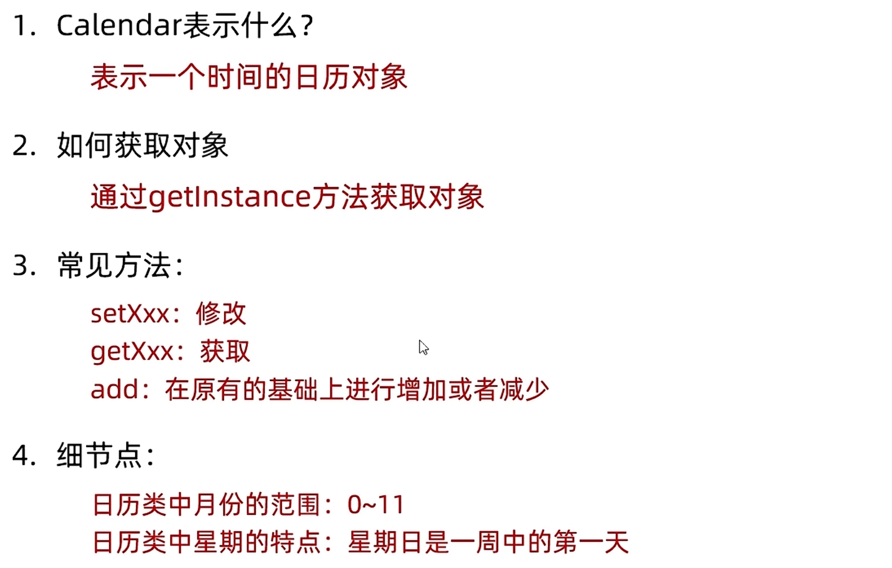
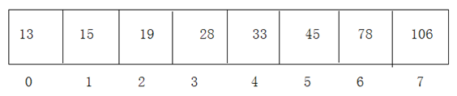

## 姓名：席崇援

## 学习任务：

- 多线程
  - 线程的调度
    - 线程的优先级，休眠，让步，插队
    - **死锁问题**
  - **线程安全问题。**
  - **单例模式的两种实现方式**
- JAVA API
  - 字符串类
    - String
      - 不可变序列
    - StringBuffer和StringBuilder
      - 可变序列对象
  - System类
  - Math类和**Random**类
  - **日期时间类**
    - **LocalData**
    - **LocalTime**
    - **LocalDateTime**
    - **SimpleDateFormat进行时间格式转换**
  - **Comparable接口**
  - 集合框架
    - Collection接口
      - 通用方法
      - List接口
        - **ArrayList**
        - **LinkList**
      - Set接口
        - HashSet（伪无序，不重复）
        - TreeSet（有序，不重复）

## 完成情况:


## 笔记：

## 线程的优先级，休眠，让步，插队

### 优先级

每个线程都有一定的优先级，同优先级线程组成先进先出队列（先到先服务），使用分时调度策略。优先级高的线程采用抢占式策略，获得较多的执行机会。每个线程默认的优先级都与创建它的父线程具有相同的优先级。

- Thread类的三个优先级常量：
  - MAX_PRIORITY（10）：最高优先级 
  - MIN _PRIORITY （1）：最低优先级
  - NORM_PRIORITY （5）：普通优先级，默认情况下main线程具有普通优先级。

* public final int getPriority() ：返回线程优先级 
* public final void setPriority(int newPriority) ：改变线程的优先级，范围在[1,10]之间。


练习：获取main线程对象的名称和优先级。

声明一个匿名内部类继承Thread类，重写run方法，在run方法中获取线程名称和优先级。设置该线程优先级为最高优先级并启动该线程。

```java
	public static void main(String[] args) {
		Thread t = new Thread(){
			public void run(){
				System.out.println(getName() + "的优先级：" + getPriority());
			}
		};
		t.setPriority(Thread.MAX_PRIORITY);
		t.start();
		
		System.out.println(Thread.currentThread().getName() +"的优先级：" + 		                                          Thread.currentThread().getPriority());
	}
```

案例：

- 声明一个匿名内部类继承Thread类，重写run方法，实现打印[1,100]之间的偶数，要求每隔1秒打印1个偶数。

- 声明一个匿名内部类继承Thread类，重写run方法，实现打印[1,100]之间的奇数，
  - 当打印到5时，让奇数线程暂停一下，再继续。
  - 当打印到5时，让奇数线程停下来，让偶数线程执行完再打印。


```java
package com.atguigu.api;

public class TestThreadStateChange {
    public static void main(String[] args) {
        Thread te = new Thread() {
            @Override
            public void run() {
                for (int i = 2; i <= 100; i += 2) {
                    System.out.println("偶数线程：" + i);
                    try {
                        Thread.sleep(1000);
                    } catch (InterruptedException e) {
                        e.printStackTrace();
                    }
                }
            }
        };
        te.start();

        Thread to = new Thread() {
            @Override
            public void run() {
                for (int i = 1; i <= 100; i += 2) {
                    System.out.println("奇数线程：" + i);
                    if (i == 5) {
//                        Thread.yield();
                        try {
                            te.join();
                        } catch (InterruptedException e) {
                            e.printStackTrace();
                        }
                    }

                }
            }
        };
        to.start();
    }
}
```

### 休眠

* public final boolean isAlive()：测试线程是否处于活动状态。如果线程已经启动且尚未终止，则为活动状态。 
* public static void sleep(long millis) :使当前正在执行的线程以指定的毫秒数暂停（暂时停止执行）。
* public final void stop()：`已过时`，不建议使用。强行结束一个线程的执行，直接进入死亡状态。run()即刻停止，可能会导致一些清理性的工作得不到完成，如文件，数据库等的关闭。同时，会立即释放该线程所持有的所有的锁，导致数据得不到同步的处理，出现数据不一致的问题。
* void suspend() / void resume() : 这两个操作就好比播放器的暂停和恢复。二者必须成对出现，否则非常容易发生死锁。suspend()调用会导致线程暂停，但不会释放任何锁资源，导致其它线程都无法访问被它占用的锁，直到调用resume()。`已过时`，不建议使用。

```java
package com.example;

public class MyThreadSleep {
    public static void main (String [] args) throws InterruptedException {
        new Thread(new SleepThread()).start();
    for(int i=0;i<10;i++){
        if(i==5){
            Thread.sleep(5000);
            System.out.println("主线程正在输出："+i);
            Thread.sleep(3000);
        }

    }
    }
}

class SleepThread implements Runnable{

    public void run(){
        for(int i=0;i<10;i++){

            if(i==3){

                try {
                    Thread.sleep(3000);
                }catch (InterruptedException e){
                    e.printStackTrace();
                }
            }
            System.out.println("线程１正在输出："+i);
            try {
                Thread.sleep(2000);
            }catch (Exception e){
                e.printStackTrace();
            }
        }
    }
}
```

### 让步

* public void run() :此线程要执行的任务在此处定义代码。
* public void start() :导致此线程开始执行; Java虚拟机调用此线程的run方法。
* public String getName() :获取当前线程名称。
* public void setName(String name)：设置该线程名称。
* public static Thread currentThread() :返回对当前正在执行的线程对象的引用。在Thread子类中就是this，通常用于主线程和Runnable实现类
* public static void yield()：yield只是让当前线程暂停一下，让系统的线程调度器重新调度一次，希望优先级与当前线程相同或更高的其他线程能够获得执行机会，但是这个不能保证，完全有可能的情况是，当某个线程调用了yield方法暂停之后，线程调度器又将其调度出来重新执行。

当线程调用 Thread.yield() 方法时，它就会主动放弃当前的CPU执行时间片，让给其他具有相同优先级的线程执行。

实际上，线程让步是一种提醒调度器当前线程已经完成了当前阶段的任务，可以进行线程切换，但是不保证一定发生线程切换，调度器可能会忽略这个提醒，继续执行当前线程。

调用 Thread.yield() 的线程会从运行状态转换到就绪状态，与其他就绪状态的线程竞争 CPU 的执行权。

如果没有其他线程处于就绪状态，那么当前线程仍然可以继续执行。

但是，一般情况下，调用 Thread.yield() 会导致当前线程让出 CPU 的使用权，使得其他具有相同优先级的线程有机会获得执行。

```
public class ThreadYieldExample {
    public static void main(String[] args) {
        Runnable myRunnable = new MyRunnable();

        Thread thread1 = new Thread(myRunnable, "Thread 1");
        Thread thread2 = new Thread(myRunnable, "Thread 2");

        thread1.start();
        thread2.start();
    }

    static class MyRunnable implements Runnable {
        @Override
        public void run() {
            for (int i = 0; i < 5; i++) {
                System.out.println(Thread.currentThread().getName() + " is running");

                // 模拟某个条件需要让步，让其他线程先执行
                if (i == 2 && Thread.currentThread().getName().equals("Thread 1")) {
                    System.out.println(Thread.currentThread().getName() + " is yielding");
                    Thread.yield();
                }

                try {
                    Thread.sleep(500);
                } catch (InterruptedException e) {
                    e.printStackTrace();
                }
            }
        }
    }
}

```

---

```java
package com.example;

public class MyYieldThread {
    public static void main (String [] args){
        Thread t1 = new YieldThread("线程１");
        Thread t2 = new YieldThread("线程２");
        //开启两个线程
        t1.start();
        t2.start();

    }
}


class YieldThread extends  Thread{

    public YieldThread (String name){
        super (name); //调用父类的构造方法
    }

    public void run(){
        for(int i = 0;i<5;i++){

            System.out.println(Thread.currentThread().getName()+"---"+i);
            if(i==3){
            System.out.println("线程让步：");
                Thread.yield(); //线程运行到此作出让步

            }

        }

    }
}
运行结果：
线程１—0
线程１—1
线程１—2
线程１—3
线程让步：
线程２—0
线程２—1
线程２—2
线程２—3
线程让步：
线程１—4
线程２—4
运行结果：
线程１—0
线程１—1
线程１—2
线程１—3
线程让步：
线程２—0
线程２—1
线程２—2
线程２—3
线程让步：
线程１—4
线程２—4
```

### 插队

void join() ：等待该线程终止。 

void join(long millis) ：等待该线程终止的时间最长为 millis 毫秒。如果millis时间到，将不再等待。 

void join(long millis, int nanos) ：等待该线程终止的时间最长为 millis 毫秒 + nanos 纳秒。 

```java
package com.example;

public class MyEmergercyThread {
    public static void main (String [] args) throws InterruptedException {
    Thread t =new Thread(new EmergencyThread(),"线程１");//创建线程
        t.start(); //开启线程
        for(int i=1;i<6;i++){
            System.out.println(Thread.currentThread().getName()+"输入:"+i);
            if(i==2){
                t.join(); //调用join（）方法
            }
            Thread.sleep(500); //线程休眠500毫秒
        }
    }
}

class  EmergencyThread  implements  Runnable{
    public void run(){

        for (int i=1;i<6;i++){
            System.out.println(Thread.currentThread().getName()+"输入:"+i);
            try {
                Thread.sleep(1000);
            } catch (InterruptedException e) {
                e.printStackTrace();
            }

        }
    }
}
运行结果：
main输入:1
线程１输入:1
main输入:2
线程１输入:2
线程１输入:3
线程１输入:4
线程１输入:5
main输入:3
main输入:4
main输入:5
```

## **线程安全问题**

**当我们使用多个线程访问同一资源（可以是同一个变量、同一个文件、同一条记录等）的时候，若多个线程`只有读操作`，那么不会发生线程安全问题。但是如果多个线程中对资源有`读和写`的操作，就容易出现线程安全问题。**

### 同一个资源问题和线程安全问题

#### 局部变量不能共享

案例：

火车站要卖票，我们模拟火车站的卖票过程。因为疫情期间，本次列车的座位共100个（即，只能出售100张火车票）。我们来模拟车站的售票窗口，实现多个窗口同时售票的过程。注意：不能出现错票、重票。

示例代码：

```javascript
package com.atguigu.unsafe;

class Window extends Thread {
    public void run() {
        int ticket = 100;
        while (ticket > 0) {
            System.out.println(getName() + "卖出一张票，票号:" + ticket);
            ticket--;
        }
    }
}

public class SaleTicketDemo1 {
    public static void main(String[] args) {
        Window w1 = new Window();
        Window w2 = new Window();
        Window w3 = new Window();

        w1.setName("窗口1");
        w2.setName("窗口2");
        w3.setName("窗口3");

        w1.start();
        w2.start();
        w3.start();
    }
}
```

结果：发现卖出300张票。

问题：局部变量是每次调用方法都是独立的，那么每个线程的run()的ticket是独立的，不是共享数据。

#### 不同对象的实例变量不共享

```java
package com.atguigu.unsafe;

class TicketWindow extends Thread {
    private int ticket = 100;

    public void run() {
        while (ticket > 0) {
            System.out.println(getName() + "卖出一张票，票号:" + ticket);
            ticket--;
        }
    }
}

public class SaleTicketDemo2 {
    public static void main(String[] args) {
        TicketWindow w1 = new TicketWindow();
        TicketWindow w2 = new TicketWindow();
        TicketWindow w3 = new TicketWindow();

        w1.setName("窗口1");
        w2.setName("窗口2");
        w3.setName("窗口3");

        w1.start();
        w2.start();
        w3.start();
    }
}


```

结果：发现卖出300张票。

问题：不同的实例对象的实例变量是独立的。

#### 静态变量是共享的

示例代码：

```java
package com.atguigu.unsafe;

class TicketSaleThread extends Thread {
    private static int ticket = 100;

    public void run() {
        while (ticket > 0) {
            try {
                Thread.sleep(10);//加入这个，使得问题暴露的更明显
            } catch (InterruptedException e) {
                e.printStackTrace();
            }
            System.out.println(getName() + "卖出一张票，票号:" + ticket);
            ticket--;
        }
    }
}

public class SaleTicketDemo3 {
    public static void main(String[] args) {
        TicketSaleThread t1 = new TicketSaleThread();
        TicketSaleThread t2 = new TicketSaleThread();
        TicketSaleThread t3 = new TicketSaleThread();

        t1.setName("窗口1");
        t2.setName("窗口2");
        t3.setName("窗口3");

        t1.start();
        t2.start();
        t3.start();
    }
}
```

运行结果：

```java
窗口1卖出一张票，票号:100
窗口2卖出一张票，票号:100
窗口3卖出一张票，票号:100
窗口3卖出一张票，票号:97
窗口1卖出一张票，票号:97
窗口2卖出一张票，票号:97
窗口1卖出一张票，票号:94
窗口3卖出一张票，票号:94
窗口2卖出一张票，票号:94
窗口2卖出一张票，票号:91
窗口1卖出一张票，票号:91
窗口3卖出一张票，票号:91
窗口3卖出一张票，票号:88
窗口1卖出一张票，票号:88
窗口2卖出一张票，票号:88
窗口3卖出一张票，票号:85
窗口1卖出一张票，票号:85
窗口2卖出一张票，票号:85
窗口3卖出一张票，票号:82
窗口1卖出一张票，票号:82
窗口2卖出一张票，票号:82
窗口2卖出一张票，票号:79
窗口3卖出一张票，票号:79
窗口1卖出一张票，票号:79
窗口3卖出一张票，票号:76
窗口1卖出一张票，票号:76
窗口2卖出一张票，票号:76
窗口1卖出一张票，票号:73
窗口2卖出一张票，票号:73
窗口3卖出一张票，票号:73
窗口2卖出一张票，票号:70
窗口1卖出一张票，票号:70
窗口3卖出一张票，票号:70
窗口2卖出一张票，票号:67
窗口3卖出一张票，票号:67
窗口1卖出一张票，票号:67
窗口1卖出一张票，票号:64
窗口3卖出一张票，票号:64
窗口2卖出一张票，票号:64
窗口2卖出一张票，票号:61
窗口3卖出一张票，票号:61
窗口1卖出一张票，票号:61
窗口1卖出一张票，票号:58
窗口2卖出一张票，票号:58
窗口3卖出一张票，票号:58
窗口2卖出一张票，票号:55
窗口1卖出一张票，票号:55
窗口3卖出一张票，票号:55
窗口3卖出一张票，票号:52
窗口1卖出一张票，票号:52
窗口2卖出一张票，票号:52
窗口2卖出一张票，票号:49
窗口1卖出一张票，票号:49
窗口3卖出一张票，票号:49
窗口2卖出一张票，票号:46
窗口3卖出一张票，票号:46
窗口1卖出一张票，票号:46
窗口2卖出一张票，票号:43
窗口3卖出一张票，票号:43
窗口1卖出一张票，票号:43
窗口3卖出一张票，票号:40
窗口1卖出一张票，票号:40
窗口2卖出一张票，票号:40
窗口2卖出一张票，票号:37
窗口3卖出一张票，票号:37
窗口1卖出一张票，票号:37
窗口2卖出一张票，票号:34
窗口1卖出一张票，票号:34
窗口3卖出一张票，票号:34
窗口3卖出一张票，票号:31
窗口2卖出一张票，票号:31
窗口1卖出一张票，票号:31
窗口1卖出一张票，票号:28
窗口2卖出一张票，票号:28
窗口3卖出一张票，票号:28
窗口2卖出一张票，票号:25
窗口1卖出一张票，票号:25
窗口3卖出一张票，票号:25
窗口2卖出一张票，票号:22
窗口3卖出一张票，票号:22
窗口1卖出一张票，票号:22
窗口3卖出一张票，票号:19
窗口1卖出一张票，票号:19
窗口2卖出一张票，票号:19
窗口2卖出一张票，票号:16
窗口3卖出一张票，票号:16
窗口1卖出一张票，票号:16
窗口2卖出一张票，票号:13
窗口1卖出一张票，票号:13
窗口3卖出一张票，票号:13
窗口2卖出一张票，票号:10
窗口1卖出一张票，票号:10
窗口3卖出一张票，票号:10
窗口3卖出一张票，票号:7
窗口1卖出一张票，票号:7
窗口2卖出一张票，票号:7
窗口3卖出一张票，票号:4
窗口1卖出一张票，票号:4
窗口2卖出一张票，票号:4
窗口3卖出一张票，票号:1
窗口2卖出一张票，票号:1
窗口1卖出一张票，票号:1
```

结果：发现卖出近100张票。

问题1：但是有重复票或负数票问题。

原因：线程安全问题

问题2：如果要考虑有两场电影，各卖100张票等

原因：TicketThread类的静态变量，是所有TicketThread类的对象共享

---

#### 同一个对象的实例变量共享

多个Thread线程使用同一个Runnable对象

```java
package com.atguigu.safe;

class TicketSaleRunnable implements Runnable {
    private int ticket = 100;

    public void run() {
        while (ticket > 0) {
            try {
                Thread.sleep(10);//加入这个，使得问题暴露的更明显
            } catch (InterruptedException e) {
                e.printStackTrace();
            }
            System.out.println(Thread.currentThread().getName() + "卖出一张票，票号:" + ticket);
            ticket--;
        }
    }
}

public class SaleTicketDemo4 {
    public static void main(String[] args) {
        TicketSaleRunnable tr = new TicketSaleRunnable();
        Thread t1 = new Thread(tr, "窗口一");
        Thread t2 = new Thread(tr, "窗口二");
        Thread t3 = new Thread(tr, "窗口三");

        t1.start();
        t2.start();
        t3.start();
    }
}

```

结果：发现卖出近100张票。

问题：但是有重复票或负数票问题。

原因：线程安全问题

#### 抽取资源类，共享同一个资源对象

示例代码：

```java
package com.atguigu.unsafe;

//1、编写资源类
class Ticket {
    private int ticket = 100;

    public void sale() {
        if (ticket > 0) {
            try {
                Thread.sleep(10);//加入这个，使得问题暴露的更明显
            } catch (InterruptedException e) {
                e.printStackTrace();
            }
            System.out.println(Thread.currentThread().getName() + "卖出一张票，票号:" + ticket);
            ticket--;
        } else {
            throw new RuntimeException("没有票了");
        }
    }

    public int getTicket() {
        return ticket;
    }
}

public class SaleTicketDemo5 {
    public static void main(String[] args) {
        //2、创建资源对象
        Ticket ticket = new Ticket();

        //3、启动多个线程操作资源类的对象
        Thread t1 = new Thread("窗口一") {
            public void run() {
                while (true) {
                    ticket.sale();
                }
            }
        };
        Thread t2 = new Thread("窗口二") {
            public void run() {
                while (true) {
                    ticket.sale();
                }
            }
        };
        Thread t3 = new Thread(new Runnable() {
            public void run() {
                ticket.sale();
            }
        }, "窗口三");

        t1.start();
        t2.start();
        t3.start();
    }
}
```

结果：发现卖出近100张票。

问题：但是有重复票或负数票问题。

原因：线程安全问题

### 同步机制解决线程安全问题

要解决上述多线程并发访问一个资源的安全性问题:也就是解决重复票与不存在票问题，Java中提供了同步机制(synchronized)来解决。

**窗口1线程进入操作的时候，窗口2和窗口3线程只能在外等着，窗口1操作结束，窗口1和窗口2和窗口3才有机会进入代码去执行。也就是说在某个线程修改共享资源的时候，其他线程不能修改该资源，等待修改完毕同步之后，才能去抢夺CPU资源，完成对应的操作，保证了数据的同步性，解决了线程不安全的现象。**

为了保证每个线程都能正常执行原子操作，Java引入了线程同步机制。注意:在任何时候,最多允许一个线程拥有同步锁，谁拿到锁就进入代码块，其他的线程只能在外等着(BLOCKED)。

#### 原理

给某段代码加“锁”，任何线程想要执行这段代码，都要先获得“锁”，我们称它为同步锁。因为Java对象在堆中的数据分为分为对象头、实例变量、空白的填充。而对象头中包含：

- Mark Word：记录了和当前对象有关的GC、锁标记等信息。
- 指向类的指针：每一个对象需要记录它是由哪个类创建出来的。
- 数组长度（只有数组对象才有）

哪个线程获得了“同步锁”对象之后，”同步锁“对象就会记录这个线程的ID，这样其他线程就只能等待了，除非这个线程”释放“了锁对象，其他线程才能重新获得/占用”同步锁“对象。

#### 同步代码块和同步方法

**同步代码块**：synchronized 关键字可以用于某个区块前面，表示只对这个区块的资源实行互斥访问。
格式:

```java
synchronized(同步锁){
     需要同步操作的代码
}
```

**同步方法：**synchronized 关键字直接修饰方法，表示同一时刻只有一个线程能进入这个方法，其他线程在外面等着。

```java
public synchronized void method(){
    可能会产生线程安全问题的代码
}
```

**synchronized的锁是什么?**

同步锁对象可以是任意类型，但是必须保证竞争“同一个共享资源”的多个线程必须使用同一个“同步锁对象”。

对于同步代码块来说，同步锁对象是由程序员手动指定的（很多时候也是指定为this或类名.class），但是对于同步方法来说，同步锁对象只能是默认的：

- 静态方法：当前类的Class对象（类名.class）

- 非静态方法：this

#### 代码演示

##### 示例一：静态方法加锁

```java
package com.atguigu.safe;

class TicketSaleThread extends Thread{
    private static int ticket = 100;
    public void run(){//直接锁这里，肯定不行，会导致，只有一个窗口卖票
        while (ticket > 0) {
            saleOneTicket();
        }
    }

    public synchronized static void saleOneTicket(){//锁对象是TicketSaleThread类的Class对象，而一个类的Class对象在内存中肯定只有一个
        if(ticket > 0) {//不加条件，相当于条件判断没有进入锁管控，线程安全问题就没有解决
            System.out.println(Thread.currentThread().getName() + "卖出一张票，票号:" + ticket);
            ticket--;
        }
    }
}
public class SaleTicketDemo3 {
    public static void main(String[] args) {
        TicketSaleThread t1 = new TicketSaleThread();
        TicketSaleThread t2 = new TicketSaleThread();
        TicketSaleThread t3 = new TicketSaleThread();

        t1.setName("窗口1");
        t2.setName("窗口2");
        t3.setName("窗口3");

        t1.start();
        t2.start();
        t3.start();
    }
}
```

##### 示例二：非静态方法加锁

```java
package com.atguigu.safe;

public class SaleTicketDemo4 {
    public static void main(String[] args) {
        TicketSaleRunnable tr = new TicketSaleRunnable();
        Thread t1 = new Thread(tr, "窗口一");
        Thread t2 = new Thread(tr, "窗口二");
        Thread t3 = new Thread(tr, "窗口三");

        t1.start();
        t2.start();
        t3.start();
    }
}

class TicketSaleRunnable implements Runnable {
    private int ticket = 100;

    public void run() {//直接锁这里，肯定不行，会导致，只有一个窗口卖票
        while (ticket > 0) {
            saleOneTicket();
        }
    }

    public synchronized void saleOneTicket() {//锁对象是this，这里就是TicketSaleRunnable对象，因为上面3个线程使用同一个TicketSaleRunnable对象，所以可以
        if (ticket > 0) {//不加条件，相当于条件判断没有进入锁管控，线程安全问题就没有解决
            System.out.println(Thread.currentThread().getName() + "卖出一张票，票号:" + ticket);
            ticket--;
        }
    }
}
```

##### 示例三：同步代码块

```java
package com.atguigu.safe;


public class SaleTicketDemo5 {
    public static void main(String[] args) {
        //2、创建资源对象
        Ticket ticket = new Ticket();

        //3、启动多个线程操作资源类的对象
        Thread t1 = new Thread("窗口一") {
            public void run() {//不能给run()直接加锁，因为t1,t2,t3的三个run方法分别属于三个Thread类对象，
                // run方法是非静态方法，那么锁对象默认选this，那么锁对象根本不是同一个
                while (true) {
                    synchronized (ticket) {
                        ticket.sale();
                    }
                }
            }
        };
        Thread t2 = new Thread("窗口二") {
            public void run() {
                while (true) {
                    synchronized (ticket) {
                        ticket.sale();
                    }
                }
            }
        };
        Thread t3 = new Thread(new Runnable() {
            public void run() {
                while (true) {
                    synchronized (ticket) {
                        ticket.sale();
                    }
                }
            }
        }, "窗口三");


        t1.start();
        t2.start();
        t3.start();
    }
}

//1、编写资源类
class Ticket {
    private int ticket = 1000;

    public void sale() {//也可以直接给这个方法加锁，锁对象是this，这里就是Ticket对象
        if (ticket > 0) {
            System.out.println(Thread.currentThread().getName() + "卖出一张票，票号:" + ticket);
            ticket--;
        } else {
            throw new RuntimeException("没有票了");
        }
    }

    public int getTicket() {
        return ticket;
    }
}

```

#### 同步操作的思考顺序

1、如何找问题，即代码是否存在线程安全？（非常重要）
（1）明确哪些代码是多线程运行的代码
（2）明确多个线程是否有共享数据
（3）明确多线程运行代码中是否有多条语句操作共享数据

2、如何解决呢？（非常重要）
对多条操作共享数据的语句，只能让一个线程都执行完，在执行过程中，其他线程不可以参与执行。
即所有操作共享数据的这些语句都要放在同步范围中

3、切记：

范围太小：不能解决安全问题

范围太大：因为一旦某个线程抢到锁，其他线程就只能等待，所以范围太大，效率会降低，不能合理利用CPU资源。

---

### 死锁

**不同的线程分别占用对方需要的同步资源不放弃，都在等待对方放弃自己需要的同步资源，就形成了线程的死锁。**

```
【小故事】

面试官：你能解释清楚什么是死锁，我就录取你！
面试者：你录取我，我就告诉你什么是死锁！
….
恭喜你，面试通过了
```

一旦出现死锁，整个程序既不会发生异常，也不会给出任何提示，只是所有线程处于阻塞状态，无法继续。

举例1：

```java
public class DeadLockTest {
	public static void main(String[] args) {

		StringBuilder s1 = new StringBuilder();
		StringBuilder s2 = new StringBuilder();

		new Thread() {
			public void run() {
				synchronized (s1) {
					s1.append("a");
					s2.append("1");
					
					try {
						Thread.sleep(10);
					} catch (InterruptedException e) {
						e.printStackTrace();
					}
					synchronized (s2) {
						s1.append("b");
						s2.append("2");

						System.out.println(s1);
						System.out.println(s2);

					}
				}
			}
		}.start();

		new Thread() {
			public void run() {
				synchronized (s2) {
					s1.append("c");
					s2.append("3");

					try {
						Thread.sleep(10);
					} catch (InterruptedException e) {
						e.printStackTrace();
					}
					
					synchronized (s1) {
						s1.append("d");
						s2.append("4");

						System.out.println(s1);
						System.out.println(s2);

					}

				}
			}
		}.start();

	}
}
```

举例2：

```java
class A {
	public synchronized void foo(B b) {
		System.out.println("当前线程名: " + Thread.currentThread().getName()
				+ " 进入了A实例的foo方法"); // ①
		try {
			Thread.sleep(200);
		} catch (InterruptedException ex) {
			ex.printStackTrace();
		}
		System.out.println("当前线程名: " + Thread.currentThread().getName()
				+ " 企图调用B实例的last方法"); // ③
		b.last();
	}

	public synchronized void last() {
		System.out.println("进入了A类的last方法内部");
	}
}

class B {
	public synchronized void bar(A a) {
		System.out.println("当前线程名: " + Thread.currentThread().getName()
				+ " 进入了B实例的bar方法"); // ②
		try {
			Thread.sleep(200);
		} catch (InterruptedException ex) {
			ex.printStackTrace();
		}
		System.out.println("当前线程名: " + Thread.currentThread().getName()
				+ " 企图调用A实例的last方法"); // ④
		a.last();
	}

	public synchronized void last() {
		System.out.println("进入了B类的last方法内部");
	}
}

public class DeadLock implements Runnable {
	A a = new A();
	B b = new B();

	public void init() {
		Thread.currentThread().setName("主线程");
		// 调用a对象的foo方法
		a.foo(b);
		System.out.println("进入了主线程之后");
	}

	public void run() {
		Thread.currentThread().setName("副线程");
		// 调用b对象的bar方法
		b.bar(a);
		System.out.println("进入了副线程之后");
	}

	public static void main(String[] args) {
		DeadLock dl = new DeadLock();
		new Thread(dl).start();
		dl.init();
	}
}
```

举例3：

```java
public class TestDeadLock {
	public static void main(String[] args) {
		Object g = new Object();
		Object m = new Object();
		Owner s = new Owner(g,m);
		Customer c = new Customer(g,m);
		new Thread(s).start();
		new Thread(c).start();
	}
}
class Owner implements Runnable{
	private Object goods;
	private Object money;

	public Owner(Object goods, Object money) {
		super();
		this.goods = goods;
		this.money = money;
	}

	@Override
	public void run() {
		synchronized (goods) {
			System.out.println("先给钱");
			synchronized (money) {
				System.out.println("发货");
			}
		}
	}
}
class Customer implements Runnable{
	private Object goods;
	private Object money;

	public Customer(Object goods, Object money) {
		super();
		this.goods = goods;
		this.money = money;
	}

	@Override
	public void run() {
		synchronized (money) {
			System.out.println("先发货");
			synchronized (goods) {
				System.out.println("再给钱");
			}
		}
	}
}
```

**诱发死锁的原因：**

- 互斥条件
- 占用且等待
- 不可抢夺（或不可抢占）
- 循环等待

以上4个条件，同时出现就会触发死锁。

**解决死锁：**

死锁一旦出现，基本很难人为干预，只能尽量规避。可以考虑打破上面的诱发条件。

针对条件1：互斥条件基本上无法被破坏。因为线程需要通过互斥解决安全问题。

针对条件2：可以考虑一次性申请所有所需的资源，这样就不存在等待的问题。

针对条件3：占用部分资源的线程在进一步申请其他资源时，如果申请不到，就主动释放掉已经占用的资源。

针对条件4：可以将资源改为线性顺序。申请资源时，先申请序号较小的，这样避免循环等待问题。

## 单例模式的两种实现方式

### 饿汉式没有线程安全问题

饿汉式：在类初始化时就直接创建单例对象，而类初始化过程是没有线程安全问题的

形式一：

```java
package com.atguigu.single.hungry;

public class HungrySingle {
    private static HungrySingle INSTANCE = new HungrySingle(); //对象是否声明为final 都可以
    
    private HungrySingle(){}
    
    public static HungrySingle getInstance(){
        return INSTANCE;
    }
}
```

形式二：

```java
/*
public class HungryOne{
    public static final HungryOne INSTANCE = new HungryOne();
    private HungryOne(){}
}*/

public enum HungryOne{
    INSTANCE
}
```

测试类：

```java
package com.atguigu.single.hungry;

public class HungrySingleTest {

    static HungrySingle hs1 = null;
    static HungrySingle hs2 = null;

    //演示存在的线程安全问题
    public static void main(String[] args) {

        Thread t1 = new Thread() {
            @Override
            public void run() {
                hs1 = HungrySingle.getInstance();
            }
        };

        Thread t2 = new Thread() {
            @Override
            public void run() {
                hs2 = HungrySingle.getInstance();
            }
        };

        t1.start();
        t2.start();

        try {
            t1.join();
        } catch (InterruptedException e) {
            e.printStackTrace();
        }
        try {
            t2.join();
        } catch (InterruptedException e) {
            e.printStackTrace();
        }

        System.out.println(hs1);
        System.out.println(hs2);
        System.out.println(hs1 == hs2);//true
    }

}
```

### 懒汉式线程安全问题

懒汉式：延迟创建对象，第一次调用getInstance方法再创建对象

形式一：

```java
package com.atguigu.single.lazy;

public class LazyOne {
    private static LazyOne instance;

    private LazyOne(){}

    //方式1：
    public static synchronized LazyOne getInstance1(){
        if(instance == null){
            instance = new LazyOne();
        }
        return instance;
    }
    //方式2：
    public static LazyOne getInstance2(){
        synchronized(LazyOne.class) {
            if (instance == null) {
                instance = new LazyOne();
            }
            return instance;
        }
    }
    //方式3：
    public static LazyOne getInstance3(){
        if(instance == null){
            synchronized (LazyOne.class) {
                try {
                    Thread.sleep(10);//加这个代码，暴露问题
                } catch (InterruptedException e) {
                    e.printStackTrace();
                }
                if(instance == null){
                    instance = new LazyOne();
                }
            }
        }

        return instance;
    }
    /*
    注意：上述方式3中，有指令重排问题
    mem = allocate(); 为单例对象分配内存空间
    instance = mem;   instance引用现在非空，但还未初始化
    ctorSingleton(instance); 为单例对象通过instance调用构造器
    从JDK2开始，分配空间、初始化、调用构造器会在线程的工作存储区一次性完成，然后复制到主存储区。但是需要   
    volatile关键字，避免指令重排。
    */
    
}

```

形式二：使用内部类

```java
package com.atguigu.single.lazy;

public class LazySingle {
    private LazySingle(){}
    
    public static LazySingle getInstance(){
        return Inner.INSTANCE;
    }
    
    private static class Inner{
        static final LazySingle INSTANCE = new LazySingle();
    }
    
}
```

> 内部类只有在外部类被调用才加载，产生INSTANCE实例；又不用加锁。
>
> 此模式具有之前两个模式的优点，同时屏蔽了它们的缺点，是最好的单例模式。
>
> 此时的内部类，使用enum进行定义，也是可以的。

测试类：

```java
package com.atguigu.single.lazy;

import org.junit.Test;

public class TestLazy {
    @Test
    public void test01(){
        LazyOne s1 = LazyOne.getInstance();
        LazyOne s2 = LazyOne.getInstance();

        System.out.println(s1);
        System.out.println(s2);
        System.out.println(s1 == s2);
    }

    //把s1和s2声明在外面，是想要在线程的匿名内部类中为s1和s2赋值
    LazyOne s1;
    LazyOne s2;
    @Test
    public void test02(){
        Thread t1 = new Thread(){
            public void run(){
                s1 = LazyOne.getInstance();
            }
        };
        Thread t2 = new Thread(){
            public void run(){
                s2 = LazyOne.getInstance();
            }
        };

        t1.start();
        t2.start();

        try {
            t1.join();
            t2.join();
        } catch (InterruptedException e) {
            e.printStackTrace();
        }

        System.out.println(s1);
        System.out.println(s2);
        System.out.println(s1 == s2);
    }


    LazySingle obj1;
    LazySingle obj2;
    @Test
    public void test03(){
        Thread t1 = new Thread(){
            public void run(){
                obj1 = LazySingle.getInstance();
            }
        };
        Thread t2 = new Thread(){
            public void run(){
                obj2 = LazySingle.getInstance();
            }
        };

        t1.start();
        t2.start();

        try {
            t1.join();
            t2.join();
        } catch (InterruptedException e) {
            e.printStackTrace();
        }

        System.out.println(obj1);
        System.out.println(obj2);
        System.out.println(obj1 == obj2);
    }
}

```

## Lock(锁)

- JDK5.0的新增功能，保证线程的安全。与采用synchronized相比，Lock可提供多种锁方案，更灵活、更强大。Lock通过显式定义同步锁对象来实现同步。同步锁使用Lock对象充当。
- java.util.concurrent.locks.Lock接口是控制多个线程对共享资源进行访问的工具。锁提供了对共享资源的独占访问，每次只能有一个线程对Lock对象加锁，线程开始访问共享资源之前应先获得Lock对象。
- 在实现线程安全的控制中，比较常用的是`ReentrantLock`，可以显式加锁、释放锁。
  - ReentrantLock类实现了 Lock 接口，它拥有与 synchronized 相同的并发性和内存语义，但是添加了类似锁投票、定时锁等候和可中断锁等候的一些特性。此外，它还提供了在激烈争用情况下更佳的性能。
- Lock锁也称同步锁，加锁与释放锁方法，如下：

  * public void lock() :加同步锁。
  * public void unlock() :释放同步锁。
- 代码结构

```java
class A{
    //1. 创建Lock的实例，必须确保多个线程共享同一个Lock实例
	private final ReentrantLock lock = new ReenTrantLock();
	public void m(){
        //2. 调动lock()，实现需共享的代码的锁定
		lock.lock();
		try{
			//保证线程安全的代码;
		}
		finally{
            //3. 调用unlock()，释放共享代码的锁定
			lock.unlock();  
		}
	}
}

```

> 注意：如果同步代码有异常，要将unlock()写入finally语句块。

举例：

```java
import java.util.concurrent.locks.ReentrantLock;

class Window implements Runnable{
	int ticket = 100;
    //1. 创建Lock的实例，必须确保多个线程共享同一个Lock实例
	private final ReentrantLock lock = new ReentrantLock();
	public void run(){
		
		while(true){
			try{
                //2. 调动lock()，实现需共享的代码的锁定
				lock.lock();
				if(ticket > 0){
					try {
						Thread.sleep(10);
					} catch (InterruptedException e) {
						e.printStackTrace();
					}
					System.out.println(ticket--);
				}else{
					break;
				}
			}finally{
                //3. 调用unlock()，释放共享代码的锁定
				lock.unlock();
			}
		}
	}
}

public class ThreadLock {
	public static void main(String[] args) {
		Window t = new Window();
		Thread t1 = new Thread(t);
		Thread t2 = new Thread(t);
		
		t1.start();
		t2.start();
	}
}
```

**synchronized与Lock的对比**

1. Lock是显式锁（手动开启和关闭锁，别忘记关闭锁），synchronized是隐式锁，出了作用域、遇到异常等自动解锁
2. Lock只有代码块锁，synchronized有代码块锁和方法锁
3. 使用Lock锁，JVM将花费较少的时间来调度线程，性能更好。并且具有更好的扩展性（提供更多的子类），更体现面向对象。
4. （了解）Lock锁可以对读不加锁，对写加锁，synchronized不可以
5. （了解）Lock锁可以有多种获取锁的方式，可以从sleep的线程中抢到锁，synchronized不可以

> 说明：开发建议中处理线程安全问题优先使用顺序为：
>
> •    Lock ----> 同步代码块 ----> 同步方法

## 线程的通信

这是多个线程间的一种`协作机制`。谈到线程我们经常想到的是线程间的`竞争（race）`，比如去争夺锁，但这并不是故事的全部，线程间也会有协作机制。

在一个线程满足某个条件时，就进入等待状态（`wait() / wait(time)`）， 等待其他线程执行完他们的指定代码过后再将其唤醒（`notify()`）;或可以指定wait的时间，等时间到了自动唤醒；在有多个线程进行等待时，如果需要，可以使用 `notifyAll()`来唤醒所有的等待线程。wait/notify 就是线程间的一种协作机制。

1. wait：线程不再活动，不再参与调度，进入 `wait set` 中，因此不会浪费 CPU 资源，也不会去竞争锁了，这时的线程状态是 WAITING 或 TIMED_WAITING。它还要等着别的线程执行一个`特别的动作`，也即“`通知（notify）`”或者等待时间到，在这个对象上等待的线程从wait set 中释放出来，重新进入到调度队列（`ready queue`）中
2. notify：则选取所通知对象的 wait set 中的一个线程释放；
3. notifyAll：则释放所通知对象的 wait set 上的全部线程。

> 注意：
>
> 被通知的线程被唤醒后也不一定能立即恢复执行，因为它当初中断的地方是在同步块内，而此刻它已经不持有锁，所以它需要再次尝试去获取锁（很可能面临其它线程的竞争），成功后才能在当初调用 wait 方法之后的地方恢复执行。
>
> 总结如下：
>
> - 如果能获取锁，线程就从 WAITING 状态变成 RUNNABLE（可运行） 状态；
> - 否则，线程就从 WAITING 状态又变成 BLOCKED（等待锁） 状态

### 举例

例题：使用两个线程打印 1-100。线程1, 线程2 交替打印

```java
class Communication implements Runnable {
    int i = 1;
    public void run() {
        while (true) {
            synchronized (this) {
                notify();
                if (i <= 100) {
                    System.out.println(Thread.currentThread().getName() + ":" + i++);
                } else
                    break;
                try {
                    wait();
                } catch (InterruptedException e) {
                    e.printStackTrace();
                }
            }
        }
    }
}
```

### 调用wait和notify需注意的细节

1. wait方法与notify方法必须要由`同一个锁对象调用`。因为：对应的锁对象可以通过notify唤醒使用同一个锁对象调用的wait方法后的线程。
2. wait方法与notify方法是属于Object类的方法的。因为：锁对象可以是任意对象，而任意对象的所属类都是继承了Object类的。
3. wait方法与notify方法必须要在`同步代码块`或者是`同步函数`中使用。因为：必须要`通过锁对象`调用这2个方法。否则会报java.lang.IllegalMonitorStateException异常。

## 区分sleep()和wait()

相同点：一旦执行，都会使得当前线程结束执行状态，进入阻塞状态。

不同点：

 ① 定义方法所属的类：sleep():Thread中定义。  wait():Object中定义

② 使用范围的不同：sleep()可以在任何需要使用的位置被调用； wait():必须使用在同步代码块或同步方法中

③ 都在同步结构中使用的时候，是否释放同步监视器的操作不同：sleep():不会释放同步监视器 ;wait():会释放同步监视器

④ 结束等待的方式不同：sleep()：指定时间一到就结束阻塞。 wait():可以指定时间也可以无限等待直到notify或notifyAll。

---

## String

### 转换

**字符串 --> 基本数据类型、包装类：**

- Integer包装类的public static int parseInt(String s)：可以将由“数字”字符组成的字符串转换为整型。
- 类似地，使用java.lang包中的Byte、Short、Long、Float、Double类调相应的类方法可以将由“数字”字符组成的字符串，转化为相应的基本数据类型。

**基本数据类型、包装类 --> 字符串：**

- 调用String类的public String valueOf(int n)可将int型转换为字符串
- 相应的valueOf(byte b)、valueOf(long l)、valueOf(float f)、valueOf(double d)、valueOf(boolean b)可由参数的相应类型到字符串的转换。

 **字符数组 -->  字符串：**

- String 类的构造器：String(char[]) 和 String(char[]，int offset，int length) 分别用字符数组中的全部字符和部分字符创建字符串对象。 

 **字符串 -->  字符数组：**

- public char[] toCharArray()：将字符串中的全部字符存放在一个字符数组中的方法。

- public void getChars(int srcBegin, int srcEnd, char[] dst, int dstBegin)：提供了将指定索引范围内的字符串存放到数组中的方法。

**字符串 --> 字节数组：（编码）**

- public byte[] getBytes() ：使用平台的默认字符集将此 String 编码为 byte 序列，并将结果存储到一个新的 byte 数组中。
- public byte[] getBytes(String charsetName) ：使用指定的字符集将此 String 编码到 byte 序列，并将结果存储到新的 byte 数组。

 **字节数组 --> 字符串：（解码）**

- String(byte[])：通过使用平台的默认字符集解码指定的 byte 数组，构造一个新的 String。
- String(byte[]，int offset，int length) ：用指定的字节数组的一部分，即从数组起始位置offset开始取length个字节构造一个字符串对象。
- String(byte[], String charsetName ) 或 new String(byte[], int, int,String charsetName )：解码，按照指定的编码方式进行解码。

代码示例：

```java
@Test
public void test01() throws Exception {
    String str = "中国";
    System.out.println(str.getBytes("ISO8859-1").length);// 2
    // ISO8859-1把所有的字符都当做一个byte处理，处理不了多个字节
    System.out.println(str.getBytes("GBK").length);// 4 每一个中文都是对应2个字节
    System.out.println(str.getBytes("UTF-8").length);// 6 常规的中文都是3个字节

    /*
     * 不乱码：（1）保证编码与解码的字符集名称一样（2）不缺字节
     */
    System.out.println(new String(str.getBytes("ISO8859-1"), "ISO8859-1"));// 乱码
    System.out.println(new String(str.getBytes("GBK"), "GBK"));// 中国
    System.out.println(new String(str.getBytes("UTF-8"), "UTF-8"));// 中国
}
```

#### 常用方法

（1）boolean isEmpty()：字符串是否为空
（2）int length()：返回字符串的长度
（3）String concat(xx)：拼接
（4）boolean equals(Object obj)：比较字符串是否相等，区分大小写
（5）boolean equalsIgnoreCase(Object obj)：比较字符串是否相等，不区分大小写
（6）int compareTo(String other)：比较字符串大小，区分大小写，按照Unicode编码值比较大小
（7）int compareToIgnoreCase(String other)：比较字符串大小，不区分大小写
（8）String toLowerCase()：将字符串中大写字母转为小写
（9）String toUpperCase()：将字符串中小写字母转为大写
（10）String trim()：去掉字符串前后空白符
（11）public String intern()：结果在常量池中共享

```java
	@Test
	public void test01(){
		//将用户输入的单词全部转为小写，如果用户没有输入单词，重新输入
		Scanner input = new Scanner(System.in);
		String word;
		while(true){
			System.out.print("请输入单词：");
			word = input.nextLine();
			if(word.trim().length()!=0){
				word = word.toLowerCase();
				break;
			}
		}
		System.out.println(word);
	}

	@Test
	public void test02(){
        //随机生成验证码，验证码由0-9，A-Z,a-z的字符组成
		char[] array = new char[26*2+10];
		for (int i = 0; i < 10; i++) {
			array[i] = (char)('0' + i);
		}
		for (int i = 10,j=0; i < 10+26; i++,j++) {
			array[i] = (char)('A' + j);
		}
		for (int i = 10+26,j=0; i < array.length; i++,j++) {
			array[i] = (char)('a' + j);
		}
		String code = "";
		Random rand = new Random();
		for (int i = 0; i < 4; i++) {
			code += array[rand.nextInt(array.length)];
		}
		System.out.println("验证码：" + code);
		//将用户输入的单词全部转为小写，如果用户没有输入单词，重新输入
		Scanner input = new Scanner(System.in);
		System.out.print("请输入验证码：");
		String inputCode = input.nextLine();
		
		if(!code.equalsIgnoreCase(inputCode)){
			System.out.println("验证码输入不正确");
		}
	}
```

#### 查找

（11）boolean contains(xx)：是否包含xx
（12）int indexOf(xx)：从前往后找当前字符串中xx，即如果有返回第一次出现的下标，要是没有返回-1
（13）int indexOf(String str, int fromIndex)：返回指定子字符串在此字符串中第一次出现处的索引，从指定的索引开始
（14）int lastIndexOf(xx)：从后往前找当前字符串中xx，即如果有返回最后一次出现的下标，要是没有返回-1
（15）int lastIndexOf(String str, int fromIndex)：返回指定子字符串在此字符串中最后一次出现处的索引，从指定的索引开始反向搜索。

```java
	@Test
	public void test01(){
		String str = "尚硅谷是一家靠谱的培训机构，尚硅谷可以说是IT培训的小清华，JavaEE是尚硅谷的当家学科，尚硅谷的大数据培训是行业独角兽。尚硅谷的前端和UI专业一样独领风骚。";
		System.out.println("是否包含清华：" + str.contains("清华"));
		System.out.println("培训出现的第一次下标：" + str.indexOf("培训"));
		System.out.println("培训出现的最后一次下标：" + str.lastIndexOf("培训"));
	}
```

#### 字符串截取

（16）String substring(int beginIndex) ：返回一个新的字符串，它是此字符串的从beginIndex开始截取到最后的一个子字符串。 
（17）String substring(int beginIndex, int endIndex) ：返回一个新字符串，它是此字符串从beginIndex开始截取到endIndex(不包含)的一个子字符串。 

```java
@Test
public void test01(){
    String str = "helloworldjavaatguigu";
    String sub1 = str.substring(5);
    String sub2 = str.substring(5,10);
    System.out.println(sub1);
    System.out.println(sub2);
}

@Test
public void test02(){
    String fileName = "快速学习Java的秘诀.dat";
    //截取文件名
    System.out.println("文件名：" + fileName.substring(0,fileName.lastIndexOf(".")));
    //截取后缀名
    System.out.println("后缀名：" + fileName.substring(fileName.lastIndexOf(".")));
}
```

#### 和字符/字符数组相关

（18）char charAt(index)：返回[index]位置的字符
（19）char[] toCharArray()： 将此字符串转换为一个新的字符数组返回
（20）static String valueOf(char[] data)  ：返回指定数组中表示该字符序列的 String
（21）static String valueOf(char[] data, int offset, int count) ： 返回指定数组中表示该字符序列的 String
（22）static String copyValueOf(char[] data)： 返回指定数组中表示该字符序列的 String
（23）static String copyValueOf(char[] data, int offset, int count)：返回指定数组中表示该字符序列的 String

```java
	@Test
	public void test01(){
		//将字符串中的字符按照大小顺序排列
		String str = "helloworldjavaatguigu";
		char[] array = str.toCharArray();
		Arrays.sort(array);
		str = new String(array);
		System.out.println(str);
	}
	
	@Test
	public void test02(){
		//将首字母转为大写
		String str = "jack";
		str = Character.toUpperCase(str.charAt(0))+str.substring(1);
		System.out.println(str);
	}
	@Test
	public void test03(){
		char[] data = {'h','e','l','l','o','j','a','v','a'};
		String s1 = String.copyValueOf(data);
		String s2 = String.copyValueOf(data,0,5);
		int num = 123456;
		String s3 = String.valueOf(num);
	
    	System.out.println(s1);
		System.out.println(s2);
		System.out.println(s3);
	}
```

#### 开头与结尾

（24）boolean startsWith(xx)：测试此字符串是否以指定的前缀开始 
（25）boolean startsWith(String prefix, int toffset)：测试此字符串从指定索引开始的子字符串是否以指定前缀开始
（26）boolean endsWith(xx)：测试此字符串是否以指定的后缀结束 

```java
	@Test
	public void test1(){
		String name = "张三";
		System.out.println(name.startsWith("张"));
	}
	
	@Test
	public void test2(){
		String file = "Hello.txt";
		if(file.endsWith(".java")){
			System.out.println("Java源文件");
		}else if(file.endsWith(".class")){
			System.out.println("Java字节码文件");
		}else{
			System.out.println("其他文件");
		}
	}
```

（27）String replace(char oldChar, char newChar)：返回一个新的字符串，它是通过用 newChar 替换此字符串中出现的所有 oldChar 得到的。 不支持正则。
（28）String replace(CharSequence target, CharSequence replacement)：使用指定的字面值替换序列替换此字符串所有匹配字面值目标序列的子字符串。 
（29）String replaceAll(String regex, String replacement)：使用给定的 replacement 替换此字符串所有匹配给定的正则表达式的子字符串。 
（30）String replaceFirst(String regex, String replacement)：使用给定的 replacement 替换此字符串匹配给定的正则表达式的第一个子字符串。 

```java
@Test
public void test1(){
    String str1 = "hello244world.java;887";
    //把其中的非字母去掉
    str1 = str1.replaceAll("[^a-zA-Z]", "");
    System.out.println(str1);

    String str2 = "12hello34world5java7891mysql456";
    //把字符串中的数字替换成,，如果结果中开头和结尾有，的话去掉
    String string = str2.replaceAll("\\d+", ",").replaceAll("^,|,$", "");
    System.out.println(string);

}
```

### 常见算法题目

**题目1：**模拟一个trim方法，去除字符串两端的空格。

```java
	public String myTrim(String str) {
		if (str != null) {
			int start = 0;// 用于记录从前往后首次索引位置不是空格的位置的索引
			int end = str.length() - 1;// 用于记录从后往前首次索引位置不是空格的位置的索引

			while (start < end && str.charAt(start) == ' ') {
				start++;
			}

			while (start < end && str.charAt(end) == ' ') {
				end--;
			}
			if (str.charAt(start) == ' ') {
				return "";
			}

			return str.substring(start, end + 1);
		}
		return null;
	}

	@Test
	public void testMyTrim() {
		String str = "   a   ";
		// str = " ";
		String newStr = myTrim(str);
		System.out.println("---" + newStr + "---");
	}
```

**题目2：**将一个字符串进行反转。将字符串中指定部分进行反转。比如“ab`cdef`g”反转为”ab`fedc`g”

```java
	// 方式一：
	public String reverse1(String str, int start, int end) {// start:2,end:5
		if (str != null) {
			// 1.
			char[] charArray = str.toCharArray();
			// 2.
			for (int i = start, j = end; i < j; i++, j--) {
				char temp = charArray[i];
				charArray[i] = charArray[j];
				charArray[j] = temp;
			}
			// 3.
			return new String(charArray);

		}
		return null;

	}

	// 方式二：
	public String reverse2(String str, int start, int end) {
		// 1.
		String newStr = str.substring(0, start);// ab
		// 2.
		for (int i = end; i >= start; i--) {
			newStr += str.charAt(i);
		} // abfedc
			// 3.
		newStr += str.substring(end + 1);
		return newStr;
	}

	// 方式三：推荐 （相较于方式二做的改进）
	public String reverse3(String str, int start, int end) {// ArrayList list = new ArrayList(80);
		// 1.
		StringBuffer s = new StringBuffer(str.length());
		// 2.
		s.append(str.substring(0, start));// ab
		// 3.
		for (int i = end; i >= start; i--) {
			s.append(str.charAt(i));
		}

		// 4.
		s.append(str.substring(end + 1));

		// 5.
		return s.toString();

	}

	@Test
	public void testReverse() {
		String str = "abcdefg";
		String str1 = reverse3(str, 2, 5);
		System.out.println(str1);// abfedcg

	}
```

**题目3：**获取一个字符串在另一个字符串中出现的次数。
              比如：获取“ ab”在 “abkkcadkabkebfkabkskab” 中出现的次数

```java
	// 第3题
	// 判断str2在str1中出现的次数
	public int getCount(String mainStr, String subStr) {
		if (mainStr.length() >= subStr.length()) {
			int count = 0;
			int index = 0;
			// while((index = mainStr.indexOf(subStr)) != -1){
			// count++;
			// mainStr = mainStr.substring(index + subStr.length());
			// }
			// 改进：
			while ((index = mainStr.indexOf(subStr, index)) != -1) {
				index += subStr.length();
				count++;
			}
			return count;
		} else {
			return 0;
		}

	}

	@Test
	public void testGetCount() {
		String str1 = "cdabkkcadkabkebfkabkskab";
		String str2 = "ab";
		int count = getCount(str1, str2);
		System.out.println(count);
	}
```

**题目4：**获取两个字符串中最大相同子串。比如：
              str1 = "abcwerthelloyuiodef“;str2 = "cvhellobnm"
              提示：将短的那个串进行长度依次递减的子串与较长的串比较。

```java
	// 第4题
	// 如果只存在一个最大长度的相同子串
	public String getMaxSameSubString(String str1, String str2) {
		if (str1 != null && str2 != null) {
			String maxStr = (str1.length() > str2.length()) ? str1 : str2;
			String minStr = (str1.length() > str2.length()) ? str2 : str1;

			int len = minStr.length();

			for (int i = 0; i < len; i++) {// 0 1 2 3 4 此层循环决定要去几个字符

				for (int x = 0, y = len - i; y <= len; x++, y++) {

					if (maxStr.contains(minStr.substring(x, y))) {

						return minStr.substring(x, y);
					}

				}

			}
		}
		return null;
	}

	// 如果存在多个长度相同的最大相同子串
	// 此时先返回String[]，后面可以用集合中的ArrayList替换，较方便
	public String[] getMaxSameSubString1(String str1, String str2) {
		if (str1 != null && str2 != null) {
			StringBuffer sBuffer = new StringBuffer();
			String maxString = (str1.length() > str2.length()) ? str1 : str2;
			String minString = (str1.length() > str2.length()) ? str2 : str1;

			int len = minString.length();
			for (int i = 0; i < len; i++) {
				for (int x = 0, y = len - i; y <= len; x++, y++) {
					String subString = minString.substring(x, y);
					if (maxString.contains(subString)) {
						sBuffer.append(subString + ",");
					}
				}
				System.out.println(sBuffer);
				if (sBuffer.length() != 0) {
					break;
				}
			}
			String[] split = sBuffer.toString().replaceAll(",$", "").split("\\,");
			return split;
		}

		return null;
	}
	// 如果存在多个长度相同的最大相同子串：使用ArrayList
//	public List<String> getMaxSameSubString1(String str1, String str2) {
//		if (str1 != null && str2 != null) {
//			List<String> list = new ArrayList<String>();
//			String maxString = (str1.length() > str2.length()) ? str1 : str2;
//			String minString = (str1.length() > str2.length()) ? str2 : str1;
//
//			int len = minString.length();
//			for (int i = 0; i < len; i++) {
//				for (int x = 0, y = len - i; y <= len; x++, y++) {
//					String subString = minString.substring(x, y);
//					if (maxString.contains(subString)) {
//						list.add(subString);
//					}
//				}
//				if (list.size() != 0) {
//					break;
//				}
//			}
//			return list;
//		}
//
//		return null;
//	}

	@Test
	public void testGetMaxSameSubString() {
		String str1 = "abcwerthelloyuiodef";
		String str2 = "cvhellobnmiodef";
		String[] strs = getMaxSameSubString1(str1, str2);
		System.out.println(Arrays.toString(strs));
	}
```

**题目5：**对字符串中字符进行自然顺序排序。
提示：
1）字符串变成字符数组。
2）对数组排序，选择，冒泡，Arrays.sort();
3）将排序后的数组变成字符串。

```java
	// 第5题
	@Test
	public void testSort() {
		String str = "abcwerthelloyuiodef";
		char[] arr = str.toCharArray();
		Arrays.sort(arr);

		String newStr = new String(arr);
		System.out.println(newStr);
	}
```

## StringBuffer和StringBuilder

**StringBuilder、StringBuffer的API是完全一致的，并且很多方法与String相同。**

**1、常用API**

（1）StringBuffer append(xx)：提供了很多的append()方法，用于进行字符串追加的方式拼接
（2）StringBuffer delete(int start, int end)：删除[start,end)之间字符
（3）StringBuffer deleteCharAt(int index)：删除[index]位置字符
（4）StringBuffer replace(int start, int end, String str)：替换[start,end)范围的字符序列为str
（5）void setCharAt(int index, char c)：替换[index]位置字符
（6）char charAt(int index)：查找指定index位置上的字符
（7）StringBuffer insert(int index, xx)：在[index]位置插入xx
（8）int length()：返回存储的字符数据的长度
（9）StringBuffer reverse()：反转

> - 当append和insert时，如果原来value数组长度不够，可扩容。
>
> - 如上(1)(2)(3)(4)(9)这些方法支持`方法链操作`。原理：
>
>   

**2、其它API**

（1）int indexOf(String str)：在当前字符序列中查询str的第一次出现下标
（2）int indexOf(String str, int fromIndex)：在当前字符序列[fromIndex,最后]中查询str的第一次出现下标
（3）int lastIndexOf(String str)：在当前字符序列中查询str的最后一次出现下标
（4）int lastIndexOf(String str, int fromIndex)：在当前字符序列[fromIndex,最后]中查询str的最后一次出现下标
（5）String substring(int start)：截取当前字符序列[start,最后]
（6）String substring(int start, int end)：截取当前字符序列[start,end)
（7）String toString()：返回此序列中数据的字符串表示形式
（8）void setLength(int newLength) ：设置当前字符序列长度为newLength

```java
@Test
public void test1(){
    StringBuilder s = new StringBuilder();
    s.append("hello").append(true).append('a').append(12).append("atguigu");
    System.out.println(s);
    System.out.println(s.length());
}

@Test
public void test2(){
    StringBuilder s = new StringBuilder("helloworld");
    s.insert(5, "java");
    s.insert(5, "chailinyan");
    System.out.println(s);
}

@Test
public void test3(){
    StringBuilder s = new StringBuilder("helloworld");
    s.delete(1, 3);
    s.deleteCharAt(4);
    System.out.println(s);
}
@Test
public void test4(){
    StringBuilder s = new StringBuilder("helloworld");
    s.reverse();
    System.out.println(s);
}

@Test
public void test5(){
    StringBuilder s = new StringBuilder("helloworld");
    s.setCharAt(2, 'a');
    System.out.println(s);
}

@Test
public void test6(){
    StringBuilder s = new StringBuilder("helloworld");
    s.setLength(30);
    System.out.println(s);
}
```

---

## Math类

`java.lang.Math` 类包含用于执行基本数学运算的方法，如初等指数、对数、平方根和三角函数。类似这样的工具类，其所有方法均为静态方法，并且不会创建对象，调用起来非常简单。

* `public static double abs(double a) ` ：返回 double 值的绝对值。 

```java
double d1 = Math.abs(-5); //d1的值为5
double d2 = Math.abs(5); //d2的值为5
```

* `public static double ceil(double a)` ：返回大于等于参数的最小的整数。

```java
double d1 = Math.ceil(3.3); //d1的值为 4.0
double d2 = Math.ceil(-3.3); //d2的值为 -3.0
double d3 = Math.ceil(5.1); //d3的值为 6.0
```

* `public static double floor(double a) ` ：返回小于等于参数最大的整数。

```java
double d1 = Math.floor(3.3); //d1的值为3.0
double d2 = Math.floor(-3.3); //d2的值为-4.0
double d3 = Math.floor(5.1); //d3的值为 5.0
```

* `public static long round(double a)` ：返回最接近参数的 long。(相当于四舍五入方法)  

```java
long d1 = Math.round(5.5); //d1的值为6
long d2 = Math.round(5.4); //d2的值为5
long d3 = Math.round(-3.3); //d3的值为-3
long d4 = Math.round(-3.8); //d4的值为-4
```

* public static double pow(double a,double b)：返回a的b幂次方法
* public static double sqrt(double a)：返回a的平方根
* `public static double random()`：返回[0,1)的随机值
* public static final double PI：返回圆周率
* public static double max(double x, double y)：返回x,y中的最大值
* public static double min(double x, double y)：返回x,y中的最小值
* 其它：acos,asin,atan,cos,sin,tan 三角函数

```java
double result = Math.pow(2,31);
double sqrt = Math.sqrt(256);
double rand = Math.random();
double pi = Math.PI;
```

### BigInteger(需要导入java.math包)

- Integer类作为int的包装类，能存储的最大整型值为2^31-1，Long类也是有限的，最大为2^63-1。如果要表示再大的整数，不管是基本数据类型还是他们的包装类都无能为力，更不用说进行运算了。


- java.math包的BigInteger可以表示`不可变的任意精度的整数`。BigInteger 提供所有 Java 的基本整数操作符的对应物，并提供 java.lang.Math 的所有相关方法。另外，BigInteger 还提供以下运算：模算术、GCD 计算、质数测试、素数生成、位操作以及一些其他操作。 


- 构造器

  - **方法可以通过.intValue()将此BigInteger转换为`int` 。**

  - BigInteger(String val)：根据字符串构建BigInteger对象
  - public BigInteger `abs`()：返回此 BigInteger 的绝对值的 BigInteger。
  - BigInteger `add`(BigInteger val) ：返回其值为 (this + val) 的 BigInteger
  - BigInteger `subtract`(BigInteger val) ：返回其值为 (this - val) 的 BigInteger
  - BigInteger `multiply`(BigInteger val) ：返回其值为 (this * val) 的 BigInteger
  - BigInteger `divide`(BigInteger val) ：返回其值为 (this / val) 的 BigInteger。整数相除只保留整数部分。
  - BigInteger `remainder`(BigInteger val) ：返回其值为 (this % val) 的 BigInteger。
  - BigInteger[] `divideAndRemainder`(BigInteger val)：返回包含 (this / val) 后跟 (this % val) 的两个 BigInteger 的数组。
  - BigInteger `pow`(int exponent) ：返回其值为 (this^exponent) 的 BigInteger。 

```java
@Test
public void test01(){
    //long bigNum = 123456789123456789123456789L;

    BigInteger b1 = new BigInteger("12345678912345678912345678");
    BigInteger b2 = new BigInteger("78923456789123456789123456789");

    //System.out.println("和：" + (b1+b2));//错误的，无法直接使用+进行求和

    System.out.println("和：" + b1.add(b2));
    System.out.println("减：" + b1.subtract(b2));
    System.out.println("乘：" + b1.multiply(b2));
    System.out.println("除：" + b2.divide(b1));
    System.out.println("余：" + b2.remainder(b1));
}
```


### BigDecimal(需要导入java.math包)

- 一般的Float类和Double类可以用来做科学计算或工程计算，但在**商业计算中，要求数字精度比较高，故用到java.math.BigDecimal类。**

- BigDecimal类支持不可变的、任意精度的有符号十进制定点数。

- 构造器
  - public BigDecimal(double val)
  - public BigDecimal(String val) --> 推荐

- 常用方法
  - public BigDecimal `add`(BigDecimal augend)
  - public BigDecimal `subtract`(BigDecimal subtrahend)
  - public BigDecimal `multiply`(BigDecimal multiplicand)
  - public BigDecimal `divide`(BigDecimal divisor, int scale, int roundingMode)：divisor是除数，scale指明保留几位小数，roundingMode指明舍入模式（ROUND_UP :向上加1、ROUND_DOWN :直接舍去、ROUND_HALF_UP:四舍五入）


- 举例

```java
@Test
public void test03(){
    BigInteger bi = new BigInteger("12433241123");
    BigDecimal bd = new BigDecimal("12435.351");
    BigDecimal bd2 = new BigDecimal("11");
    System.out.println(bi);
    // System.out.println(bd.divide(bd2));
    System.out.println(bd.divide(bd2, BigDecimal.ROUND_HALF_UP));
    System.out.println(bd.divide(bd2, 15, BigDecimal.ROUND_HALF_UP));
}

```

## Random类(需要导入java.util.Random包)

用于产生随机数

- `boolean nextBoolean()`:返回下一个伪随机数，它是取自此随机数生成器序列的均匀分布的 boolean 值。 
- `void nextBytes(byte[] bytes)`:生成随机字节并将其置于用户提供的 byte 数组中。 
- `double nextDouble()`:返回下一个伪随机数，它是取自此随机数生成器序列的、在 0.0 和 1.0 之间均匀分布的 double 值。 
- `float nextFloat()`:返回下一个伪随机数，它是取自此随机数生成器序列的、在 0.0 和 1.0 之间均匀分布的 float 值。 
- `double nextGaussian()`:返回下一个伪随机数，它是取自此随机数生成器序列的、呈高斯（“正态”）分布的 double 值，其平均值是 0.0，标准差是 1.0。 
- `int nextInt()`:返回下一个伪随机数，它是此随机数生成器的序列中均匀分布的 int 值。 
- `int nextInt(int n)`:返回一个伪随机数，它是取自此随机数生成器序列的、在 0（包括）和指定值（不包括）之间均匀分布的 int 值。 
- `long nextLong()`:返回下一个伪随机数，它是取自此随机数生成器序列的均匀分布的 long 值。 

```java
@Test
public void test04(){
    Random r = new Random();
    System.out.println("随机整数：" + r.nextInt());
    System.out.println("随机小数：" + r.nextDouble());
    System.out.println("随机布尔值：" + r.nextBoolean());
}
```

## System类

**System 类中提供了一些系统级的操作方法，常用的方法有 arraycopy()、currentTimeMillis()、exit()、gc() 和 getProperty()。**

- `native long currentTimeMillis()`：
  该方法的作用是返回当前的计算机时间，时间的表达格式为当前计算机时间和GMT时间(格林威治时间)1970年1月1号0时0分0秒所差的毫秒数。

- `void exit(int status)`：
  该方法的作用是退出程序。其中status的值为0代表正常退出，非零代表异常退出。使用该方法可以在图形界面编程中实现程序的退出功能等。

- `void gc()`：
  该方法的作用是请求系统进行垃圾回收。至于系统是否立刻回收，则取决于系统中垃圾回收算法的实现以及系统执行时的情况。

- `String getProperty(String key)`：
  该方法的作用是获得系统中属性名为key的属性对应的值。系统中常见的属性名以及属性的作用如下表所示：

### arraycopy() 方法

该方法的作用是数组复制，即从指定源数组中复制一个数组，复制从指定的位置开始，到目标数组的指定位置结束。该方法的具体定义如下：

```java
public static void arraycopy(Object src,int srcPos,Object dest,int destPos,int length)
```

示例:

```java
public class System_arrayCopy {
    public static void main(String[] args) {
        char[] srcArray = {'A','B','C','D'};
        char[] destArray = {'E','F','G','H'};
        System.arraycopy(srcArray,1,destArray,1,2);
        System.out.println("源数组：");
        for(int i = 0;i < srcArray.length;i++) {
            System.out.println(srcArray[i]);
        }
        System.out.println("目标数组：");
        for(int j = 0;j < destArray.length;j++) {
            System.out.println(destArray[j]);
        }
    }
}

```

如上述代码，将数组 srcArray 中，从下标 1 开始的数据复制到数组 destArray 从下标 1 开始的位置，总共复制两个。也就是将 srcArray[1] 复制给 destArray[1]，将 srcArray[2] 复制给 destArray[2]。这样经过复制之后，数组 srcArray 中的元素不发生变化，而数组 destArray 中的元素将变为 E、B、C、 H，下面为输出结果：

```java
源数组：
A
B
C
D
目标数组：
E
B
C
H
```

### currentTimeMillis() 方法

该方法的作用是返回当前的计算机时间，时间的格式为当前计算机时间与 GMT 时间（格林尼治时间）1970 年 1 月 1 日 0 时 0 分 0 秒所差的毫秒数。一般用它来测试程序的执行时间。例如：

```java
long m = System.currentTimeMillis();
上述语句将获得一个长整型的数字，该数字就是以差值表达的当前时间。
```

使用`currentTimeMillis()`方法来显示时间不够直观，但是可以很方便地进行时间计算。例如，计算程序运行需要的时间就可以使用如下的代码：

```java
public class System_currentTimeMillis {
    public static void main(String[] args) {
        long start = System.currentTimeMillis();
        for(int i = 0;i < 100000000;i++) {
            int temp = 0;
        }
        long end = System.currentTimeMillis();
        long time = end - start;
        System.out.println("程序执行时间" + time + "秒");
    }
}

```

**上述代码中的变量 time 的值表示代码中 for 循环执行所需要的毫秒数，使用这种方法可以测试不同算法的程序的执行效率高低，也可以用于后期线程控制时的精确延时实现**

###  exit() 方法

该方法的作用是终止当前正在运行的 Java 虚拟机，具体的定义格式如下：

```java
public static void exit(int status)
```

其中，status 的值为 0 时表示正常退出，非零时表示异常退出。

## **日期时间类**(java.util.Date)

**System类提供的public static long currentTimeMillis()：用来返回当前时间与1970年1月1日0时0分0秒之间以毫秒为单位的时间差。**

表示特定的瞬间，精确到毫秒。

- 构造器：
  - Date()：使用无参构造器创建的对象可以获取本地当前时间。
  - Date(long 毫秒数)：把该毫秒值换算成日期时间对象
- 常用方法
  - getTime(): 返回自 1970 年 1 月 1 日 00:00:00 GMT 以来此 Date 对象表示的毫秒数。
  - toString(): 把此 Date 对象转换为以下形式的 String： dow mon dd hh:mm:ss zzz yyyy 其中： dow 是一周中的某一天 (Sun, Mon, Tue, Wed, Thu, Fri, Sat)，zzz是时间标准。
  - 其它很多方法都过时了。
- 举例：

```java
@Test
public void test1(){
    Date d = new Date();
    System.out.println(d);
}

@Test
public void test2(){
    long time = System.currentTimeMillis();
    System.out.println(time);//1559806982971
    //当前系统时间距离1970-1-1 0:0:0 0毫秒的时间差，毫秒为单位
}

@Test
public void test3(){
    Date d = new Date();
    long time = d.getTime();
    System.out.println(time);//1559807047979
}

@Test
public void test4(){
    long time = 1559807047979L;
    Date d = new Date(time);
    System.out.println(d);
}

@Test
public void test5(){
    long time = Long.MAX_VALUE;
    Date d = new Date(time);
    System.out.println(d);
}
```

---

---

### JAVA8的时间

Java 8 以一个新的开始为 Java 创建优秀的 API。新的日期时间API包含：

* `java.time` – 包含值对象的基础包
* `java.time.chrono` – 提供对不同的日历系统的访问。
* `java.time.format` – 格式化和解析时间和日期
* `java.time.temporal` – 包括底层框架和扩展特性
* `java.time.zone` – 包含时区支持的类

### **LocalData和LocalTime及LocalDateTime**

### 本地日期时间：LocalDate、LocalTime、LocalDateTime

| 方法                                                         | **描述**                                                     |
| ------------------------------------------------------------ | ------------------------------------------------------------ |
| `now() `/ now(ZoneId zone)                                   | 静态方法，根据当前时间创建对象/指定时区的对象                |
| `of(xx,xx,xx,xx,xx,xxx)`                                     | 静态方法，根据指定日期/时间创建对象                          |
| getDayOfMonth()/getDayOfYear()                               | 获得月份天数(1-31) /获得年份天数(1-366)                      |
| getDayOfWeek()                                               | 获得星期几(返回一个 DayOfWeek 枚举值)                        |
| getMonth()                                                   | 获得月份, 返回一个 Month 枚举值                              |
| getMonthValue() / getYear()                                  | 获得月份(1-12) /获得年份                                     |
| getHours()/getMinute()/getSecond()                           | 获得当前对象对应的小时、分钟、秒                             |
| withDayOfMonth()/withDayOfYear()/withMonth()/withYear()      | 将月份天数、年份天数、月份、年份修改为指定的值并返回新的对象 |
| with(TemporalAdjuster  t)                                    | 将当前日期时间设置为校对器指定的日期时间                     |
| plusDays(), plusWeeks(), plusMonths(), plusYears(),plusHours() | 向当前对象添加几天、几周、几个月、几年、几小时               |
| minusMonths() / minusWeeks()/minusDays()/minusYears()/minusHours() | 从当前对象减去几月、几周、几天、几年、几小时                 |
| plus(TemporalAmount t)/minus(TemporalAmount t)               | 添加或减少一个 Duration 或 Period                            |
| isBefore()/isAfter()                                         | 比较两个 LocalDate                                           |
| isLeapYear()                                                 | 判断是否是闰年（在LocalDate类中声明）                        |
| format(DateTimeFormatter  t)                                 | 格式化本地日期、时间，返回一个字符串                         |
| parse(Charsequence text)                                     | 将指定格式的字符串解析为日期、时间                           |

```java
import org.junit.Test;

import java.time.LocalDate;
import java.time.LocalDateTime;
import java.time.LocalTime;

public class TestLocalDateTime {
    @Test
    public void test01(){
        LocalDate now = LocalDate.now();
        System.out.println(now);
    }
    @Test
    public void test02(){
        LocalTime now = LocalTime.now();
        System.out.println(now);
    }
    @Test
    public void test03(){
        LocalDateTime now = LocalDateTime.now();
        System.out.println(now);
    }
    @Test
    public void test04(){
        LocalDate lai = LocalDate.of(2019, 5, 13);
        System.out.println(lai);
    }
	@Test
    public void test05(){
        LocalDate lai = LocalDate.of(2019, 5, 13);
        System.out.println(lai.getDayOfYear());
    }
	@Test
    public void test06(){
        LocalDate lai = LocalDate.of(2019, 5, 13);
        LocalDate go = lai.plusDays(160);
        System.out.println(go);//2019-10-20
    }
    @Test
    public void test7(){
        LocalDate now = LocalDate.now();
        LocalDate before = now.minusDays(100);
        System.out.println(before);//2019-02-26
    }   
}
```

### 

### **SimpleDateFormat以及进行时间格式转换**

- java.text.SimpleDateFormat类是一个不与语言环境有关的方式来格式化和解析日期的具体类。
- 可以进行格式化：日期 --> 文本
- 可以进行解析：文本 --> 日期
- **构造器：**
  - SimpleDateFormat() ：默认的模式和语言环境创建对象
  - public SimpleDateFormat(String pattern)：该构造方法可以用参数pattern指定的格式创建一个对象
- **格式化：**
  - public String format(Date date)：方法格式化时间对象date
- **解析：**
  - public Date parse(String source)：从给定字符串的开始解析文本，以生成一个日期。


```java
//格式化
@Test
public void test1(){
    Date d = new Date();

    SimpleDateFormat sf = new SimpleDateFormat("yyyy年MM月dd日 HH时mm分ss秒 SSS毫秒  E Z");
    //把Date日期转成字符串，按照指定的格式转
    String str = sf.format(d);
    System.out.println(str);
}
//解析
@Test
public void test2() throws ParseException{
    String str = "2022年06月06日 16时03分14秒 545毫秒  星期四 +0800";
    SimpleDateFormat sf = new SimpleDateFormat("yyyy年MM月dd日 HH时mm分ss秒 SSS毫秒  E Z");
    Date d = sf.parse(str);
    System.out.println(d);
}
```

### Calendar(日历)java.util.Calendar

- `Calendar` 类是一个抽象类，主用用于完成日期字段之间相互操作的功能。


- 获取Calendar实例的方法

  - 使用`Calendar.getInstance()`方法

    

  - 调用它的子类GregorianCalendar（公历）的构造器。

    

- 一个Calendar的实例是系统时间的抽象表示，可以修改或获取 YEAR、MONTH、DAY_OF_WEEK、HOUR_OF_DAY 、MINUTE、SECOND等 `日历字段`对应的时间值。

  - public int get(int field)：返回给定日历字段的值
  - public void set(int field,int value) ：将给定的日历字段设置为指定的值
  - public void add(int field,int amount)：根据日历的规则，为给定的日历字段添加或者减去指定的时间量
  - public final Date getTime()：将Calendar转成Date对象
  - public final void setTime(Date date)：使用指定的Date对象重置Calendar的时间

- 常用字段

  

- 注意：

  - 获取月份时：一月是0，二月是1，以此类推，12月是11
  - 获取星期时：周日是1，周二是2 ， 。。。。周六是7

- 示例代码：


```java
import org.junit.Test;

import java.util.Calendar;
import java.util.TimeZone;

public class TestCalendar {
    @Test
    public void test1(){
        Calendar c = Calendar.getInstance();
        System.out.println(c);

        int year = c.get(Calendar.YEAR);
        int month = c.get(Calendar.MONTH)+1;
        int day = c.get(Calendar.DATE);
        int hour = c.get(Calendar.HOUR_OF_DAY);
        int minute = c.get(Calendar.MINUTE);

        System.out.println(year + "-" + month + "-" + day + " " + hour + ":" + minute);
    }

    @Test
    public void test2(){
        TimeZone t = TimeZone.getTimeZone("America/Los_Angeles");
        Calendar c = Calendar.getInstance(t);
        int year = c.get(Calendar.YEAR);
        int month = c.get(Calendar.MONTH)+1;
        int day = c.get(Calendar.DATE);
        int hour = c.get(Calendar.HOUR_OF_DAY);
        int minute = c.get(Calendar.MINUTE);

        System.out.println(year + "-" + month + "-" + day + " " + hour + ":" + minute);
    }
    
    @Test
    public void test3(){
        Calendar calendar = Calendar.getInstance();
		// 从一个 Calendar 对象中获取 Date 对象
		Date date = calendar.getTime();
        
		// 使用给定的 Date 设置此 Calendar 的时间
		date = new Date(234234235235L);
		calendar.setTime(date);
		calendar.set(Calendar.DAY_OF_MONTH, 8);
		System.out.println("当前时间日设置为8后,时间是:" + calendar.getTime());
        
		calendar.add(Calendar.HOUR, 2);
		System.out.println("当前时间加2小时后,时间是:" + calendar.getTime());
        
		calendar.add(Calendar.MONTH, -2);
		System.out.println("当前日期减2个月后,时间是:" + calendar.getTime());  
    }
}
```

### 

## Comparable接口

使用 Comparable 接口
Comparable 接口的定义
Comparable 接口是一个泛型接口，通常在类的声明中使用泛型参数来指定需要比较的对象类型。它包含了一个 compareTo 方法，如下所示：

```java
public interface Comparable<T> {
    int compareTo(T o);
}
```

compareTo 方法返回一个整数值，用于表示当前对象与另一个对象的比较结果。通常，它有以下三种返回值：

如果当前对象小于另一个对象，则返回负整数。
如果当前对象等于另一个对象，则返回零。
如果当前对象大于另一个对象，则返回正整数。
实现 Comparable 接口
要使一个类可以进行自然排序，需要实现 Comparable 接口并提供 compareTo 方法的具体实现。在 compareTo 方法中，您需要指定对象之间的比较规则。

下面是一个示例，展示了如何实现 Comparable 接口来对自定义类进行排序：

```java
public class Student implements Comparable<Student> {
    private String name;
    private int age;

    public Student(String name, int age) {
        this.name = name;
        this.age = age;
    }

    @Override
    public int compareTo(Student other) {
        // 按照年龄升序排序
        return this.age - other.age;
    }

    @Override
    public String toString() {
        return "Student{name='" + name + "', age=" + age + '}';
    }
}

```

在上述示例中，Student 类实现了 Comparable<Student> 接口，并重写了 compareTo 方法。按照年龄升序排序是通过比较当前对象的年龄属性和另一个对象的年龄属性来实现的。

使用自然排序
一旦类实现了 Comparable 接口，对象就可以被用于自然排序，例如放入 TreeSet 或通过 Collections.sort 方法进行排序。

使用 TreeSet 进行自然排序
TreeSet 是一个有序集合，它使用自然排序来维护元素的顺序。在将对象添加到 TreeSet 中时，会自动调用对象的 compareTo 方法来确定它们的排序位置。

public static void main(String[] args) {
    TreeSet<Student> studentSet = new TreeSet<>();
    studentSet.add(new Student("Alice", 22));
    studentSet.add(new Student("Bob", 20));
    studentSet.add(new Student("Charlie", 25));

```java
public static void main(String[] args) {
    TreeSet<Student> studentSet = new TreeSet<>();
    studentSet.add(new Student("Alice", 22));
    studentSet.add(new Student("Bob", 20));
    studentSet.add(new Student("Charlie", 25));

    for (Student student : studentSet) {
        System.out.println(student);
    }
}
```

在上述示例中，Student 对象被添加到 TreeSet 中，由于 Student 类实现了 Comparable 接口，TreeSet 会根据年龄属性自动对学生对象进行排序。

使用 Collections.sort 进行自然排序
如果您有一个列表或数组，想要对其中的元素进行排序，可以使用 Collections.sort 方法。这个方法要求列表中的元素必须实现 Comparable 接口。

```java
public static void main(String[] args) {
    List<Student> students = new ArrayList<>();
    students.add(new Student("Alice", 22));
    students.add(new Student("Bob", 20));
    students.add(new Student("Charlie", 25));

    Collections.sort(students);

    for (Student student : students) {
        System.out.println(student);
    }
}

```


在上述示例中，Collections.sort方法对学生列表进行了排序。由于 Student 类实现了 Comparable 接口，它根据年龄属性自动进行了升序排序。

自然排序的更多用法
当使用 Comparable 接口进行自然排序时，除了基本的对象比较之外，还可以应用一些高级用法来实现更多的排序需求。下面将介绍一些常见的 Comparable 接口的更多用法：

多属性排序
有时需要对对象进行多属性排序，例如，先按年龄升序排序，然后按姓名字母顺序排序。为了实现多属性排序，可以在 compareTo 方法中逐一比较不同属性，确保按照所需顺序比较。

```java
public class Student implements Comparable<Student> {
    private String name;
    private int age;

    public Student(String name, int age) {
        this.name = name;
        this.age = age;
    }

    @Override
    public int compareTo(Student other) {
        // 先按年龄升序排序
        int ageComparison = this.age - other.age;
        if (ageComparison != 0) {
            return ageComparison;
        }
        
        // 如果年龄相等，则按姓名字母顺序排序
        return this.name.compareTo(other.name);
    }

    @Override
    public String toString() {
        return "Student{name='" + name + "', age=" + age + '}';
    }
}

```

在上述示例中，compareTo 方法首先比较年龄属性，如果年龄相等，则再比较姓名属性。

排序顺序反转
如果需要按相反的顺序进行排序，可以在 compareTo 方法中反转比较结果。通常，可以使用 - 运算符来实现反转。

```java
public class ReverseStringComparator implements Comparable<String> {
    @Override
    public int compareTo(String str) {
        // 反转字符串的比较结果
        return -str.compareTo(this.toString());
    }

    @Override
    public String toString() {
        return "ReverseStringComparator";
    }
}

```

在上述示例中，ReverseStringComparator 类实现了 Comparable 接口，但在 compareTo 方法中使用了 - 运算符来反转字符串的比较结果。

复杂对象排序
如果要对复杂对象进行排序，可能需要在 compareTo 方法中考虑多个属性和子对象的比较。这可以通过递归比较或使用嵌套 Comparable 接口来实现。

```java
// 构造函数和属性的设置方法

public class Person implements Comparable<Person> {
    private String name;
    private int age;
    private Address address;

@Override
public int compareTo(Person other) {
    // 先按年龄升序排序
    int ageComparison = this.age - other.age;
    if (ageComparison != 0) {
        return ageComparison;
    }
    
    // 如果年龄相等，则按姓名字母顺序排序
    int nameComparison = this.name.compareTo(other.name);
    if (nameComparison != 0) {
        return nameComparison;
    }

    // 如果姓名相等，则比较地址对象
    return this.address.compareTo(other.address);
}

@Override
	public String toString() {
    	return "Person{name='" + name + "', age=" + age + ", 			address=" + address + '}';
	}
}
```
在上述示例中，Person 类实现了 Comparable 接口，通过逐一比较年龄、姓名和地址属性，以实现复杂对象的排序。

## Collection接口

### 添加

（1）add(E obj)：添加元素对象到当前集合中
（2）addAll(Collection other)：添加other集合中的所有元素对象到当前集合中，即this = this ∪ other

注意：add和addAll的区别

~~~java
package com.atguigu.collection;

import org.junit.Test;

import java.util.ArrayList;
import java.util.Collection;

public class TestCollectionAdd {
    @Test
    public void testAdd(){
        //ArrayList是Collection的子接口List的实现类之一。
        Collection coll = new ArrayList();
        coll.add("小李广");
        coll.add("扫地僧");
        coll.add("石破天");
        System.out.println(coll);
    }

    @Test
    public void testAddAll(){
        Collection c1 = new ArrayList();
        c1.add(1);
        c1.add(2);
        System.out.println("c1集合元素的个数：" + c1.size());//2
        System.out.println("c1 = " + c1);

        Collection c2 = new ArrayList();
        c2.add(1);
        c2.add(2);
        System.out.println("c2集合元素的个数：" + c2.size());//2
        System.out.println("c2 = " + c2);

        Collection other = new ArrayList();
        other.add(1);
        other.add(2);
        other.add(3);
        System.out.println("other集合元素的个数：" + other.size());//3
        System.out.println("other = " + other);
        System.out.println();

        c1.addAll(other);
        System.out.println("c1集合元素的个数：" + c1.size());//5
        System.out.println("c1.addAll(other) = " + c1);

        c2.add(other);
        System.out.println("c2集合元素的个数：" + c2.size());//3
        System.out.println("c2.add(other) = " + c2);
    }
}
~~~

> 注意：coll.addAll(other);与coll.add(other);


### 判断

（3）int size()：获取当前集合中实际存储的元素个数
（4）boolean isEmpty()：判断当前集合是否为空集合
（5）boolean contains(Object obj)：判断当前集合中是否存在一个与obj对象equals返回true的元素
（6）boolean containsAll(Collection coll)：判断coll集合中的元素是否在当前集合中都存在。即coll集合是否是当前集合的“子集”
（7）boolean equals(Object obj)：判断当前集合与obj是否相等

```java
package com.atguigu.collection;

import org.junit.Test;

import java.util.ArrayList;
import java.util.Arrays;
import java.util.Collection;

public class TestCollectionContains {
    @Test
    public void test01() {
        Collection coll = new ArrayList();
        System.out.println("coll在添加元素之前，isEmpty = " + coll.isEmpty());
        coll.add("小李广");
        coll.add("扫地僧");
        coll.add("石破天");
        coll.add("佛地魔");
        System.out.println("coll的元素个数" + coll.size());

        System.out.println("coll在添加元素之后，isEmpty = " + coll.isEmpty());
    }

    @Test
    public void test02() {
        Collection coll = new ArrayList();
        coll.add("小李广");
        coll.add("扫地僧");
        coll.add("石破天");
        coll.add("佛地魔");
        System.out.println("coll = " + coll);
        System.out.println("coll是否包含“小李广” = " + coll.contains("小李广"));
        System.out.println("coll是否包含“宋红康” = " + coll.contains("宋红康"));

        Collection other = new ArrayList();
        other.add("小李广");
        other.add("扫地僧");
        other.add("尚硅谷");
        System.out.println("other = " + other);

        System.out.println("coll.containsAll(other) = " + coll.containsAll(other));
    }

    @Test
    public void test03(){
        Collection c1 = new ArrayList();
        c1.add(1);
        c1.add(2);
        System.out.println("c1集合元素的个数：" + c1.size());//2
        System.out.println("c1 = " + c1);

        Collection c2 = new ArrayList();
        c2.add(1);
        c2.add(2);
        System.out.println("c2集合元素的个数：" + c2.size());//2
        System.out.println("c2 = " + c2);

        Collection other = new ArrayList();
        other.add(1);
        other.add(2);
        other.add(3);
        System.out.println("other集合元素的个数：" + other.size());//3
        System.out.println("other = " + other);
        System.out.println();

        c1.addAll(other);
        System.out.println("c1集合元素的个数：" + c1.size());//5
        System.out.println("c1.addAll(other) = " + c1);
        System.out.println("c1.contains(other) = " + c1.contains(other));
        System.out.println("c1.containsAll(other) = " + c1.containsAll(other));
        System.out.println();

        c2.add(other);
        System.out.println("c2集合元素的个数：" + c2.size());
        System.out.println("c2.add(other) = " + c2);
        System.out.println("c2.contains(other) = " + c2.contains(other));
        System.out.println("c2.containsAll(other) = " + c2.containsAll(other));
    }

}
```

### 删除

（8）void clear()：清空集合元素
（9） boolean remove(Object obj) ：从当前集合中删除第一个找到的与obj对象equals返回true的元素。
（10）boolean removeAll(Collection coll)：从当前集合中删除所有与coll集合中相同的元素。即this = this - this ∩ coll
（11）boolean retainAll(Collection coll)：从当前集合中删除两个集合中不同的元素，使得当前集合仅保留与coll集合中的元素相同的元素，即当前集合中仅保留两个集合的交集，即this  = this ∩ coll；

注意几种删除方法的区别

```java
package com.atguigu.collection;

import org.junit.Test;

import java.util.ArrayList;
import java.util.Collection;
import java.util.function.Predicate;

public class TestCollectionRemove {
    @Test
    public void test01(){
        Collection coll = new ArrayList();
        coll.add("小李广");
        coll.add("扫地僧");
        coll.add("石破天");
        coll.add("佛地魔");
        System.out.println("coll = " + coll);

        coll.remove("小李广");
        System.out.println("删除元素\"小李广\"之后coll = " + coll);
        
        coll.clear();
        System.out.println("coll清空之后，coll = " + coll);
    }

    @Test
    public void test02() {
        Collection coll = new ArrayList();
        coll.add("小李广");
        coll.add("扫地僧");
        coll.add("石破天");
        coll.add("佛地魔");
        System.out.println("coll = " + coll);

        Collection other = new ArrayList();
        other.add("小李广");
        other.add("扫地僧");
        other.add("尚硅谷");
        System.out.println("other = " + other);

        coll.removeAll(other);
        System.out.println("coll.removeAll(other)之后，coll = " + coll);
        System.out.println("coll.removeAll(other)之后，other = " + other);
    }

    @Test
    public void test03() {
        Collection coll = new ArrayList();
        coll.add("小李广");
        coll.add("扫地僧");
        coll.add("石破天");
        coll.add("佛地魔");
        System.out.println("coll = " + coll);

        Collection other = new ArrayList();
        other.add("小李广");
        other.add("扫地僧");
        other.add("尚硅谷");
        System.out.println("other = " + other);

        coll.retainAll(other);
        System.out.println("coll.retainAll(other)之后，coll = " + coll);
        System.out.println("coll.retainAll(other)之后，other = " + other);
    }

}
```

### 其它

（12）Object[] toArray()：返回包含当前集合中所有元素的数组
（13）hashCode()：获取集合对象的哈希值
（14）iterator()：返回迭代器对象，用于集合遍历

```java
public class TestCollectionContains {
    @Test
    public void test01() {
        Collection coll = new ArrayList();

        coll.add("小李广");
        coll.add("扫地僧");
        coll.add("石破天");
        coll.add("佛地魔");
		//集合转换为数组：集合的toArray()方法
        Object[] objects = coll.toArray();
        System.out.println("用数组返回coll中所有元素：" + Arrays.toString(objects));
		
        //对应的，数组转换为集合：调用Arrays的asList(Object ...objs)
        Object[] arr1 = new Object[]{123,"AA","CC"};
        Collection list = Arrays.asList(arr1);
        System.out.println(list);
    }
}
```

### 常用方法

Collections 中提供了一系列静态的方法对集合元素进行排序、查询和修改等操作，还提供了对集合对象设置不可变、对集合对象实现同步控制等方法（均为static方法）：

**排序操作：**

- reverse(List)：反转 List 中元素的顺序
- shuffle(List)：对 List 集合元素进行随机排序
- sort(List)：根据元素的自然顺序对指定 List 集合元素按升序排序
- sort(List，Comparator)：根据指定的 Comparator 产生的顺序对 List 集合元素进行排序
- swap(List，int， int)：将指定 list 集合中的 i 处元素和 j 处元素进行交换

**查找**

- Object max(Collection)：根据元素的自然顺序，返回给定集合中的最大元素
- Object max(Collection，Comparator)：根据 Comparator 指定的顺序，返回给定集合中的最大元素
- Object min(Collection)：根据元素的自然顺序，返回给定集合中的最小元素
- Object min(Collection，Comparator)：根据 Comparator 指定的顺序，返回给定集合中的最小元素
- int binarySearch(List list,T key)在List集合中查找某个元素的下标，但是List的元素必须是T或T的子类对象，而且必须是可比较大小的，即支持自然排序的。而且集合也事先必须是有序的，否则结果不确定。
- int binarySearch(List list,T key,Comparator c)在List集合中查找某个元素的下标，但是List的元素必须是T或T的子类对象，而且集合也事先必须是按照c比较器规则进行排序过的，否则结果不确定。
- int frequency(Collection c，Object o)：返回指定集合中指定元素的出现次数

**复制、替换**

- void copy(List dest,List src)：将src中的内容复制到dest中
- boolean replaceAll(List list，Object oldVal，Object newVal)：使用新值替换 List 对象的所有旧值
- 提供了多个unmodifiableXxx()方法，该方法返回指定 Xxx的不可修改的视图。

**添加**

- boolean addAll(Collection  c,T... elements)将所有指定元素添加到指定 collection 中。

**同步**

- Collections 类中提供了多个 synchronizedXxx() 方法，该方法可使将指定集合包装成线程同步的集合，从而可以解决多线程并发访问集合时的线程安全问题：


### 举例

```java
package com.atguigu.collections;

import org.junit.Test;

import java.text.Collator;
import java.util.*;

public class TestCollections {
    @Test
    public void test01(){
        /*
        public static <T> boolean addAll(Collection<? super T> c,T... elements)
        将所有指定元素添加到指定 collection 中。Collection的集合的元素类型必须>=T类型
        */
        Collection<Object> coll = new ArrayList<>();
        Collections.addAll(coll, "hello","java");
        Collections.addAll(coll, 1,2,3,4);

        Collection<String> coll2 = new ArrayList<>();
        Collections.addAll(coll2, "hello","java");
        //Collections.addAll(coll2, 1,2,3,4);//String和Integer之间没有父子类关系
    }

	@Test
    public void test02(){
/*
 * public static <T extends Object & Comparable<? super T>> T max(Collection<? extends T> coll)
 * 在coll集合中找出最大的元素，集合中的对象必须是T或T的子类对象，而且支持自然排序
*  
*  public static <T> T max(Collection<? extends T> coll,Comparator<? super T> comp)
*  在coll集合中找出最大的元素，集合中的对象必须是T或T的子类对象，按照比较器comp找出最大者
*
*/
        List<Man> list = new ArrayList<>();
        list.add(new Man("张三",23));
        list.add(new Man("李四",24));
        list.add(new Man("王五",25));

        /*
         * Man max = Collections.max(list);//要求Man实现Comparable接口，或者父类实现
         * System.out.println(max);
         */

        Man max = Collections.max(list, new Comparator<Man>() {
            @Override
            public int compare(Man o1, Man o2) {
                return o2.getAge()-o2.getAge();
            }
        });
        System.out.println(max);
    }

	@Test
    public void test03(){
        /*
         * public static void reverse(List<?> list)
         * 反转指定列表List中元素的顺序。
         */
        List<String> list = new ArrayList<>();
        Collections.addAll(list,"hello","java","world");
        System.out.println(list);

        Collections.reverse(list);
        System.out.println(list);
    }
	@Test
    public void test04(){
        /*
         * public static void shuffle(List<?> list) 
         * List 集合元素进行随机排序，类似洗牌，打乱顺序
         */
        List<String> list = new ArrayList<>();
        Collections.addAll(list,"hello","java","world");

        Collections.shuffle(list);
        System.out.println(list);
    }
	@Test
    public void test05() {
        /*
         * public static <T extends Comparable<? super T>> void sort(List<T> list)
         * 根据元素的自然顺序对指定 List 集合元素按升序排序
         *
         * public static <T> void sort(List<T> list,Comparator<? super T> c)
         * 根据指定的 Comparator 产生的顺序对 List 集合元素进行排序
         */
        List<Man> list = new ArrayList<>();
        list.add(new Man("张三",23));
        list.add(new Man("李四",24));
        list.add(new Man("王五",25));

        Collections.sort(list);
        System.out.println(list);

        Collections.sort(list, new Comparator<Man>() {
            @Override
            public int compare(Man o1, Man o2) {
                return Collator.getInstance(Locale.CHINA).compare(o1.getName(),o2.getName());
            }
        });
        System.out.println(list);
    }
	@Test
    public void test06(){
        /*
         * public static void swap(List<?> list,int i,int j)
         * 将指定 list 集合中的 i 处元素和 j 处元素进行交换
         */
        List<String> list = new ArrayList<>();
        Collections.addAll(list,"hello","java","world");

        Collections.swap(list,0,2);
        System.out.println(list);
    }
	@Test
    public void test07(){
        /*
         * public static int frequency(Collection<?> c,Object o)
         * 返回指定集合中指定元素的出现次数
         */
        List<String> list = new ArrayList<>();
        Collections.addAll(list,"hello","java","world","hello","hello");
        int count = Collections.frequency(list, "hello");
        System.out.println("count = " + count);
    }
	@Test
    public void test08(){
        /*
         * public static <T> void copy(List<? super T> dest,List<? extends T> src)
         * 将src中的内容复制到dest中
         */
        List<Integer> list = new ArrayList<>();
        for(int i=1; i<=5; i++){//1-5
            list.add(i);
        }

        List<Integer> list2 = new ArrayList<>();
        for(int i=11; i<=13; i++){//11-13
            list2.add(i);
        }

        Collections.copy(list, list2);
        System.out.println(list);

        List<Integer> list3 = new ArrayList<>();
        for(int i=11; i<=20; i++){//11-20
            list3.add(i);
        }
		//java.lang.IndexOutOfBoundsException: Source does not fit in dest
        //Collections.copy(list, list3);
        //System.out.println(list);

    }
	
	@Test
    public void test09(){
        /*
         * public static <T> boolean replaceAll(List<T> list，T oldVal，T newVal)
         * 使用新值替换 List 对象的所有旧值
         */
        List<String> list = new ArrayList<>();
        Collections.addAll(list,"hello","java","world","hello","hello");

        Collections.replaceAll(list, "hello","song");
        System.out.println(list);
    }
}

```


## ArrayList

List除了从Collection集合继承的方法外，List 集合里添加了一些`根据索引`来操作集合元素的方法。

- 插入元素
  - `void add(int index, Object ele)`:在index位置插入ele元素
  - boolean addAll(int index, Collection eles):从index位置开始将eles中的所有元素添加进来
- 获取元素
  - `Object get(int index)`:获取指定index位置的元素
  - List subList(int fromIndex, int toIndex):返回从fromIndex到toIndex位置的子集合
- 获取元素索引
  - int indexOf(Object obj):返回obj在集合中首次出现的位置
  - int lastIndexOf(Object obj):返回obj在当前集合中末次出现的位置
- 删除和替换元素
  - `Object remove(int index)`:移除指定index位置的元素，并返回此元素

  - `Object set(int index, Object ele)`:设置指定index位置的元素为ele


举例：

```java
package com.atguigu.list;

import java.util.ArrayList;
import java.util.List;

public class TestListMethod {
    public static void main(String[] args) {
        // 创建List集合对象
        List<String> list = new ArrayList<String>();

        // 往 尾部添加 指定元素
        list.add("图图");
        list.add("小美");
        list.add("不高兴");

        System.out.println(list);
        // add(int index,String s) 往指定位置添加
        list.add(1,"没头脑");

        System.out.println(list);
        // String remove(int index) 删除指定位置元素  返回被删除元素
        // 删除索引位置为2的元素
        System.out.println("删除索引位置为2的元素");
        System.out.println(list.remove(2));

        System.out.println(list);

        // String set(int index,String s)
        // 在指定位置 进行 元素替代（改）
        // 修改指定位置元素
        list.set(0, "三毛");
        System.out.println(list);

        // String get(int index)  获取指定位置元素
        // 跟size() 方法一起用  来 遍历的
        for(int i = 0;i<list.size();i++){
            System.out.println(list.get(i));
        }
        //还可以使用增强for
        for (String string : list) {
            System.out.println(string);
        }
    }
}
```

> 注意：在JavaSE中List名称的类型有两个，一个是java.util.List集合接口，一个是java.awt.List图形界面的组件，别导错包了。

- **ArrayList 是 List 接口的**`主要实现类`

- 本质上，ArrayList是对象引用的一个”变长”数组

- Arrays.asList(…) 方法返回的 List 集合，既不是 ArrayList 实例，也不是 Vector 实例。 Arrays.asList(…) 返回值是一个固定长度的 List 集合

  

## LinkedList

对于频繁的插入或删除元素的操作，建议使用LinkedList类，效率较高。这是由底层采用链表（双向链表）结构存储数据决定的。

- void addFirst(Object obj)
- void addLast(Object obj)	
- Object getFirst()
- Object getLast()
- Object removeFirst()
- Object removeLast()

## HashSet

- HashSet 是 Set 接口的主要实现类，大多数时候使用 Set 集合时都使用这个实现类。

- HashSet 按 Hash 算法来存储集合中的元素，因此具有很好的存储、查找、删除性能。

- HashSet 具有以下`特点`：
  - 不能保证元素的排列顺序
  - HashSet 不是线程安全的
  - 集合元素可以是 null

- HashSet 集合`判断两个元素相等的标准`：两个对象通过 `hashCode()` 方法得到的哈希值相等，并且两个对象的 `equals() `方法返回值为true。

- 对于存放在Set容器中的对象，**对应的类一定要重写hashCode()和equals(Object obj)方法**，以实现对象相等规则。即：“相等的对象必须具有相等的散列码”。

### HashSet中添加元素的过程：

- 第1步：当向 HashSet 集合中存入一个元素时，HashSet 会调用该对象的 hashCode() 方法得到该对象的 hashCode值，然后根据 hashCode值，通过某个散列函数决定该对象在 HashSet 底层数组中的存储位置。

- 第2步：如果要在数组中存储的位置上没有元素，则直接添加成功。

- 第3步：如果要在数组中存储的位置上有元素，则继续比较：

  - 如果两个元素的hashCode值不相等，则添加成功；
  - 如果两个元素的hashCode()值相等，则会继续调用equals()方法：
    - 如果equals()方法结果为false，则添加成功。
    - 如果equals()方法结果为true，则添加失败。

  > 第2步添加成功，元素会保存在底层数组中。
  >
  > 第3步两种添加成功的操作，由于该底层数组的位置已经有元素了，则会通过`链表`的方式继续链接，存储。

### 重写 hashCode() 方法的基本原则

- 在程序运行时，同一个对象多次调用 hashCode() 方法应该返回相同的值。
- 当两个对象的 equals() 方法比较返回 true 时，这两个对象的 hashCode() 方法的返回值也应相等。
- 对象中用作 equals() 方法比较的 Field，都应该用来计算 hashCode 值。


> 注意：如果两个元素的 equals() 方法返回 true，但它们的 hashCode() 返回值不相等，hashSet 将会把它们存储在不同的位置，但依然可以添加成功。

### 重写equals()方法的基本原则

- 重写equals方法的时候一般都需要同时复写hashCode方法。通常参与计算hashCode的对象的属性也应该参与到equals()中进行计算。

- 推荐：开发中直接调用Eclipse/IDEA里的快捷键自动重写equals()和hashCode()方法即可。

  - 为什么用Eclipse/IDEA复写hashCode方法，有31这个数字？

  ```
  首先，选择系数的时候要选择尽量大的系数。因为如果计算出来的hash地址越大，所谓的“冲突”就越少，查找起来效率也会提高。（减少冲突）
  
  其次，31只占用5bits,相乘造成数据溢出的概率较小。
  
  再次，31可以 由i*31== (i<<5)-1来表示,现在很多虚拟机里面都有做相关优化。（提高算法效率）
  
  最后，31是一个素数，素数作用就是如果我用一个数字来乘以这个素数，那么最终出来的结果只能被素数本身和被乘数还有1来整除！(减少冲突)
  ```

**练习1：**在List内去除重复数字值，要求尽量简单

```java
public static List duplicateList(List list) {
      HashSet set = new HashSet();
      set.addAll(list);
      return new ArrayList(set);
}
public static void main(String[] args) {
      List list = new ArrayList();
      list.add(new Integer(1));
      list.add(new Integer(2));
      list.add(new Integer(2));
      list.add(new Integer(4));
      list.add(new Integer(4));
      List list2 = duplicateList(list);
      for (Object integer : list2) {
          System.out.println(integer);
      }
}

```

## TreeSet

- TreeSet 是 SortedSet 接口的实现类，TreeSet 可以按照添加的元素的指定的属性的大小顺序进行遍历。
- TreeSet底层使用`红黑树`结构存储数据
- 新增的方法如下： (了解)
  - Comparator comparator()
  - Object first()
  - Object last()
  - Object lower(Object e)
  - Object higher(Object e)
  - SortedSet subSet(fromElement, toElement)
  - SortedSet headSet(toElement)
  - SortedSet tailSet(fromElement)

### 注意:

- TreeSet特点：不允许重复、实现排序（自然排序或定制排序）
- TreeSet 两种排序方法：`自然排序`和`定制排序`。默认情况下，TreeSet 采用自然排序。
  - `自然排序`：TreeSet 会调用集合元素的 compareTo(Object obj) 方法来比较元素之间的大小关系，然后将集合元素按升序(默认情况)排列。
    - 如果试图把一个对象添加到 TreeSet 时，则该对象的类必须实现 Comparable 接口。
    - 实现 Comparable 的类必须实现 compareTo(Object obj) 方法，两个对象即通过 compareTo(Object obj) 方法的返回值来比较大小。
  - `定制排序`：如果元素所属的类没有实现Comparable接口，或不希望按照升序(默认情况)的方式排列元素或希望按照其它属性大小进行排序，则考虑使用定制排序。定制排序，通过Comparator接口来实现。需要重写compare(T o1,T o2)方法。
    - 利用int compare(T o1,T o2)方法，比较o1和o2的大小：如果方法返回正整数，则表示o1大于o2；如果返回0，表示相等；返回负整数，表示o1小于o2。
    - 要实现定制排序，需要将实现Comparator接口的实例作为形参传递给TreeSet的构造器。
- 因为只有相同类的两个实例才会比较大小，所以向 TreeSet 中添加的应该是`同一个类的对象`。
- 对于 TreeSet 集合而言，它判断`两个对象是否相等的唯一标准`是：两个对象通过 `compareTo(Object obj) 或compare(Object o1,Object o2)`方法比较返回值。返回值为0，则认为两个对象相等。

举例1：

```java
package com.atguigu.set;


import org.junit.Test;
import java.util.Iterator;
import java.util.TreeSet;

/**
 * @author 尚硅谷-宋红康
 * @create 14:22
 */
public class TreeSetTest {
    /*
    * 自然排序：针对String类的对象
    * */
    @Test
    public void test1(){
        TreeSet set = new TreeSet();

        set.add("MM");
        set.add("CC");
        set.add("AA");
        set.add("DD");
        set.add("ZZ");
        //set.add(123);  //报ClassCastException的异常

        Iterator iterator = set.iterator();
        while(iterator.hasNext()){
            System.out.println(iterator.next());
        }
    }
    /*
    * 自然排序：针对User类的对象
    * */
    @Test
    public void test2(){
        TreeSet set = new TreeSet();

        set.add(new User("Tom",12));
        set.add(new User("Rose",23));
        set.add(new User("Jerry",2));
        set.add(new User("Eric",18));
        set.add(new User("Tommy",44));
        set.add(new User("Jim",23));
        set.add(new User("Maria",18));
        //set.add("Tom");

        Iterator iterator = set.iterator();
        while(iterator.hasNext()){
            System.out.println(iterator.next());
        }

        System.out.println(set.contains(new User("Jack", 23))); //true
    }
}
```

其中，User类定义如下：

```java
/**
 * @author 尚硅谷-宋红康
 * @create 14:22
 */
public class User implements Comparable{
    String name;
    int age;
    
	public User() {
    }
    
    public User(String name, int age) {
        this.name = name;
        this.age = age;
    }
    
    @Override
    public String toString() {
        return "User{" +
                "name='" + name + '\'' +
                ", age=" + age +
                '}';
    }
    /*
    举例：按照age从小到大的顺序排列，如果age相同，则按照name从大到小的顺序排列
    * */
    public int compareTo(Object o) {
        if(this == o){
            return 0;
        }

        if(o instanceof User){
            User user = (User)o;
            int value = this.age - user.age;
            if(value != 0){
                return value;
            }
            return -this.name.compareTo(user.name);
        }
        throw new RuntimeException("输入的类型不匹配");
    }
}

```

举例2：

```java
/*
 * 定制排序
 * */
@Test
public void test3(){
    //按照User的姓名的从小到大的顺序排列
    Comparator comparator = new Comparator() {
        @Override
        public int compare(Object o1, Object o2) {
            if(o1 instanceof User && o2 instanceof User){
                User u1 = (User)o1;
                User u2 = (User)o2;

                return u1.name.compareTo(u2.name);
            }
            throw new RuntimeException("输入的类型不匹配");
        }
    };
    TreeSet set = new TreeSet(comparator);

    set.add(new User("Tom",12));
    set.add(new User("Rose",23));
    set.add(new User("Jerry",2));
    set.add(new User("Eric",18));
    set.add(new User("Tommy",44));
    set.add(new User("Jim",23));
    set.add(new User("Maria",18));
    //set.add(new User("Maria",28));

    Iterator iterator = set.iterator();
    while(iterator.hasNext()){
        System.out.println(iterator.next());
    }
}
```

### 练习

**练习1：**在一个List集合中存储了多个无大小顺序并且有重复的字符串，定义一个方法，让其有序(从小到大排序)，并且不能去除重复元素。

提示：考查ArrayList、TreeSet

```java
/**
 * 
 * @Description
 * @author 尚硅谷-宋红康
 * @date 2022年4月7日上午12:50:46
 *
 */
public class SortTest {
	public static void main(String[] args) {
		ArrayList list = new ArrayList();
		list.add("ccc");
		list.add("ccc");
		list.add("aaa");
		list.add("aaa");
		list.add("bbb");
		list.add("ddd");
		list.add("ddd");
		sort(list);
		System.out.println(list);
	}

	/*
	 * 对集合中的元素排序,并保留重复
	 */
	public static void sort(List list) {
		TreeSet ts = new TreeSet(new Comparator() { 
			@Override
			public int compare(Object o1, Object o2) { // 重写compare方法
                String s1 = (String)o1;
                String s2 = (String)o2;
				int num = s1.compareTo(s2); // 比较内容
				return num == 0 ? 1 : num; // 如果内容一样返回一个不为0的数字即可
			}
		});

		ts.addAll(list); // 将list集合中的所有元素添加到ts中
		list.clear(); // 清空list
		list.addAll(ts); // 将ts中排序并保留重复的结果在添加到list中
	}
}

```

**练习2：**TreeSet的自然排序和定制排序

1. 定义一个Employee类。
   该类包含：private成员变量name,age,birthday，其中 birthday 为 MyDate 类的对象；
   并为每一个属性定义 getter, setter 方法；
   并重写 toString 方法输出 name, age, birthday

2. MyDate类包含:
   private成员变量year,month,day；并为每一个属性定义 getter, setter 方法；

3. 创建该类的 5 个对象，并把这些对象放入 TreeSet 集合中（下一章：TreeSet 需使用泛型来定义）

4. 分别按以下两种方式对集合中的元素进行排序，并遍历输出：

   1). 使Employee 实现 Comparable 接口，并按 name 排序
   2). 创建 TreeSet 时传入 Comparator对象，按生日日期的先后排序。

代码实现：

```java
public class MyDate implements Comparable{
    private int year;
    private int month;
    private int day;

    public MyDate() {
    }

    public MyDate(int year, int month, int day) {
        this.year = year;
        this.month = month;
        this.day = day;
    }

    public int getYear() {
        return year;
    }

    public void setYear(int year) {
        this.year = year;
    }

    public int getMonth() {
        return month;
    }

    public void setMonth(int month) {
        this.month = month;
    }

    public int getDay() {
        return day;
    }

    public void setDay(int day) {
        this.day = day;
    }

    @Override
    public String toString() {
//        return "MyDate{" +
//                "year=" + year +
//                ", month=" + month +
//                ", day=" + day +
//                '}';
        return year + "年" + month + "月" + day + "日";
    }

    @Override
    public int compareTo(Object o) {
        if(this == o){
            return 0;
        }
        if(o instanceof MyDate){
            MyDate myDate = (MyDate) o;
            int yearDistance = this.getYear() - myDate.getYear();
            if(yearDistance != 0){
                return yearDistance;
            }
            int monthDistance = this.getMonth() - myDate.getMonth();
            if(monthDistance != 0){
                return monthDistance;
            }

            return this.getDay() - myDate.getDay();
        }
        throw new RuntimeException("输入的类型不匹配");
    }
}
```

```java
public class Employee implements Comparable{
    private String name;
    private int age;
    private MyDate birthday;


    public Employee() {
    }

    public Employee(String name, int age, MyDate birthday) {
        this.name = name;
        this.age = age;
        this.birthday = birthday;
    }

    public String getName() {
        return name;
    }

    public void setName(String name) {
        this.name = name;
    }

    public int getAge() {
        return age;
    }

    public void setAge(int age) {
        this.age = age;
    }

    public MyDate getBirthday() {
        return birthday;
    }

    public void setBirthday(MyDate birthday) {
        this.birthday = birthday;
    }

    @Override
    public String toString() {
        return "Employee{" +
                "name='" + name + '\'' +
                ", age='" + age + '\'' +
                ", birthday=" + birthday +
                '}';
    }

    @Override
    public int compareTo(Object o) {
        if(o == this){
            return 0;
        }
        if(o instanceof Employee){
            Employee emp = (Employee) o;
            return this.name.compareTo(emp.name);
        }
        throw new RuntimeException("传入的类型不匹配");
    }
}
```

```java
public class EmployeeTest {
    /*
    自然排序：
    创建该类的 5 个对象，并把这些对象放入 TreeSet 集合中
    * 需求1：使Employee 实现 Comparable 接口，并按 name 排序
    * */
    @Test
    public void test1(){
        TreeSet set = new TreeSet();

        Employee e1 = new Employee("Tom",23,new MyDate(1999,7,9));
        Employee e2 = new Employee("Rose",43,new MyDate(1999,7,19));
        Employee e3 = new Employee("Jack",54,new MyDate(1998,12,21));
        Employee e4 = new Employee("Jerry",12,new MyDate(2002,4,21));
        Employee e5 = new Employee("Tony",22,new MyDate(2001,9,12));

        set.add(e1);
        set.add(e2);
        set.add(e3);
        set.add(e4);
        set.add(e5);

        //遍历
        Iterator iterator = set.iterator();
        while(iterator.hasNext()){
            System.out.println(iterator.next());
        }
    }

    /*
    * 定制排序：
    * 创建 TreeSet 时传入 Comparator对象，按生日日期的先后排序。
    * */
    @Test
    public void test2(){
        Comparator comparator = new Comparator() {
            @Override
            public int compare(Object o1, Object o2) {
                if(o1 instanceof Employee && o2 instanceof Employee){
                    Employee e1 = (Employee) o1;
                    Employee e2 = (Employee) o2;
                    //对比两个employee的生日的大小
                    MyDate birth1 = e1.getBirthday();
                    MyDate birth2 = e2.getBirthday();
                    //方式1：
//                    int yearDistance = birth1.getYear() - birth2.getYear();
//                    if(yearDistance != 0){
//                        return yearDistance;
//                    }
//                    int monthDistance = birth1.getMonth() - birth2.getMonth();
//                    if(monthDistance != 0){
//                        return monthDistance;
//                    }
//
//                    return birth1.getDay() - birth2.getDay();

                    //方式2：
                    return birth1.compareTo(birth2);
                }

                throw new RuntimeException("输入的类型不匹配");

            }
        };
        TreeSet set = new TreeSet(comparator);

        Employee e1 = new Employee("Tom",23,new MyDate(1999,7,9));
        Employee e2 = new Employee("Rose",43,new MyDate(1999,7,19));
        Employee e3 = new Employee("Jack",54,new MyDate(1998,12,21));
        Employee e4 = new Employee("Jerry",12,new MyDate(2002,4,21));
        Employee e5 = new Employee("Tony",22,new MyDate(2001,9,12));

        set.add(e1);
        set.add(e2);
        set.add(e3);
        set.add(e4);
        set.add(e5);

        //遍历
        Iterator iterator = set.iterator();
        while(iterator.hasNext()){
            System.out.println(iterator.next());
        }

    }
}
```

## 
