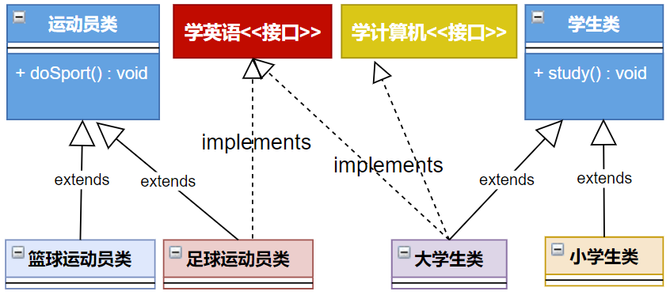
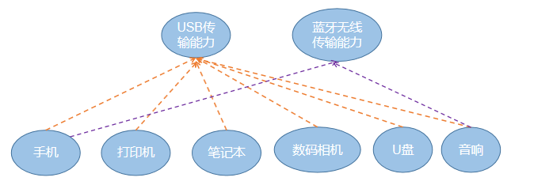
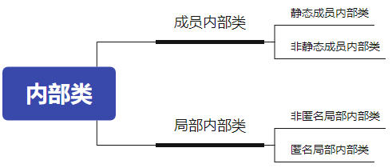
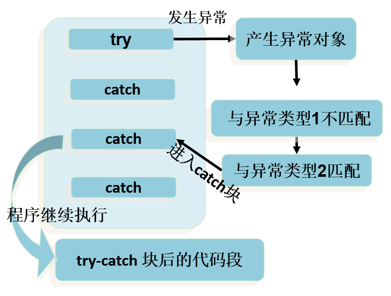

## 姓名：席崇援

## 学习任务：

- **面向对象编程**
  - final关键字修饰类，方法，属性
  - 抽象类
  - 接口（确定某些行为，但是行为的实现由实现类实现）
  - 内部类
    - 成员内部类和局部内部类
    - **注意匿名内部类的实现-->之后理解lambda表达式以及函数式接口**
- 异常处理以及自定义异常
  - try-catch-final
  - throws
  - throw
  - 自定义异常
- 包装类
  - 自动装箱和自动拆箱
  - String类型数据和基本数据类型的转换——调用对应的包装类方法
- 多线程
  - 继承Thread
  - 实现Runnable接口
  - 两种方法的区别：**Runnable方式能避免单继承以及共享数据的优势**

## 完成情况:


## 笔记：

## final关键字修饰类，方法，属性

final修饰某个变量（成员变量或局部变量），一旦赋值，它的值就不能被修改，即常量，常量名建议使用大写字母。


例如：final double MY_PI = 3.14;

> 如果某个成员变量用final修饰后，没有set方法，并且必须初始化（可以显式赋值、或在初始化块赋值、实例变量还可以在构造器中赋值）

- 修饰成员变量

```java
public final class Test {
    public static int totalNumber = 5;
    public final int ID;

    public Test() {
        ID = ++totalNumber; // 可在构造器中给final修饰的“变量”赋值
    }
    public static void main(String[] args) {
        Test t = new Test();
        System.out.println(t.ID);
    }
}
```

- 修饰局部变量：

```java
public class TestFinal {
    public static void main(String[] args){
        final int MIN_SCORE ;
        MIN_SCORE = 0;
        final int MAX_SCORE = 100;
        MAX_SCORE = 200; //非法
    }
}
```

- 错误演示：

```java
class A {
    private final String INFO = "atguigu";  //声明常量

    public void print() {
        //The final field A.INFO cannot be  assigned
        //INFO = "尚硅谷"; 
    }
}

```

如果你的目的是让`INFO`的值在对象创建时可以被设置，并且在之后保持不变，你可以将其声明为`final`，并且在构造函数中初始化它。例如：

```java
class A {
    private final String INFO;

    public A(String info) {
        this.INFO = info;
    }

    public void print() {
        System.out.println(INFO);
    }
}
//在这个修改后的版本中，INFO在构造函数中被初始化，并且在对象的生命周期内不能被重新赋值，这符合final字段的使用约定。
```

## 抽象类

### 语法格式

* **抽象类**：被abstract修饰的类。
* **抽象方法**：被abstract修饰没有方法体的方法。

抽象类的语法格式

```java
[权限修饰符] abstract class 类名{
    
}
[权限修饰符] abstract class 类名 extends 父类{
    
}
```

抽象方法的语法格式

```java
[其他修饰符] abstract 返回值类型 方法名([形参列表]);
```

> 注意：抽象方法没有方法体


代码举例：

```java
public abstract class Animal {
    public abstract void eat();
}
```

```java
public class Cat extends Animal {
    public void eat (){
      	System.out.println("小猫吃鱼和猫粮"); 
    }
}
```

```java
public class CatTest {
 	 public static void main(String[] args) {
        // 创建子类对象
        Cat c = new Cat(); 
       
        // 调用eat方法
        c.eat();
  	}
}
```

此时的方法重写，是子类对父类抽象方法的完成实现，我们将这种方法重写的操作，也叫做**实现方法**。

### 使用说明

1. 抽象类**不能创建对象**，如果创建，编译无法通过而报错。只能创建其非抽象子类的对象。

   > 理解：假设创建了抽象类的对象，调用抽象的方法，而抽象方法没有具体的方法体，没有意义。
   >
   > 抽象类是用来被继承的，抽象类的子类必须重写父类的抽象方法，并提供方法体。若没有重写全部的抽象方法，仍为抽象类。

2. 抽象类中，也有构造方法，是供子类创建对象时，初始化父类成员变量使用的。

   > 理解：子类的构造方法中，有默认的super()或手动的super(实参列表)，需要访问父类构造方法。

3. 抽象类中，不一定包含抽象方法，但是有抽象方法的类必定是抽象类。

   > 理解：未包含抽象方法的抽象类，目的就是不想让调用者创建该类对象，通常用于某些特殊的类结构设计。

4. 抽象类的子类，必须重写抽象父类中**所有的**抽象方法，否则，编译无法通过而报错。除非该子类也是抽象类。 

   > 理解：假设不重写所有抽象方法，则类中可能包含抽象方法。那么创建对象后，调用抽象的方法，没有意义。

### 注意事项

- 不能用abstract修饰变量、代码块、构造器；

- 不能用abstract修饰私有方法、静态方法、final的方法、final的类。


## 接口

接口就是规范，定义的是一组规则，体现了现实世界中“如果你是/要...则必须能...”的思想。继承是一个"是不是"的is-a关系，而接口实现则是 "能不能"的`has-a`关系。

接口的定义，它与定义类方式相似，但是使用 `interface` 关键字。它也会被编译成.class文件，但一定要明确它并不是类，而是另外一种引用数据类型。

> 引用数据类型：数组，类，枚举，接口，注解。

### 接口的声明格式

```java
[修饰符] interface 接口名{
    //接口的成员列表：
    // 公共的静态常量
    // 公共的抽象方法
    
    // 公共的默认方法（JDK1.8以上）
    // 公共的静态方法（JDK1.8以上）
    // 私有方法（JDK1.9以上）
}
```

示例代码：

```java
package com.atguigu.interfacetype;

public interface USB3{
    //静态常量
    long MAX_SPEED = 500*1024*1024;//500MB/s

    //抽象方法
    void in();
    void out();

    //默认方法
    default void start(){
        System.out.println("开始");
    }
    default void stop(){
        System.out.println("结束");
    }

    //静态方法
    static void show(){
        System.out.println("USB 3.0可以同步全速地进行读写操作");
    }
}
```

### 接口的成员说明

**在JDK8.0 之前**，接口中只允许出现：

（1）公共的静态的常量：其中`public static final`可以省略

（2）公共的抽象的方法：其中`public abstract`可以省略

> 理解：接口是从多个相似类中抽象出来的规范，不需要提供具体实现

**在JDK8.0 时**，接口中允许声明`默认方法`和`静态方法`：

（3）公共的默认的方法：其中public 可以省略，建议保留，但是default不能省略

（4）公共的静态的方法：其中public 可以省略，建议保留，但是static不能省略

**在JDK9.0 时**，接口又增加了：

（5）私有方法

除此之外，接口中没有构造器，没有初始化块，因为接口中没有成员变量需要动态初始化。

### 接口的使用规则

#### **1、类实现接口（implements）**

接口**不能创建对象**，但是可以被类实现（`implements` ，类似于被继承）。

类与接口的关系为实现关系，即**类实现接口**，该类可以称为接口的实现类。实现的动作类似继承，格式相仿，只是关键字不同，实现使用 ` implements`关键字。

```java
【修饰符】 class 实现类  implements 接口{
	// 重写接口中抽象方法【必须】，当然如果实现类是抽象类，那么可以不重写
  	// 重写接口中默认方法【可选】
}

【修饰符】 class 实现类 extends 父类 implements 接口{
    // 重写接口中抽象方法【必须】，当然如果实现类是抽象类，那么可以不重写
  	// 重写接口中默认方法【可选】
}
```


注意：

1. 如果接口的实现类是非抽象类，那么必须`重写接口中所有抽象方法`。

2. 默认方法可以选择保留，也可以重写。

   > 重写时，default单词就不要再写了，它只用于在接口中表示默认方法，到类中就没有默认方法的概念了

3. 接口中的静态方法不能被继承也不能被重写

举例：

```java
interface USB{		// 
	public void start() ;
	public void stop() ;	
}
class Computer{
	public static void show(USB usb){	
		usb.start() ;
		System.out.println("=========== USB 设备工作 ========") ;
		usb.stop() ;
	}
};
class Flash implements USB{
	public void start(){	// 重写方法
		System.out.println("U盘开始工作。") ;
	}
	public void stop(){		// 重写方法
		System.out.println("U盘停止工作。") ;
	}
};
class Print implements USB{
	public void start(){	// 重写方法
		System.out.println("打印机开始工作。") ;
	}
	public void stop(){		// 重写方法
		System.out.println("打印机停止工作。") ;
	}
};
public class InterfaceDemo{
	public static void main(String args[]){
		Computer.show(new Flash()) ;
		Computer.show(new Print()) ;

		c.show(new USB(){
			public void start(){
				System.out.println("移动硬盘开始运行");
			}
			public void stop(){
				System.out.println("移动硬盘停止运行");
			}
		});
	}
};
```

#### **2、接口的多实现（implements）**

之前学过，在继承体系中，一个类只能继承一个父类。而对于接口而言，一个类是可以实现多个接口的，这叫做接口的`多实现`。并且，一个类能继承一个父类，同时实现多个接口。

实现格式：

```java
【修饰符】 class 实现类  implements 接口1，接口2，接口3。。。{
	// 重写接口中所有抽象方法【必须】，当然如果实现类是抽象类，那么可以不重写
  	// 重写接口中默认方法【可选】
}

【修饰符】 class 实现类 extends 父类 implements 接口1，接口2，接口3。。。{
    // 重写接口中所有抽象方法【必须】，当然如果实现类是抽象类，那么可以不重写
  	// 重写接口中默认方法【可选】
}
```

> 接口中，有多个抽象方法时，实现类必须重写所有抽象方法。**如果抽象方法有重名的，只需要重写一次**。

举例：






定义多个接口：

```java
package com.atguigu.interfacetype;

public interface A {
    void showA();
}
```

```java
package com.atguigu.interfacetype;

public interface B {
    void showB();
}
```

定义实现类：

```java
package com.atguigu.interfacetype;

public class C implements A,B {
    @Override
    public void showA() {
        System.out.println("showA");
    }

    @Override
    public void showB() {
        System.out.println("showB");
    }
}

```

测试类

```java
package com.atguigu.interfacetype;

public class TestC {
    public static void main(String[] args) {
        C c = new C();
        c.showA();
        c.showB();
    }
}
```

#### **3、接口的多继承(extends)**

一个接口能继承另一个或者多个接口，接口的继承也使用 `extends` 关键字，子接口继承父接口的方法。

定义父接口：

```java
package com.atguigu.interfacetype;

public interface Chargeable {
    void charge();
    void in();
    void out();
}
```

定义子接口：

```java
package com.atguigu.interfacetype;

public interface UsbC extends Chargeable,USB3 {
    void reverse();
}
```

定义子接口的实现类：

```java
package com.atguigu.interfacetype;

public class TypeCConverter implements UsbC {
    @Override
    public void reverse() {
        System.out.println("正反面都支持");
    }

    @Override
    public void charge() {
        System.out.println("可充电");
    }

    @Override
    public void in() {
        System.out.println("接收数据");
    }

    @Override
    public void out() {
        System.out.println("输出数据");
    }
}
```

>所有父接口的抽象方法都有重写。
>
>方法签名相同的抽象方法只需要实现一次。

#### **4、接口与实现类对象构成多态引用**

实现类实现接口，类似于子类继承父类，因此，接口类型的变量与实现类的对象之间，也可以构成多态引用。通过接口类型的变量调用方法，最终执行的是你new的实现类对象实现的方法体。

接口的不同实现类：

```java
package com.atguigu.interfacetype;

public class Mouse implements USB3 {
    @Override
    public void out() {
        System.out.println("发送脉冲信号");
    }

    @Override
    public void in() {
        System.out.println("不接收信号");
    }
}
```

```java
package com.atguigu.interfacetype;

public class KeyBoard implements USB3{
    @Override
    public void in() {
        System.out.println("不接收信号");
    }

    @Override
    public void out() {
        System.out.println("发送按键信号");
    }
}

```

测试类

```java
package com.atguigu.interfacetype;

public class TestComputer {
    public static void main(String[] args) {
        Computer computer = new Computer();
        USB3 usb = new Mouse();
        computer.setUsb(usb);
        usb.start();
        usb.out();
        usb.in();
        usb.stop();
        System.out.println("--------------------------");

        usb = new KeyBoard();
        computer.setUsb(usb);
        usb.start();
        usb.out();
        usb.in();
        usb.stop();
        System.out.println("--------------------------");

        usb = new MobileHDD();
        computer.setUsb(usb);
        usb.start();
        usb.out();
        usb.in();
        usb.stop();
    }
}
```

**5、使用接口的静态成员**

接口不能直接创建对象，但是可以通过接口名直接调用接口的静态方法和静态常量。

```java
package com.atguigu.interfacetype;

public class TestUSB3 {
    public static void main(String[] args) {
        //通过“接口名.”调用接口的静态方法 (JDK8.0才能开始使用)
        USB3.show();
        //通过“接口名.”直接使用接口的静态常量
        System.out.println(USB3.MAX_SPEED);
    }
}
```

**6、使用接口的非静态方法**

* 对于接口的静态方法，直接使用“`接口名.`”进行调用即可
  * 也只能使用“接口名."进行调用，不能通过实现类的对象进行调用
* 对于接口的抽象方法、默认方法，只能通过实现类对象才可以调用
  * 接口不能直接创建对象，只能创建实现类的对象

```java
package com.atguigu.interfacetype;

public class TestMobileHDD {
    public static void main(String[] args) {
        //创建实现类对象
        MobileHDD b = new MobileHDD();

        //通过实现类对象调用重写的抽象方法，以及接口的默认方法，如果实现类重写了就执行重写的默认方法，如果没有重写，就执行接口中的默认方法
        b.start();
        b.in();
        b.stop();

        //通过接口名调用接口的静态方法
//        MobileHDD.show();
//        b.show();
        Usb3.show();
    }
}
```

### JDK8中相关冲突问题

#### 默认方法冲突问题

##### **（1）类优先原则**

当一个类，既继承一个父类，又实现若干个接口时，父类中的成员方法与接口中的抽象方法重名，子类就近选择执行父类的成员方法。代码如下：

定义接口：

```java
package com.atguigu.interfacetype;

public interface Friend {
    default void date(){//约会
        System.out.println("吃喝玩乐");
    }
}
```

定义父类：

```java
package com.atguigu.interfacetype;

public class Father {
    public void date(){//约会
        System.out.println("爸爸约吃饭");
    }
}
```

定义子类：

```java
package com.atguigu.interfacetype;

public class Son extends Father implements Friend {
    @Override
    public void date() {
        //(1)不重写默认保留父类的
        //(2)调用父类被重写的
//        super.date();
        //(3)保留父接口的
//        Friend.super.date();
        //(4)完全重写
        System.out.println("跟康师傅学Java");
    }
}
```

定义测试类：

```java
package com.atguigu.interfacetype;

public class TestSon {
    public static void main(String[] args) {
        Son s = new Son();
        s.date();
    }
}
```

##### **（2）接口冲突（左右为难）**

- 当一个类同时实现了多个父接口，而多个父接口中包含方法签名相同的默认方法时，怎么办呢？


无论你多难抉择，最终都是要做出选择的。

声明接口：

```java
package com.atguigu.interfacetype;

public interface BoyFriend {
    default void date(){//约会
        System.out.println("神秘约会");
    }
}
```

选择保留其中一个，通过“`接口名.super.方法名`"的方法选择保留哪个接口的默认方法。

```java
package com.atguigu.interfacetype;

public class Girl implements Friend,BoyFriend{

    @Override
    public void date() {
        //(1)保留其中一个父接口的
//        Friend.super.date();
//        BoyFriend.super.date();
        //(2)完全重写
        System.out.println("跟康师傅学Java");
    }

}
```

测试类

```java
package com.atguigu.interfacetype;

public class TestGirl {
    public static void main(String[] args) {
        Girl girl = new Girl();
        girl.date();
    }
}
```

- 当一个子接口同时继承了多个接口，而多个父接口中包含方法签名相同的默认方法时，怎么办呢？

另一个父接口：

```java
package com.atguigu.interfacetype;

public interface USB2 {
    //静态常量
    long MAX_SPEED = 60*1024*1024;//60MB/s

    //抽象方法
    void in();
    void out();

    //默认方法
    public default void start(){
        System.out.println("开始");
    }
    public default void stop(){
        System.out.println("结束");
    }

    //静态方法
    public static void show(){
        System.out.println("USB 2.0可以高速地进行读写操作");
    }
}
```

子接口：

```java
package com.atguigu.interfacetype;

public interface USB extends USB2,USB3 {
    @Override
    default void start() {
        System.out.println("Usb.start");
    }

    @Override
    default void stop() {
        System.out.println("Usb.stop");
    }
}

```

> 小贴士：
>
> 子接口重写默认方法时，default关键字可以保留。
>
> 子类重写默认方法时，default关键字不可以保留。

#### 常量冲突问题

- 当子类继承父类又实现父接口，而父类中存在与父接口常量同名的成员变量，并且该成员变量名在子类中仍然可见。
- 当子类同时实现多个接口，而多个接口存在相同同名常量。

此时在子类中想要引用父类或父接口的同名的常量或成员变量时，就会有冲突问题。

父类和父接口：

```java
package com.atguigu.interfacetype;

public class SuperClass {
    int x = 1;
}
```

```java
package com.atguigu.interfacetype;

public interface SuperInterface {
    int x = 2;
    int y = 2;
}
```

```java
package com.atguigu.interfacetype;

public interface MotherInterface {
    int x = 3;
}
```

子类：

```java
package com.atguigu.interfacetype;

public class SubClass extends SuperClass implements SuperInterface,MotherInterface {
    public void method(){
//        System.out.println("x = " + x);//模糊不清
        System.out.println("super.x = " + super.x);
        System.out.println("SuperInterface.x = " + SuperInterface.x);
        System.out.println("MotherInterface.x = " + MotherInterface.x);
        System.out.println("y = " + y);//没有重名问题，可以直接访问
    }
}
```

### 接口的总结

- **接口本身不能创建对象，只能创建接口的实现类对象，接口类型的变量可以与实现类对象构成多态引用。**
- **声明接口用interface，接口的成员声明有限制：**
  - **（1）公共的静态常量**
  - **（2）公共的抽象方法**
  - **（3）公共的默认方法（JDK8.0 及以上）**
  - **（4）公共的静态方法（JDK8.0 及以上）**
  - **（5）私有方法（JDK9.0 及以上）**
- **类可以实现接口，关键字是implements，而且支持多实现。如果实现类不是抽象类，就必须实现接口中所有的抽象方法。如果实现类既要继承父类又要实现父接口，那么继承（extends）在前，实现（implements）在后。**
- **接口可以继承接口，关键字是extends，而且支持多继承。**
- **接口的默认方法可以选择重写或不重写。如果有冲突问题，另行处理。子类重写父接口的默认方法，要去掉default，子接口重写父接口的默认方法，不要去掉default。**
- **接口的静态方法不能被继承，也不能被重写。接口的静态方法只能通过“接口名.静态方法名”进行调用。**


## 内部类

**根据内部类声明的位置（如同变量的分类），我们可以分为：**



### 成员内部类

如果成员内部类中不使用外部类的非静态成员，那么通常将内部类声明为静态内部类，否则声明为非静态内部类。

**语法格式：**

```java
[修饰符] class 外部类{
    [其他修饰符] [static] class 内部类{
    }
}
```

**成员内部类的使用特征，概括来讲有如下两种角色：**

- 成员内部类作为`类的成员的角色`：
  - 和外部类不同，Inner class还可以声明为private或protected；
  - 可以调用外部类的结构。（注意：在静态内部类中不能使用外部类的非静态成员）
  - Inner class 可以声明为static的，但此时就不能再使用外层类的非static的成员变量；
- 成员内部类作为`类的角色`：
  - 可以在内部定义属性、方法、构造器等结构
  - 可以继承自己的想要继承的父类，实现自己想要实现的父接口们，和外部类的父类和父接口无关
  - 可以声明为abstract类 ，因此可以被其它的内部类继承
  - 可以声明为final的，表示不能被继承
  - 编译以后生成OuterClass$InnerClass.class字节码文件（也适用于局部内部类）

注意点：

2. 外部类访问成员内部类的成员，需要“内部类.成员”或“内部类对象.成员”的方式

3. 成员内部类可以直接使用外部类的所有成员，包括私有的数据

4. 当想要在外部类的静态成员部分使用内部类时，可以考虑内部类声明为静态的

#### 创建成员内部类对象

- 实例化静态内部类

```
外部类名.静态内部类名 变量 = 外部类名.静态内部类名();
变量.非静态方法();
```

- 实例化非静态内部类

```
外部类名 变量1 = new 外部类();
外部类名.非静态内部类名 变量2 = 变量1.new 非静态内部类名();
变量2.非静态方法();
```

####  举例

```java
public class TestMemberInnerClass {
    public static void main(String[] args) {
        //创建静态内部类实例，并调用方法
        Outer.StaticInner inner = new Outer.StaticInner();
        inner.inFun();
        //调用静态内部类静态方法
        Outer.StaticInner.inMethod();

        System.out.println("*****************************");
        
        //创建非静态内部类实例（方式1），并调用方法
        Outer outer = new Outer();
        Outer.NoStaticInner inner1 = outer.new NoStaticInner();
        inner1.inFun();

        //创建非静态内部类实例（方式2）
        Outer.NoStaticInner inner2 = outer.getNoStaticInner();
        inner1.inFun();
    }
}
class Outer{
    private static String a = "外部类的静态a";
    private static String b  = "外部类的静态b";
    private String c = "外部类对象的非静态c";
    private String d = "外部类对象的非静态d";

    static class StaticInner{
        private static String a ="静态内部类的静态a";
        private String c = "静态内部类对象的非静态c";
        public static void inMethod(){
            System.out.println("Inner.a = " + a);
            System.out.println("Outer.a = " + Outer.a);
            System.out.println("b = " + b);
        }
        public void inFun(){
            System.out.println("Inner.inFun");
            System.out.println("Outer.a = " + Outer.a);
            System.out.println("Inner.a = " + a);
            System.out.println("b = " + b);
            System.out.println("c = " + c);
//            System.out.println("d = " + d);//不能访问外部类的非静态成员
        }
    }

    class NoStaticInner{
        private String a = "非静态内部类对象的非静态a";
        private String c = "非静态内部类对象的非静态c";

        public void inFun(){
            System.out.println("NoStaticInner.inFun");
            System.out.println("Outer.a = " + Outer.a);
            System.out.println("a = " + a);
            System.out.println("b = " + b);
            System.out.println("Outer.c = " + Outer.this.c);
            System.out.println("c = " + c);
            System.out.println("d = " + d);
        }
    }


    public NoStaticInner getNoStaticInner(){
        return new NoStaticInner();
    }
}
```

### 静态内部类


**`静态内部类`（Static Nested Class）是定义在另一个类的静态成员位置上的内部类。静态内部类与外部类的关系类似于静态成员与外部类的关系。静态内部类可以访问外部类的静态成员，但不能直接访问外部类的非静态成员。外部类可以通过创建静态内部类的实例来访问静态内部类的成员**。

```Java
定义：
public class A{//外部类
    static class B{//静态内部类
    }
}
```

#### **细节：**

1.静态内部类定义在外部类的静态成员位置所以用static修饰
2.可以直接访问外部类的所有静态成员（包含私有的）但不能直接访问外部类的非静态成员，如果想访问外部类的非静态成员需要创建外部类的实例对象

```JAVA
public class A{//外部类
    private int num=10;
    static class B{//静态内部类
        public void print(){//访问外部类的非静态成员需要创建外部类的对象
            A a = new A();
            System.out.println(a.num);
        }
    }
}
```

3.可以添加任意访问修饰符(public、protected、默认、private),因为它的地位就是一个静态成员。（作用和成员内部类一样）
4.作用域：同其他成员一样是整个类体
5.静态内部类可以声明静态和非静态成员变量和方法，而成员内部类、局部内部类、匿名内部类不能声明静态成员变量和方法。

```java
public class A{//外部类
    static class B{//静态内部类
        public static int num=10;
        public void print(){//访问外部类的非静态成员需要创建外部类的对象
            System.out.println(num);
        }
    }
}
```

6.外部类可以访问静态内部类的所有成员，在外部类的成员方法中创建静态内部类对象，再到主方法中创建外部类的对象调用成员方法（该方法是静态内部类对象所在的方法）这里和成员内部类的调用方式一样

```java
public class A{//外部类
    static class B{//静态内部类
        public static int num=10;
        public void print(){//访问外部类的非静态成员需要创建外部类的对象
            System.out.println(num);
        }
    }
    public void inner(){
        B b = new B();
        b.print();
    }
    public static void main(String[] args) {
    A a = new A();
    a.inner();
	}
}
```

7.外部其他类访问静态内部类：
（1）在主方法中直接创建静态内部类对象(理解：因为静态内部类是静态成员所以直接通过类名调用，看new 和（）中间部分)
外部类名.静态内部类名 变量名 = new 外部类名.静态内部类名();

```java
public class A{//外部类
    static class B{//静态内部类
        public static int num=10;
        public void print(){//访问外部类的非静态成员需要创建外部类的对象
            System.out.println(num);
        }
    }
}
class Test{//外部其他类
    public static void main(String[] args) {
        A.B b = new A.B();
        b.print();
    }
}
```

结果如下：

```
10
```

（2）外部其他类可以通过"外部类.内部类.静态成员"的方式访问内部类中的静态成员，但是其中的非静态成员需要上面创建静态内部类的实例对象才能访问。

```java
public class A{//外部类
    static class B{//静态内部类
        public static int num=10;
        public void print(){//访问外部类的非静态成员需要创建外部类的对象
            System.out.println(num);
        }
    }
}
class Test{
    public static void main(String[] args) {
        System.out.println(A.B.num);
    }
}
```

结果和上面一样

8.如果外部类和静态内部类的静态属性或静态方法重名时，默认遵循就近原则，如果想访问外部类的静态成员，则可以使用(外部类名.静态成员)去访问，因为静态属性是类的成员所以直接通过类名调用

```java
public class A{//外部类
    public static int num=20;
    static class B{//静态内部类
        public static int num=10;
        public void print(){//访问外部类的非静态成员需要创建外部类的对象
            System.out.println("访问静态内部类的静态属性num："+num);
            System.out.println("访问外部类的静态属性num："+ A.num);
        }
    }
}
class Test{
    public static void main(String[] args) {
        A.B b = new A.B();
        b.print();
    }
}
```

结果如下：

```java
访问静态内部类的静态属性num：10
访问外部类的静态属性num：20
```

### 局部内部类


#### 非匿名局部内部类

语法格式：

```java
[修饰符] class 外部类{
    [修饰符] 返回值类型  方法名(形参列表){
            [final/abstract] class 内部类{
    	}
    }    
}
```

- 编译后有自己的独立的字节码文件，只不过在内部类名前面冠以外部类名、$符号、编号。
  - 这里有编号是因为同一个外部类中，不同的方法中存在相同名称的局部内部类

* 和成员内部类不同的是，它前面不能有权限修饰符等
* 局部内部类如同局部变量一样，有作用域
* 局部内部类中是否能访问外部类的非静态的成员，取决于所在的方法

举例：

```java
/**
 * ClassName: TestLocalInner
 * @Author 尚硅谷-宋红康
 * @Create 17:19
 * @Version 1.0
 */
public class TestLocalInner {
    public static void main(String[] args) {
        Outer.outMethod();
        System.out.println("-------------------");

        Outer out = new Outer();
        out.outTest();
        System.out.println("-------------------");

        Runner runner = Outer.getRunner();
        runner.run();

    }
}
class Outer{

    public static void outMethod(){
        System.out.println("Outer.outMethod");
        final String c = "局部变量c";
        class Inner{
            public void inMethod(){
                System.out.println("Inner.inMethod");
                System.out.println(c);
            }
        }

        Inner in = new Inner();
        in.inMethod();
    }

    public void outTest(){
        class Inner{
            public void inMethod1(){
                System.out.println("Inner.inMethod1");
            }
        }

        Inner in = new Inner();
        in.inMethod1();
    }

    public static Runner getRunner(){
        class LocalRunner implements Runner{
            @Override
            public void run() {
                System.out.println("LocalRunner.run");
            }
        }
        return new LocalRunner();
    }

}
interface Runner{
    void run();
}
```

#### 匿名内部类

因为考虑到这个子类或实现类是一次性的，那么我们“费尽心机”的给它取名字，就显得多余。那么我们完全可以使用匿名内部类的方式来实现，避免给类命名的问题。

```java
new 父类([实参列表]){
    重写方法...
}
```

```java
new 父接口(){
    重写方法...
}
```

举例1：使用匿名内部类的对象直接调用方法：

```java
interface A{
	void a();
}
public class Test{
    public static void main(String[] args){
    	new A(){
			@Override
			public void a() {
				System.out.println("aaaa");
			}
    	}.a();
    }
}
```

举例2：通过父类或父接口的变量多态引用匿名内部类的对象

```java
interface A{
	void a();
}
public class Test{
    public static void main(String[] args){
    	A obj = new A(){
			@Override
			public void a() {
				System.out.println("aaaa");
			}
    	};
    	obj.a();
    }
}
```

举例3：匿名内部类的对象作为实参

```java
interface A{
	void method();
}
public class Test{
    public static void test(A a){
    	a.method();
    }
    
    public static void main(String[] args){
    	test(new A(){

			@Override
			public void method() {
				System.out.println("aaaa");
			}
    	});
    }   
}
```

## 异常处理以及自定义异常

### try-catch-final

#### try-catch-finally基本格式

捕获异常语法如下：

~~~java
try{
	......	//可能产生异常的代码
}
catch( 异常类型1 e ){
	......	//当产生异常类型1型异常时的处置措施
}
catch( 异常类型2 e ){
	...... 	//当产生异常类型2型异常时的处置措施
}  
finally{
	...... //无论是否发生异常，都无条件执行的语句
} 

~~~

**1、整体执行过程：**

当某段代码可能发生异常，不管这个异常是编译时异常（受检异常）还是运行时异常（非受检异常），我们都可以使用try块将它括起来，并在try块下面编写catch分支尝试捕获对应的异常对象。

- 如果在程序运行时，try块中的代码没有发生异常，那么catch所有的分支都不执行。
- 如果在程序运行时，try块中的代码发生了异常，根据异常对象的类型，将从上到下选择第一个匹配的catch分支执行。此时try中发生异常的语句下面的代码将不执行，而整个try...catch之后的代码可以继续运行。
- 如果在程序运行时，try块中的代码发生了异常，但是所有catch分支都无法匹配（捕获）这个异常，那么JVM将会终止当前方法的执行，并把异常对象“抛”给调用者。如果调用者不处理，程序就挂了。



**2、try**

- 捕获异常的第一步是用`try{…}语句块`选定捕获异常的范围，将可能出现异常的业务逻辑代码放在try语句块中。

**3、catch (Exceptiontype e)**

- catch分支，分为两个部分，catch()中编写异常类型和异常参数名，{}中编写如果发生了这个异常，要做什么处理的代码。

- 如果明确知道产生的是何种异常，可以用该异常类作为catch的参数；也可以用其父类作为catch的参数。

  比如：可以用ArithmeticException类作为参数的地方，就可以用RuntimeException类作为参数，或者用所有异常的父类Exception类作为参数。但不能是与ArithmeticException类无关的异常，如NullPointerException（catch中的语句将不会执行）。

- 每个try语句块可以伴随一个或多个catch语句，用于处理可能产生的不同类型的异常对象。

- 如果有多个catch分支，并且多个异常类型有父子类关系，必须保证小的子异常类型在上，大的父异常类型在下。否则，报错。

- catch中常用异常处理的方式

  - `public String getMessage()`：获取异常的描述信息，返回字符串

  - `public void printStackTrace()`：打印异常的跟踪栈信息并输出到控制台。包含了异常的类型、异常的原因、还包括异常出现的位置，在开发和调试阶段，都得使用printStackTrace()。

  

#### 使用举例

举例1：

```java
public class IndexOutExp {
    public static void main(String[] args) {
        String friends[] = { "lisa", "bily", "kessy" };
        try {
            for (int i = 0; i < 5; i++) {
            System.out.println(friends[i]);
            }
        } catch (ArrayIndexOutOfBoundsException e) {
            System.out.println("index err");
        }
        System.out.println("\nthis is the end");
    }
}

```

举例2：

```java
public class DivideZero1 {
    int x;
    public static void main(String[] args) {
        int y;
        DivideZero1 c = new DivideZero1();
        try {
            y = 3 / c.x;
        } catch (ArithmeticException e) {
            System.out.println("divide by zero error!");
        }
        System.out.println("program ends ok!");
    }
}

```

举例3：

```java
@Test
public void test1(){
	try{
		String str1 = "atguigu.com";
		str1 = null;
		System.out.println(str1.charAt(0));
	}catch(NullPointerException e){
		//异常的处理方式1
		System.out.println("不好意思，亲~出现了小问题，正在加紧解决...");	
	}catch(ClassCastException e){
		//异常的处理方式2
		System.out.println("出现了类型转换的异常");
	}catch(RuntimeException e){
		//异常的处理方式3
		System.out.println("出现了运行时异常");
	}
	//此处的代码，在异常被处理了以后，是可以正常执行的
	System.out.println("hello");
}
```

####  finally使用及举例

- 因为异常会引发程序跳转，从而会导致有些语句执行不到。而程序中有一些特定的代码无论异常是否发生，都`需要执行`。例如，数据库连接、输入流输出流、Socket连接、Lock锁的关闭等，这样的代码通常就会放到finally块中。所以，我们通常将一定要被执行的代码声明在finally中。

  - 唯一的例外，使用 System.exit(0) 来终止当前正在运行的 Java 虚拟机。

- 不论在try代码块中是否发生了异常事件，catch语句是否执行，catch语句是否有异常，catch语句中是否有return，finally块中的语句都会被执行。

- finally语句和catch语句是可选的，但finally不能单独使用。

  ```java
  try{
       
  }finally{
      
  } 
  ```

举例1：确保资源关闭

```java
package com.atguigu.keyword;

import java.util.InputMismatchException;
import java.util.Scanner;

public class TestFinally {
    public static void main(String[] args) {
        Scanner input = new Scanner(System.in);
        try {
            System.out.print("请输入第一个整数：");
            int a = input.nextInt();
            System.out.print("请输入第二个整数：");
            int b = input.nextInt();
            int result = a/b;
            System.out.println(a + "/" + b +"=" + result);
        } catch (InputMismatchException e) {
            System.out.println("数字格式不正确，请输入两个整数");
        }catch (ArithmeticException e){
            System.out.println("第二个整数不能为0");
        } finally {
            System.out.println("程序结束，释放资源");
            input.close();
        }
    }
    
    @Test
    public void test1(){
        FileInputStream fis = null;
        try{
            File file = new File("hello1.txt");
            fis = new FileInputStream(file);//FileNotFoundException
            int b = fis.read();//IOException
            while(b != -1){
                System.out.print((char)b);
                b = fis.read();//IOException
            }

        }catch(IOException e){
            e.printStackTrace();
        }finally{
            try {
                if(fis != null)
                    fis.close();//IOException
            } catch (IOException e) {
                e.printStackTrace();
            }	
        }
    }
}
```

举例2：从try回来

```java
public class FinallyTest1 {
    public static void main(String[] args) {
        int result = test("12");
        System.out.println(result);
    }

    public static int test(String str){
        try{
            Integer.parseInt(str);
            return 1;
        }catch(NumberFormatException e){
            return -1;
        }finally{
            System.out.println("test结束");
        }
    }
}
```

举例3：从catch回来

```java
public class FinallyTest2 {
    public static void main(String[] args) {
        int result = test("a");
        System.out.println(result);
    }

    public static int test(String str) {
        try {
            Integer.parseInt(str);
            return 1;
        } catch (NumberFormatException e) {
            return -1;
        } finally {
            System.out.println("test结束");
        }
    }
}
```

举例4：从finally回来

```java
public class FinallyTest3 {
    public static void main(String[] args) {
        int result = test("a");
        System.out.println(result);
    }

    public static int test(String str) {
        try {
            Integer.parseInt(str);
            return 1;
        } catch (NumberFormatException e) {
            return -1;
        } finally {
            System.out.println("test结束");
            return 0;
        }
    }
}
```

### throws

#### **声明异常格式：**

~~~
修饰符 返回值类型 方法名(参数) throws 异常类名1,异常类名2…{   }	
~~~

在throws后面可以写多个异常类型，用逗号隔开。

举例：

```java
public void readFile(String file)  throws FileNotFoundException,IOException {
	...
	// 读文件的操作可能产生FileNotFoundException或IOException类型的异常
	FileInputStream fis = new FileInputStream(file);
    //...
}
```

#### **针对于编译时异常**

```java
package com.atguigu.keyword;

public class TestThrowsCheckedException {
    public static void main(String[] args) {
        System.out.println("上课.....");
        try {
            afterClass();//换到这里处理异常
        } catch (InterruptedException e) {
            e.printStackTrace();
            System.out.println("准备提前上课");
        }
        System.out.println("上课.....");
    }

    public static void afterClass() throws InterruptedException {
        for(int i=10; i>=1; i--){
            Thread.sleep(1000);//本来应该在这里处理异常
            System.out.println("距离上课还有：" + i + "分钟");
        }
    }
}

```

**举例：针对于运行时异常：**

throws后面也可以写运行时异常类型，只是运行时异常类型，写或不写对于编译器和程序执行来说都没有任何区别。如果写了，唯一的区别就是调用者调用该方法后，使用try...catch结构时，IDEA可以获得更多的信息，需要添加哪种catch分支。

~~~java
package com.atguigu.keyword;

import java.util.InputMismatchException;
import java.util.Scanner;

public class TestThrowsRuntimeException {
    public static void main(String[] args) {
        Scanner input = new Scanner(System.in);
        try {
            System.out.print("请输入第一个整数：");
            int a = input.nextInt();
            System.out.print("请输入第二个整数：");
            int b = input.nextInt();
            int result = divide(a,b);
            System.out.println(a + "/" + b +"=" + result);
        } catch (ArithmeticException | InputMismatchException e) {
            e.printStackTrace();
        } finally {
            input.close();
        }
    }

    public static int divide(int a, int b)throws ArithmeticException{
        return a/b;
    }
}

~~~

#### 方法重写中throws的要求

方法重写时，对于方法签名是有严格要求的。复习：

```
（1）方法名必须相同
（2）形参列表必须相同
（3）返回值类型
	- 基本数据类型和void：必须相同
	- 引用数据类型：<=
（4）权限修饰符：>=，而且要求父类被重写方法在子类中是可见的
（5）不能是static，final修饰的方法
```

此外，对于throws异常列表要求：

- 如果父类被重写方法的方法签名后面没有 “throws  编译时异常类型”，那么重写方法时，方法签名后面也不能出现“throws  编译时异常类型”。
- 如果父类被重写方法的方法签名后面有 “`throws  编译时异常类型`”，那么重写方法时，throws的编译时异常类型必须 <= 被重写方法throws的编译时异常类型，或者不throws编译时异常。
- 方法重写，对于“`throws 运行时异常类型`”没有要求。

```java
package com.atguigu.keyword;

import java.io.IOException;

class Father{
    public void method()throws Exception{
        System.out.println("Father.method");
    }
}
class Son extends Father{
    @Override
    public void method() throws IOException,ClassCastException {
        System.out.println("Son.method");
    }
}
```

### throw

#### 使用格式

~~~java
throw new 异常类名(参数);
~~~

throw语句抛出的异常对象，和JVM自动创建和抛出的异常对象一样。

- 如果是编译时异常类型的对象，同样需要使用throws或者try...catch处理，否则编译不通过。

- 如果是运行时异常类型的对象，编译器不提示。

- 可以抛出的异常必须是Throwable或其子类的实例。下面的语句在编译时将会产生语法错误：

  ```java
  throw new String("want to throw");
  ```

#### **注意:**

**无论是编译时异常类型的对象，还是运行时异常类型的对象，如果没有被try..catch合理的处理，都会导致程序崩溃。****

throw语句会导致程序执行流程被改变，throw语句是明确抛出一个异常对象，因此它`下面的代码将不会执行`。

如果当前方法没有try...catch处理这个异常对象，throw语句就会`代替return语句`提前终止当前方法的执行，并返回一个异常对象给调用者。

~~~java
package com.atguigu.keyword;

public class TestThrow {
    public static void main(String[] args) {
        try {
            System.out.println(max(4,2,31,1));
        } catch (Exception e) {
            e.printStackTrace();
        }
        try {
            System.out.println(max(4));
        } catch (Exception e) {
            e.printStackTrace();
        }
        try {
            System.out.println(max());
        } catch (Exception e) {
            e.printStackTrace();
        }
    }

    public static int max(int... nums){
        if(nums == null || nums.length==0){
            throw new IllegalArgumentException("没有传入任何整数，无法获取最大值");
        }
        int max = nums[0];
        for (int i = 1; i < nums.length; i++) {
            if(nums[i] > max){
                max = nums[i];
            }
        }
        return max;
    }
}
~~~

### 自定义异常

####  如何自定义异常类?

**（1）要继承一个异常类型**

​			**自定义一个编译时异常类型：自定义类继承`java.lang.Exception`。**

​			**自定义一个运行时异常类型：自定义类继承`java.lang.RuntimeException`。**

**（2）建议大家提供至少两个构造器，一个是无参构造，一个是(String message)构造器。**

**（3）自定义异常需要提供`serialVersionUID`**

####  注意点

1. **自定义的异常只能通过throw抛出。**
2. **自定义异常最重要的是异常类的名字和message属性。当异常出现时，可以根据名字判断异常类型。比如：`TeamException("成员已满，无法添加"); `、 `TeamException("该员工已是某团队成员");`**

3. **自定义异常对象只能手动抛出。抛出后由try..catch处理，也可以甩锅throws给调用者处理。**

###  举例

举例1：

```java
class MyException extends Exception {
    static final long serialVersionUID = 23423423435L;
    private int idnumber;

    public MyException(String message, int id) {
        super(message);
        this.idnumber = id;
    }

    public int getId() {
        return idnumber;
    }
}

```

```java
public class MyExpTest {
    public void regist(int num) throws MyException {
        if (num < 0)
            throw new MyException("人数为负值，不合理", 3);
        else
            System.out.println("登记人数" + num);
    }
    public void manager() {
        try {
            regist(100);
        } catch (MyException e) {
            System.out.print("登记失败，出错种类" + e.getId());
        }
        System.out.print("本次登记操作结束");
    }
    public static void main(String args[]) {
        MyExpTest t = new MyExpTest();
        t.manager();
    }
}

```

举例2：

~~~java
package com.atguigu.define;
//自定义异常：
public class NotTriangleException extends Exception{
    static final long serialVersionUID = 13465653435L;

    public NotTriangleException() {
    }

    public NotTriangleException(String message) {
        super(message);
    }
}

~~~

```java
package com.atguigu.define;

public class Triangle {
    private double a;
    private double b;
    private double c;

    public Triangle(double a, double b, double c) throws NotTriangleException {
        if(a<=0 || b<=0 || c<=0){
            throw new NotTriangleException("三角形的边长必须是正数");
        }
        if(a+b<=c || b+c<=a || a+c<=b){
            throw new NotTriangleException(a+"," + b +"," + c +"不能构造三角形，三角形任意两边之后必须大于第三边");
        }
        this.a = a;
        this.b = b;
        this.c = c;
    }

    public double getA() {
        return a;
    }

    public void setA(double a) throws NotTriangleException{
        if(a<=0){
            throw new NotTriangleException("三角形的边长必须是正数");
        }
        if(a+b<=c || b+c<=a || a+c<=b){
            throw new NotTriangleException(a+"," + b +"," + c +"不能构造三角形，三角形任意两边之后必须大于第三边");
        }
        this.a = a;
    }

    public double getB() {
        return b;
    }

    public void setB(double b) throws NotTriangleException {
        if(b<=0){
            throw new NotTriangleException("三角形的边长必须是正数");
        }
        if(a+b<=c || b+c<=a || a+c<=b){
            throw new NotTriangleException(a+"," + b +"," + c +"不能构造三角形，三角形任意两边之后必须大于第三边");
        }
        this.b = b;
    }

    public double getC() {
        return c;
    }

    public void setC(double c) throws NotTriangleException {
        if(c<=0){
            throw new NotTriangleException("三角形的边长必须是正数");
        }
        if(a+b<=c || b+c<=a || a+c<=b){
            throw new NotTriangleException(a+"," + b +"," + c +"不能构造三角形，三角形任意两边之后必须大于第三边");
        }
        this.c = c;
    }

    @Override
    public String toString() {
        return "Triangle{" +
                "a=" + a +
                ", b=" + b +
                ", c=" + c +
                '}';
    }
}
```

```java
package com.atguigu.define;

public class TestTriangle {
    public static void main(String[] args) {
        Triangle t = null;
        try {
            t = new Triangle(2,2,3);
            System.out.println("三角形创建成功：");
            System.out.println(t);
        } catch (NotTriangleException e) {
            System.err.println("三角形创建失败");
            e.printStackTrace();
        }

        try {
            if(t != null) {
                t.setA(1);
            }
            System.out.println("三角形边长修改成功");
        } catch (NotTriangleException e) {
            System.out.println("三角形边长修改失败");
            e.printStackTrace();
        }
    }
}
```

### 异常处理5个关键字


> 类比：上游排污，下游治污

## 包装类

### 有哪些包装类


封装以后的，内存结构对比：

```java
public static void main(String[] args){
	int num = 520;
	Integer obj = new Integer(520);
}
```


### 自定义包装类

```java
public class MyInteger {
    int value;

    public MyInteger() {
    }

    public MyInteger(int value) {
        this.value = value;
    }

    @Override
    public String toString() {
        return String.valueOf(value);
    }
}

```

### 自动装箱和自动拆箱

由于我们经常要做基本类型与包装类之间的转换，从`JDK5.0 `开始，基本类型与包装类的装箱、拆箱动作可以自动完成。例如：

```java
Integer i = 4;//自动装箱。相当于Integer i = Integer.valueOf(4);
i = i + 5;//等号右边：将i对象转成基本数值(自动拆箱) i.intValue() + 5;
//加法运算完成后，再次装箱，把基本数值转成对象。
```

> 注意：只能与自己对应的类型之间才能实现自动装箱与拆箱。

```java
Integer i = 1;
Double d = 1;//错误的，1是int类型
```

### 基本数据类型、包装类与字符串间的转换

**（1）基本数据类型转为字符串**

**方式1：**调用字符串重载的valueOf()方法

```java
int a = 10;
//String str = a;//错误的

String str = String.valueOf(a);
```

**方式2：**更直接的方式

```java
int a = 10;

String str = a + "";
```

**（2）字符串转为基本数据类型**

**方式1：**除了Character类之外，其他所有包装类都具有parseXxx静态方法可以将字符串参数转换为对应的基本类型，例如：

* `public static int parseInt(String s)`：将字符串参数转换为对应的int基本类型。
* `public static long parseLong(String s)`：将字符串参数转换为对应的long基本类型。
* `public static double parseDouble(String s)`：将字符串参数转换为对应的double基本类型。

**方式2：**字符串转为包装类，然后可以自动拆箱为基本数据类型

* ```public static Integer valueOf(String s)```：将字符串参数转换为对应的Integer包装类，然后可以自动拆箱为int基本类型
* ```public static Long valueOf(String s)```：将字符串参数转换为对应的Long包装类，然后可以自动拆箱为long基本类型
* ```public static Double valueOf(String s)```：将字符串参数转换为对应的Double包装类，然后可以自动拆箱为double基本类型

注意:如果字符串参数的内容无法正确转换为对应的基本类型，则会抛出`java.lang.NumberFormatException`异常。

**方式3：**通过包装类的构造器实现

```java
int a = Integer.parseInt("整数的字符串");
double d = Double.parseDouble("小数的字符串");
boolean b = Boolean.parseBoolean("true或false");

int a = Integer.valueOf("整数的字符串");
double d = Double.valueOf("小数的字符串");
boolean b = Boolean.valueOf("true或false");

int i = new Integer(“12”);

```

其他方式小结：


### 包装类的其它API

#### 数据类型的最大最小值

```java
Integer.MAX_VALUE和Integer.MIN_VALUE
    
Long.MAX_VALUE和Long.MIN_VALUE
    
Double.MAX_VALUE和Double.MIN_VALUE
```

#### 字符转大小写

```java
Character.toUpperCase('x');

Character.toLowerCase('X');
```

#### 整数转进制

```java
Integer.toBinaryString(int i) 
    
Integer.toHexString(int i)
    
Integer.toOctalString(int i)
```

#### 比较的方法

```java
Double.compare(double d1, double d2)
    
Integer.compare(int x, int y) 
```

### 包装类对象特点

#### 包装类缓存对象

| 包装类    | 缓存对象    |
| --------- | ----------- |
| Byte      | -128~127    |
| Short     | -128~127    |
| Integer   | -128~127    |
| Long      | -128~127    |
| Float     | 没有        |
| Double    | 没有        |
| Character | 0~127       |
| Boolean   | true和false |

```java
Integer a = 1;
Integer b = 1;
System.out.println(a == b);//true

Integer i = 128;
Integer j = 128;
System.out.println(i == j);//false

Integer m = new Integer(1);//新new的在堆中
Integer n = 1;//这个用的是缓冲的常量对象，在方法区
System.out.println(m == n);//false

Integer x = new Integer(1);//新new的在堆中
Integer y = new Integer(1);//另一个新new的在堆中
System.out.println(x == y);//false
```

```java
Double d1 = 1.0;
Double d2 = 1.0;
System.out.println(d1==d2);//false 比较地址，没有缓存对象，每一个都是新new的
```

#### 类型转换问题

```java
Integer i = 1000;
double j = 1000;
System.out.println(i==j);//true  会先将i自动拆箱为int，然后根据基本数据类型“自动类型转换”规则，转为double比较
```

```java
Integer i = 1000;
int j = 1000;
System.out.println(i==j);//true 会自动拆箱，按照基本数据类型进行比较
```

```java
Integer i = 1;
Double d = 1.0
System.out.println(i==d);//编译报错
```

#### 包装类对象不可变

```java
public class TestExam {
	public static void main(String[] args) {
		int i = 1;
		Integer j = new Integer(2);
		Circle c = new Circle();
		change(i,j,c);
		System.out.println("i = " + i);//1
		System.out.println("j = " + j);//2
		System.out.println("c.radius = " + c.radius);//10.0
	}
	
	/*
	 * 方法的参数传递机制：
	 * （1）基本数据类型：形参的修改完全不影响实参
	 * （2）引用数据类型：通过形参修改对象的属性值，会影响实参的属性值
	 * 这类Integer等包装类对象是“不可变”对象，即一旦修改，就是新对象，和实参就无关了
	 */
	public static void change(int a ,Integer b,Circle c ){
		a += 10;
//		b += 10;//等价于  b = new Integer(b+10);
		c.radius += 10;
		/*c = new Circle();
		c.radius+=10;*/
	}
}
class Circle{
	double radius;
}
```

### 练习:

```Java
package com.atguigu12.wrapper.interview;

/**
 * 判断如下程序的执行结果
 *
 * @author 尚硅谷-宋红康
 * @create 12:50
 */
public class InterviewTest2 {
    public static void main(String[] args) {
        //题目1：
        int i = 10;
        double d = 10.2;
//        System.out.println(i == d);//false
        //题目2：
        Integer i1 = 10;
        Double d1 = 10.2;
//		System.out.println(i1 == d1);//编译报错

        //题目3：
        Integer m = 1000;
        double n = 1000;
        System.out.println(m == n);//true

        //题目4：
        Integer x = 1000;
        int y = 1000;
        System.out.println(x == y);//true
    }
}
```

## 多线程

### 继承Thread

Java通过继承Thread类来**创建**并**启动多线程**的步骤如下：

1. 定义Thread类的子类，并重写该类的run()方法，该run()方法的方法体就代表了线程需要完成的任务
2. 创建Thread子类的实例，即创建了线程对象
3. 调用线程对象的start()方法来启动该线程

代码如下：

~~~java
package com.atguigu.thread;
//自定义线程类
public class MyThread extends Thread {
    //定义指定线程名称的构造方法
    public MyThread(String name) {
        //调用父类的String参数的构造方法，指定线程的名称
        super(name);
    }
    /**
     * 重写run方法，完成该线程执行的逻辑
     */
    @Override
    public void run() {
        for (int i = 0; i < 10; i++) {
            System.out.println(getName()+"：正在执行！"+i);
        }
    }
}
~~~

测试类：

~~~java
package com.atguigu.thread;

public class TestMyThread {
    public static void main(String[] args) {
        //创建自定义线程对象1
        MyThread mt1 = new MyThread("子线程1");
        //开启子线程1
        mt1.start();
        
        //创建自定义线程对象2
        MyThread mt2 = new MyThread("子线程2");
        //开启子线程2
        mt2.start();
        
        //在主方法中执行for循环
        for (int i = 0; i < 10; i++) {
            System.out.println("main线程！"+i);
        }
    }
}

~~~


> 注意：
>
> 1. 如果自己手动调用run()方法，那么就只是普通方法，没有启动多线程模式。
>
> 2. run()方法由JVM调用，什么时候调用，执行的过程控制都有操作系统的CPU调度决定。
>
> 3. 想要启动多线程，必须调用start方法。
>
> 4. 一个线程对象只能调用一次start()方法启动，如果重复调用了，则将抛出以上的异常“`IllegalThreadStateException`”。

### 实现Runnable接口

Java有单继承的限制，当我们无法继承Thread类时，那么该如何做呢？在核心类库中提供了Runnable接口，我们可以实现Runnable接口，重写run()方法，然后再通过Thread类的对象代理启动和执行我们的线程体run()方法

步骤如下：

1. 定义Runnable接口的实现类，并重写该接口的run()方法，该run()方法的方法体同样是该线程的线程执行体。
2. 创建Runnable实现类的实例，并以此实例作为Thread的target参数来创建Thread对象，该Thread对象才是真正
   的线程对象。

3. 调用线程对象的start()方法，启动线程。调用Runnable接口实现类的run方法。

代码如下：

```java
package com.atguigu.thread;

public class MyRunnable implements Runnable {
    @Override
    public void run() {
        for (int i = 0; i < 20; i++) {
            System.out.println(Thread.currentThread().getName() + " " + i);
        }
    }
}
```

测试类：

```java
package com.atguigu.thread;

public class TestMyRunnable {
    public static void main(String[] args) {
        //创建自定义类对象  线程任务对象
        MyRunnable mr = new MyRunnable();
        //创建线程对象
        Thread t = new Thread(mr, "长江");
        t.start();
        for (int i = 0; i < 20; i++) {
            System.out.println("黄河 " + i);
        }
    }
}
```

 通过实现Runnable接口，使得该类有了多线程类的特征。所有的分线程要执行的代码都在run方法里面。

在启动的多线程的时候，需要先通过Thread类的构造方法Thread(Runnable target) 构造出对象，然后调用Thread对象的start()方法来运行多线程代码。

实际上，所有的多线程代码都是通过运行Thread的start()方法来运行的。因此，不管是继承Thread类还是实现
Runnable接口来实现多线程，最终还是通过Thread的对象的API来控制线程的，熟悉Thread类的API是进行多线程编程的基础。

说明：Runnable对象仅仅作为Thread对象的target，Runnable实现类里包含的run()方法仅作为线程执行体。
而实际的线程对象依然是Thread实例，只是该Thread线程负责执行其target的run()方法。


### 两种方法的区别：**Runnable方式能避免单继承以及共享数据的优势**

Thread类实际上也是实现了Runnable接口的类。即：

```java
public class Thread extends Object implements Runnable
```

**区别**

- 继承Thread：线程代码存放Thread子类run方法中。

- 实现Runnable：线程代码存在接口的子类的run方法。

**实现Runnable接口比继承Thread类所具有的优势**

- 避免了单继承的局限性
- 多个线程可以共享同一个接口实现类的对象，非常适合多个相同线程来处理同一份资源。
- 增加程序的健壮性，实现解耦操作，代码可以被多个线程共享，代码和线程独立。
